# Tour Navigator Data Analytics

Tour Navigator는 여행자가 짧은 설문에 답하면 성향 유형을 판정하고, 그 유형에 맞는 **테마 여행지**와 **지역 시티투어 코스**를 추천하는 서비스입니다. 이 저장소는 그 추천을 뒷받침하는 데이터 분석 전체를 담고 있습니다.

- **추천 경로**: 설문 → 유형 점수 → 5범주 선호 → 테마·코스 점수
- **공급 데이터 분석**: 전국 관광지 2,549곳과 시티투어 179코스의 PCA·코사인 군집, 연령·성별·지출·해양 관광 자료
- **함께 들어 있는 것**: 입력 CSV, 실행 코드·노트북, Word·Markdown 명세서, 학습 모델, 결과 표와 그림, 검증 기록

현재 기준은 **통합 명세서 6.2 / 분기 설문 6.1**, 주 분석 엔진은 **integrated-5.0**(지출업종 분류 제거)입니다. 여기 있는 결과는 세션에서 검증한 스냅숏입니다. 입력 CSV를 바꾸면 다시 학습해야 합니다.

## 핵심 요약

| 영역 | 내용 | 주요 수치 |
|---|---|---|
| 설문 | 공통 S1~S6 + 관심사 B 1문항 + 필요할 때만 F1. 7~8문항으로 끝남 | 완료 경로 141,833개 전수 검사 |
| 유형 판정 | 선택지마다 C1~C10에 가산점. 최고점과 2점 이내인 유형은 복합 유형으로 유지 | 유형 10개 |
| 추천 | 유형 프로필을 5범주(역사·자연·체험·음식·바다) 선호로 바꿔 테마와 코스를 각각 점수화 | 적격 코스 179개 |
| 관광지 군집 G/GC | 범주·체류시간·유네스코 표식으로 전국 관광지 군집 | 2,549곳, 10군집, 실루엣 0.719 |
| 코스 군집 T/TC | 범주 비중·방문지 수·야경 세 묶음의 분산을 0.75·0.15·0.10으로 맞춘 뒤 군집 | 179코스, T 6군집·TC 7군집 |
| 보조 분석 | 연령별 인기관광지(A), 지역 성별·연령 구성(R), 지역 지출 회귀(M), 해양 관광 | A 3군집, R 2군집, M 로그 R² 0.14 |

군집은 관광지·코스의 공급 특성을 **설명**하는 데 씁니다. 추천 점수는 군집 번호를 쓰지 않고 선호 벡터와 코스 범주 비중을 직접 비교합니다.

## 전체 처리 흐름

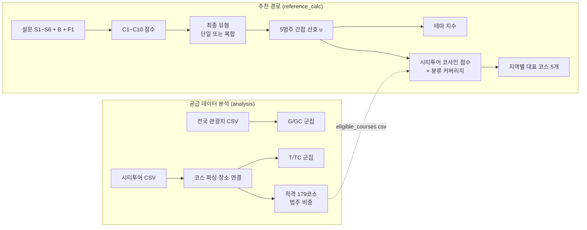

## 바로 보기

| 자료 | 위치 |
|---|---|
| 전체 상세명세서: 설문, 산식, PCA 축, 코사인, 지역 배정, 여행장소, 체류 | [Markdown](docs/Tour_Navigator_Integrated_Specification.md) · [Word](docs/Tour_Navigator_Cosine_Specification.docx) |
| 최신 설문과 선택지별 가산점 | [설문 MD](survey/Tour_Navigator_Branching_Questionnaire.md) · [점수 사전 CSV](survey/implementation/question_score_map.csv) |
| 응답자용 설문지 | [Word](survey/Tour_Navigator_Survey_Form.docx) · [PNG 6장](survey/survey_png/) |
| CSV → PCA·코사인 군집·표·그림 | [Jupyter Notebook](analysis/Tour_Navigator_Integrated.ipynb) · [동일 분석 Python](analysis/run_analysis.py) |
| 신규 설문 → 유형 → 테마·지역 시티투어 | [추천 코드](reference_calc/recommend_reference.py) · [설문 엔진](reference_calc/score_survey.py) |
| 주 분석 PNG 41개·결과 CSV 92개 | [결과 폴더](analysis/outputs_cosine/run_20260929_000435_315309/) |
| 입력 데이터의 위치·행 수·해시 | [입력 목록](docs/INPUT_DATA_INDEX.md) · [전체 파일 SHA256](verification/release_manifest.csv) |
| 기존 앱·확장 산식 비교와 체류 코드 | [Node.js 코드집](tour_scoring/) · [원본 추적 정보](tour_scoring/PROVENANCE.json) |

## 추천 예제

[`reference_calc/demo_answers.json`](reference_calc/demo_answers.json)의 가상 응답을 넣은 결과입니다([전체 결과](reference_calc/demo_result.json)).

1. **유형**: 문화 산책형(C4)과 조용한 휴식형(C5)이 11점 동점이어서 F1 확인 문항이 나왔습니다. 응답자가 `BALANCED`를 골라 두 유형이 모두 13점이 됐고, 둘을 0.5씩 섞은 복합 유형으로 판정됩니다.
2. **테마 상위 3개**: 영월 「왕과 사는 남자」 31.5점, 경주·거제 「RESCENE Route」 25.5점, 서울 「케이팝 데몬 헌터스」 25.0점
3. **지역별 대표 시티투어 5개**

| 순위 | 지역 | 코스 | 점수 |
|---|---|---|---|
| 1 | 연천 | 연천명소코스 | 95.8 |
| 2 | 파주 | 2026 파주시티투어 당일코스(수요일) | 95.1 |
| 3 | 순천 | (테마투어)생태투어 | 95.1 |
| 4 | 대전 | 대덕특구탐방 | 95.1 |
| 5 | 부산 | 오렌지라인 | 89.8 |

테마 점수와 코스 점수는 계산식이 달라 서로 더하거나 크기를 비교하지 않습니다.

## 분석 결과 둘러보기

아래 그림은 모두 저장소에 있는 결과 파일입니다. 주 분석 그림 41개 전체는 [plots 폴더](analysis/outputs_cosine/run_20260929_000435_315309/plots/)에 있습니다. 그림 속 범주 이름은 영어로 표기했습니다(Heritage=역사, Nature=자연, Activity=체험, Food=음식, Coast=바다).

### 1. 설문 분기 흐름

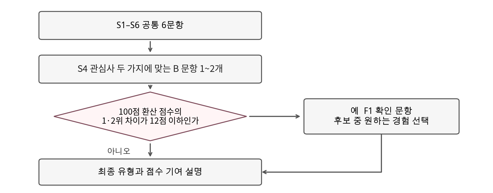

모든 응답자는 공통 6문항과, S4에서 고른 주 관심사에 맞는 B 문항 1개에 답합니다. 1위와 2위 유형의 점수 차이가 2점 이하일 때만 F1 확인 문항이 나옵니다. 그래서 설문은 7문항 또는 8문항으로 끝납니다. B 문항의 "D = 없음"은 어떤 유형에도 점수를 더하지 않습니다.

### 2. 관광지 군집 G: PCA 투영과 범주 구성

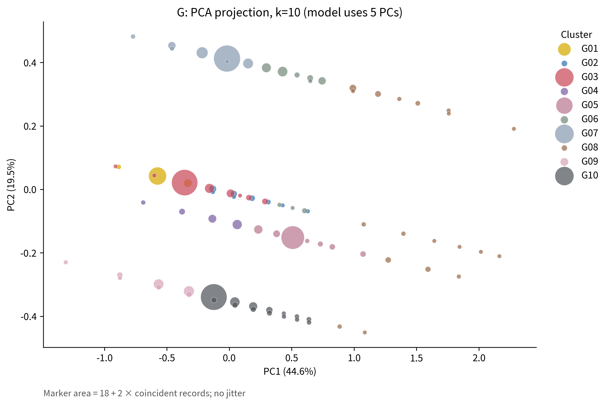

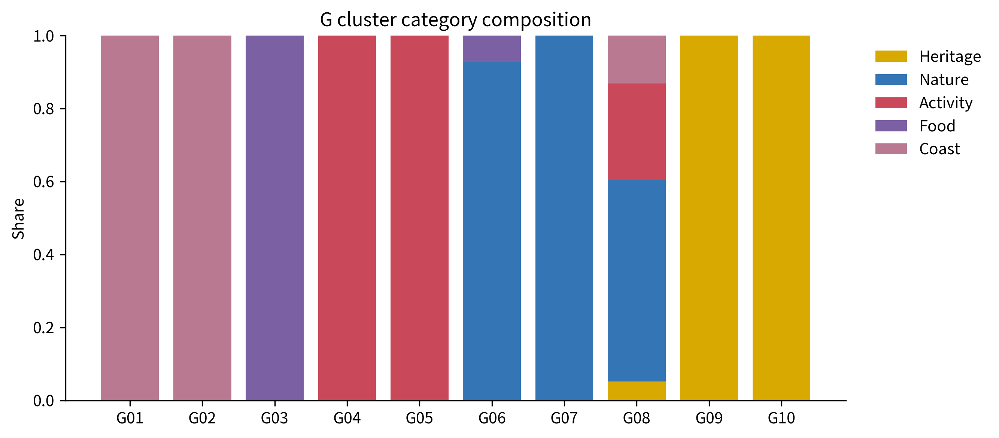

전국 관광지 3,118곳 중 숙박 569곳을 빼고 2,549곳을 군집했습니다. 특징은 범주(원핫), 기준 체류시간, 유네스코 표식입니다. PCA 5축이 분산의 99.4%를 담고, 탐색 범위 k=2~10에서 k=10이 선택됐습니다(실루엣 0.719).

- 위 그림은 첫 두 축(PC1 44.6%, PC2 19.5%)만 보여 줍니다. 점이 겹쳐 보여도 나머지 3개 축에서 나뉠 수 있습니다. 원 크기는 같은 좌표에 겹친 장소 수입니다.
- 아래 그림처럼 대부분의 군집은 범주 하나로 이루어집니다. 같은 범주 안에서는 체류시간으로 다시 나뉩니다. 예를 들어 역사는 G09(짧은 방문)와 G10(보통 방문), 체험은 G04와 G05로 나뉩니다.
- 장소마다 범주가 하나뿐이라 실루엣이 높게 나오기 쉽습니다. 이 값을 군집 품질이 뛰어나다는 뜻으로 읽지 마세요.

### 3. 관광지 군집별 규모와 체류시간

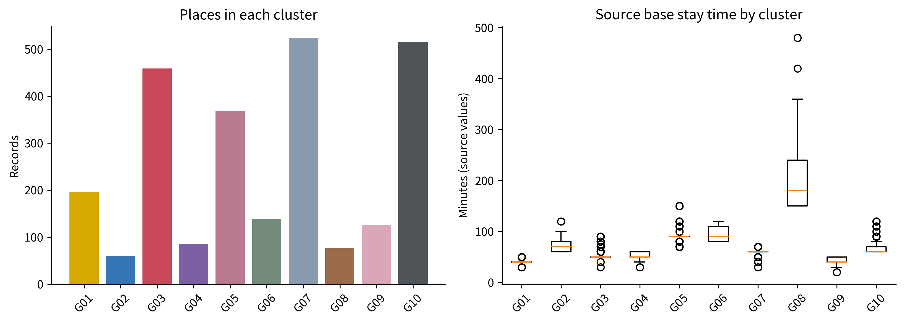

가장 큰 군집은 자연 G07(523곳), 역사 G10(516곳), 음식 G03(459곳)입니다. 체류시간(오른쪽)은 대부분 40~90분에 모입니다. G08(76곳)만 중앙값 180분으로 길며, 자연·체험·바다가 섞인 장시간 방문지 묶음입니다.

### 4. 시티투어 코스 정제와 장소 연결

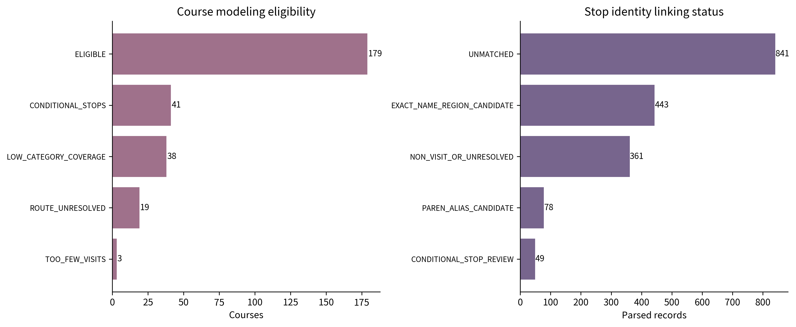

시티투어 280코스 중 179코스가 분석 조건을 통과했습니다. 조건은 방문 후보 2곳 이상, 범주 분류 커버리지 0.5 이상, 경로 해석 가능, 조건부 경유지 없음입니다. 탈락 사유는 조건부 경유지 41, 범주 커버리지 부족 38, 경로 해석 불가 19, 방문지 부족 3입니다.

오른쪽은 경유지 이름을 관광지 목록과 맞춘 결과입니다. 지역과 이름이 모두 맞는 후보가 443건이지만 841건은 짝을 찾지 못했습니다. 연결 결과는 모두 **후보**이고, 사람이 확인한 연결은 아직 0건입니다.

### 5. 코스 군집 T: 범주 구성

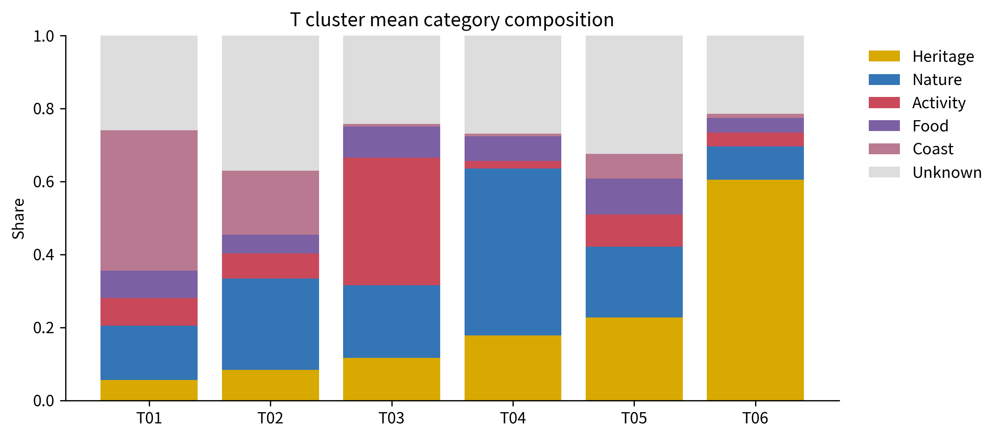

179코스를 여섯 가지 구성으로 나눴습니다. T01은 바다(0.39), T03은 체험(0.35), T04는 자연(0.46), T06은 역사(0.60) 비중이 두드러집니다. T02(12코스)는 야경 코스이고, T05(44코스)는 평균 방문지가 8곳인 긴 혼합 코스입니다. 막대 위쪽 회색은 범주를 알 수 없는 경유지 비중입니다.

2026-09-29 개정 전에는 방문지 수가 분산의 72%를 차지해서 군집이 "긴 코스 대 짧은 코스" 두 개로만 나뉘었습니다. 세 묶음의 흩어진 정도를 맞춘 뒤 가중치를 곱하도록 고쳐 설계대로 범주 구성이 군집을 가르게 됐습니다(명세서 22장). 평균 실루엣은 0.222로 경계가 뚜렷하지 않으므로 T 군집은 탐색용 요약으로만 씁니다.

### 6. 기존 T와 코사인 TC 비교

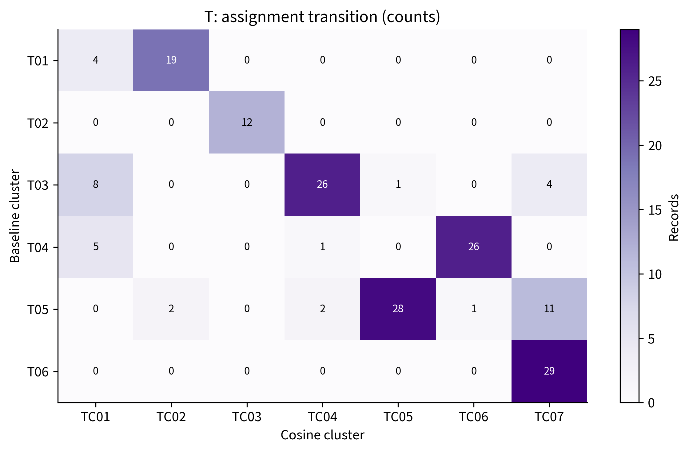

행은 기존 PCA 군집(T), 열은 구면 코사인 군집(TC)입니다. 야경 T02는 TC03으로, 역사 T06은 TC07로 그대로 옮겨 갑니다. 반면 T05(긴 혼합)의 11코스는 역사형 TC07로 이동합니다. 여러 군집에서 모인 17코스는 음식 비중이 큰 TC01로 새로 묶였습니다. 기존 대비 ARI는 0.585입니다.

### 7. 기존 군집과 코사인 군집의 분리 정도

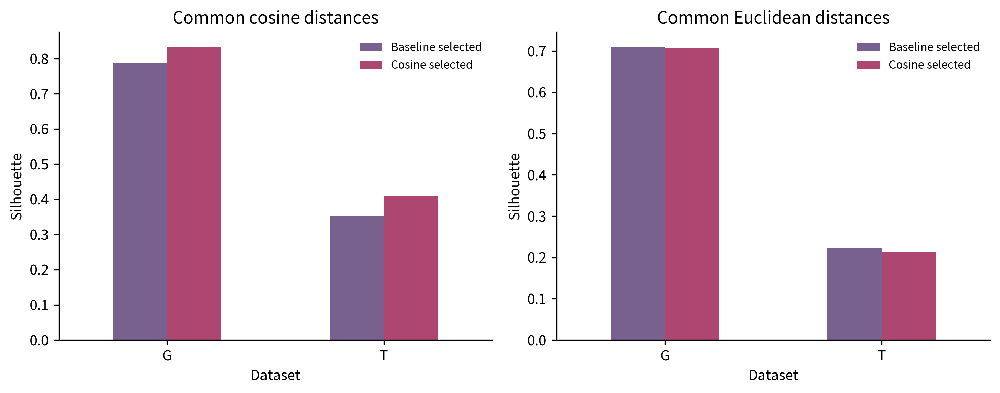

두 모델을 같은 거리로 평가했습니다. 코사인 거리(왼쪽)에서는 G가 0.787에서 0.834로, T가 0.353에서 0.410으로 코사인 군집이 더 잘 나뉩니다. 유클리드 거리(오른쪽)에서는 기존 군집이 약간 높습니다. 평가 거리마다 유리한 모델이 다르므로, 한쪽 수치만으로 어느 모델이 낫다고 판단하지 않습니다.

### 8. 코스 점수가 만들어지는 방식

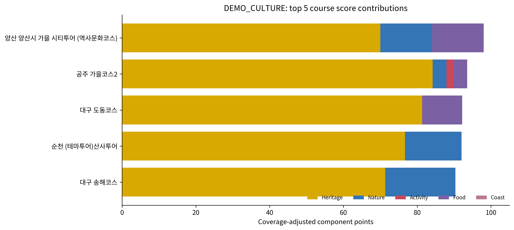

코스 점수 `100 × cosine(선호, 코스 범주 비중) × 커버리지`를 범주별 기여로 나눠 보여 줍니다. 이 그림은 역사를 강하게 선호하는 **가상 응답**(`DEMO_CULTURE`)의 예입니다. 1위 양산 역사문화코스 98.0점 중 약 70점이 역사에서 옵니다. 실제 서비스에서도 이렇게 "왜 이 코스인지"를 범주별로 설명할 수 있습니다.

### 9. 해양 관광: 월별 추이와 지역별 분포

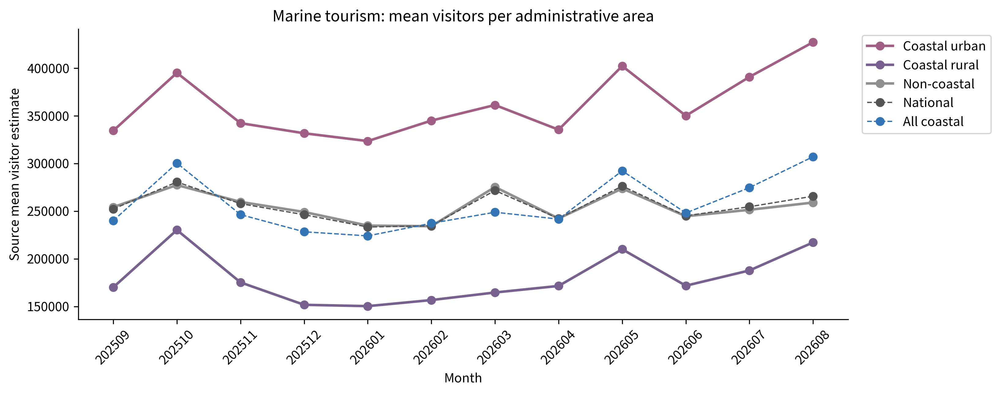

2025년 9월부터 2026년 8월까지 행정구역당 평균 방문자 추정치입니다. 연안 도시가 늘 가장 많고 연안 어촌이 가장 적습니다. 모든 집단이 10월과 5월에 오르고, 연안은 여름(7~8월)에 다시 크게 늡니다.

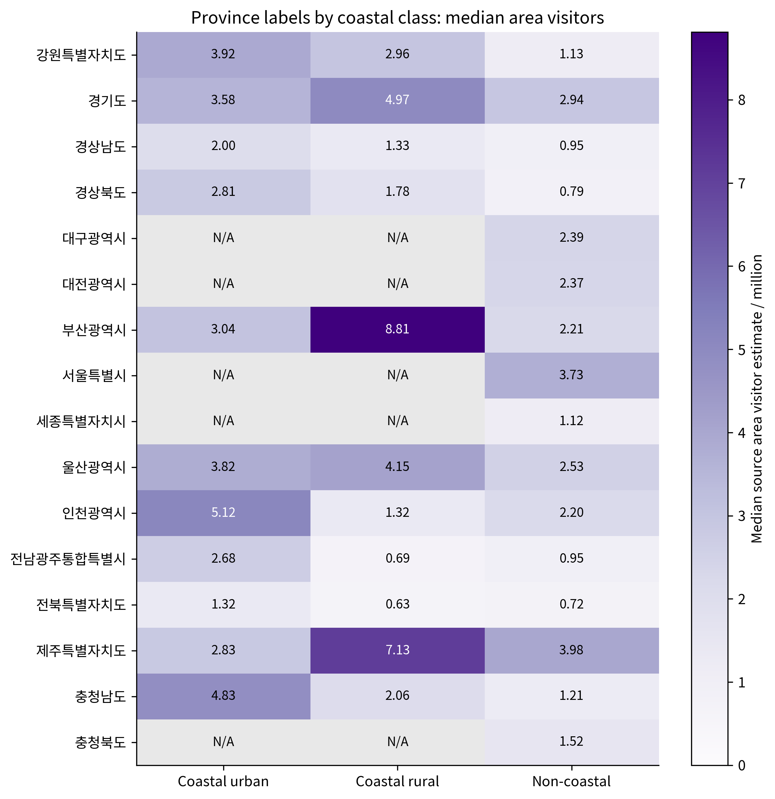

시도와 연안 구분별 읍면동 방문자 추정치의 중앙값(백만 명)입니다. 부산(8.81)과 제주(7.13)의 연안 어촌이 가장 높습니다. N/A는 해당 구분의 지역이 없다는 뜻입니다. 해양 자료는 설명용이며 추천 가산점(0)이나 체류 배율(1)에는 반영하지 않습니다.

### 10. 지역 지출과 관광 공급의 관계

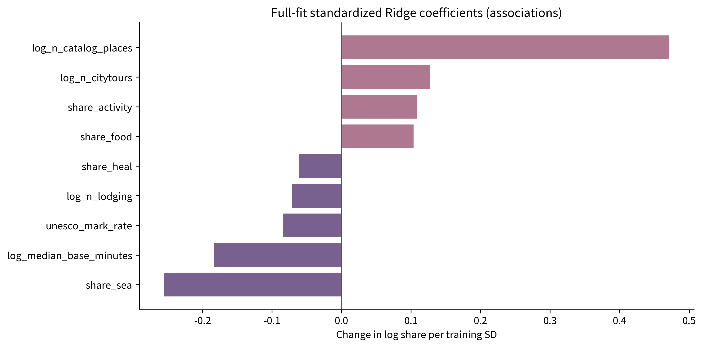

111개 지역의 내국인 지출 비중을 관광 공급 특징으로 설명한 Ridge 회귀입니다. 관광지 수가 많을수록 지출 비중이 크고(+0.47), 바다 비중이 클수록 작습니다(−0.26). 다만 교차검증 로그 R²가 0.14로 설명력이 낮고, 계수는 인과가 아닌 연관입니다.

### 11. 지역별 방문자 연령·성별 구성 R

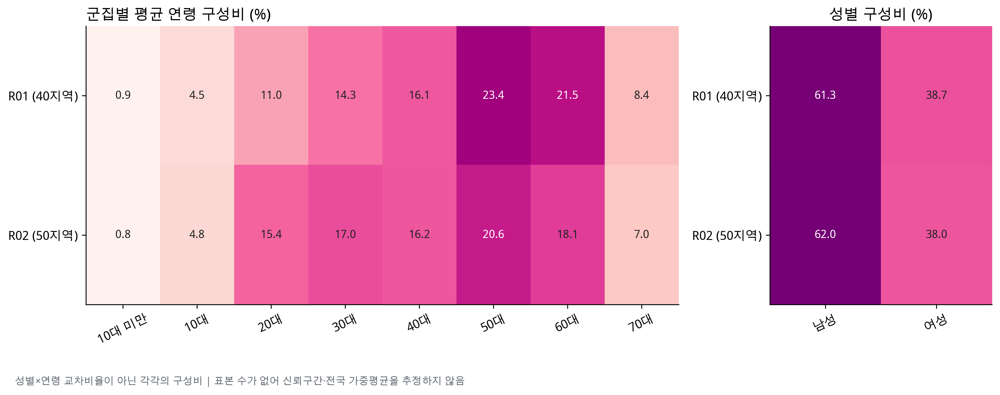

90개 지역을 방문자 연령·성별 구성비로 두 군집으로 나눴습니다(실루엣 0.317). R01(40지역)은 50·60대 비중이 높고, R02(50지역)는 20·30대 비중이 높습니다. 성별 구성은 두 군집 모두 남성 약 61~62%로 비슷합니다. 연령과 성별은 각각의 구성비이며, "30대 여성"처럼 교차한 비율이 아닙니다.

## 1. 최신 설문 점수와 추천 실행

Python 3.10 이상 표준 라이브러리만 필요합니다. 저장소 최상위에서 실행하세요.

```bash
python reference_calc/score_survey.py reference_calc/demo_answers.json
python reference_calc/recommend_reference.py reference_calc/demo_answers.json
python reference_calc/verify_reference.py
```

입력은 S1~S6와, S4에서 고른 관심사에 해당하는 B 문항 하나입니다. F1이 필요한 경우에만 후보 C 코드 또는 `BALANCED`를 입력합니다. B1~B7의 **D = 없음**은 모든 유형에 0점을 더하고 기존 점수를 유지합니다. 예제 응답은 가상 데이터입니다.

- 유형: 선택지별 C1~C10 가산점 합계, 최고점과 2점 이내인 유형을 최종 후보로 유지.
- 선호 벡터: 후보의 기존 5범주 프로필을 점수 차이에 따른 가중치로 합성. `q_source=type_profile_prior`이며 개인 선호 실측값이 아님.
- 테마: `100 × (프로필 적합도 + 0.5 × 주요 관심사 항) / 1.5`로 정렬.
- 시티투어: `100 × cosine(선호 벡터, 코스 범주 비중) × 분류 커버리지`로 정렬하고 지역명별 첫 코스를 최대 5개 선택.
- 테마 점수와 코스 점수는 합산하지 않으며, 군집 번호를 추천의 강제 필터로 사용하지 않음.
- 신규 기본 흐름의 지역·한류·연령·성별 별도 가산은 0. 관련 분석 데이터를 자동 가산으로 해석하지 않음.

`reference_calc/eligible_courses.csv`는 적격 179코스 스냅숏입니다. 새 CSV를 학습해도 이 파일은 자동 교체되지 않습니다. 최신 분석 결과와 출처를 검토한 후 갱신해야 합니다.

## 2. CSV부터 분석 재실행

```bash
python -m pip install -r analysis/requirements.txt
python analysis/run_analysis.py
```

Jupyter에서는 `analysis` 폴더에서 [Tour_Navigator_Integrated.ipynb](analysis/Tour_Navigator_Integrated.ipynb)를 열고 **Restart Kernel → Run All** 하세요. Jupyter는 별도 설치합니다. 결과는 `analysis/outputs_cosine/run_실행시각/`의 `tables`, `plots`, `models`에 저장되며 기존 스냅숏을 덮어쓰지 않습니다.

현재 스냅숏은 Python 3.12와 [`analysis/requirements-tested.txt`](analysis/requirements-tested.txt)의 고정 버전으로 만들었습니다. 같은 환경에서 다시 실행하면 결과 CSV와 모델이 바이트 단위로 같게 나옵니다. 그림의 한글은 맑은 고딕, AppleGothic, Noto Sans CJK KR, 나눔고딕 순서로 먼저 찾은 글꼴로 그립니다. 한글 글꼴이 없으면 그림의 글자만 깨지고 수치 결과는 같습니다.

| 입력 | 위치 | 용도 |
|---|---|---|
| 전국 여행장소 | `analysis/tour-places.csv` | 범주·체류·유네스코 표식, G/GC 군집 |
| 지역 시티투어 | `analysis/citytour.csv` | 코스 정제·장소 연결·범주 비중, T/TC 군집 |
| 지역별 내국인 지출 비율 | `analysis/spending_csv/spend_region.csv` | 지역 관광공급과 지출의 설명 회귀 |
| 전국 해양관광 | `analysis/marine_csv/` | 전국 히트맵, 월별 추이, Top5, 검색순위 |
| 연령별 인기관광지 | `age_upgrade/data/raw/` | 연령 지표와 A 군집 |
| 지역 성별·연령별 방문자 구성비 | `demographic_upgrade/data/raw/` | 주변비율 지표와 R 군집 |
| 2026 해외한류실태조사 집계치 | `hallyu_preprocessed_csv/` | 전처리 CSV 8개, 통계값·설계계수·적용조건 |

지출 **업종 분류 S/SC 및 업종·월별 지출 입력은 제거**했습니다. 지역 지출 회귀는 유지합니다. 해양 월별 방문자는 지출 월별 입력과 다른 자료입니다.

주 노트북의 직접 5범주 평점 CSV는 코사인 계산을 검증하는 별도 선택 입력이며 최신 분기 설문에 포함되지 않습니다. 파일이 없으면 `SYNTHETIC_DEMONSTRATION`으로 표시한 가상 응답 4개로 계산을 시연합니다.

분석 스냅숏: 장소 3,118행 중 숙박 569행 제외 후 2,549행, 코스 280행 중 적격 179행, G/GC 10군집, T 6군집·TC 7군집. T는 범주 비중·방문 후보 수·야경 세 묶음의 분산을 맞춘 뒤 가중치 0.75·0.15·0.10을 적용합니다(명세서 22장). PCA 축은 학습된 성분이며 설문 유형과 다릅니다. 식·실루엣·ARI 해석은 통합 명세서를 참조하세요.

## 3. 연령·성연령 및 기존 산식 비교

```bash
python age_upgrade/run_age_clustering.py
python demographic_upgrade/analyze_demographics.py
npm test --prefix tour_scoring
python run_session.py examples/full_session.json
```

마지막 두 명령과 `tour_scoring`, `survey_legacy`, `session_results`는 **기존 v1~v4 비교용**입니다. 최신 설문은 `reference_calc`를 사용합니다. 성별·연령 구성비는 교차분포가 아닌 주변비율입니다. 한류 자료는 개인 응답 원자료가 아닌 집계 통계입니다.

체류·일정 코드는 `tour_scoring/src/scoring-v2.cjs`, `citytour.cjs`, `session.cjs`와 명세서에 있습니다. 신규 설문의 체류 연결은 명세에 포함되어 있으나 `reference_calc`에 일정 검증을 통합한 것은 아닙니다.

## 폴더 구조

| 폴더 | 역할 | 상태 |
|---|---|---|
| `reference_calc/` | 신규 설문 점수와 테마·시티투어 추천 계산 | 최신 |
| `survey/` | 분기 설문 6.1 문항, 설문지 Word·PNG, 설문 엔진 검증 | 최신 |
| `analysis/` | 입력 CSV, 주 분석 노트북·스크립트, 결과 스냅숏(`outputs_cosine/`) | 최신 |
| `docs/` | 통합 명세서 MD·Word, 입력 목록, 이관 기록 | 최신 |
| `age_upgrade/` | 연령별 인기관광지 A 군집 | 보조 분석 |
| `demographic_upgrade/` | 지역 성별·연령 구성 R 군집 | 보조 분석 |
| `hallyu_preprocessed_csv/` | 2026 해외한류실태조사 전처리 CSV | 보조 자료 |
| `tour_scoring/`, `survey_legacy/`, `session_results/`, `examples/`, `run_session.py` | 기존 v1~v4 산식과 세션 예제 | 비교용 |
| `verification/` | 실행 로그, 검증 결과, 전체 파일 SHA256 | 검증 기록 |
| `archive/` | 이전 버전 안내 | 보관 |

## 해석할 때 주의할 점

- 군집 번호(G01, T03 등)는 실행마다 새로 매기는 번호입니다. 입력이나 전처리를 바꾸면 번호와 의미가 달라질 수 있습니다.
- 설문 유형 C1~C10은 규칙으로 만든 분류이고, G·T 군집은 데이터에서 묶은 집단입니다. 번호가 같아도 서로 대응하지 않습니다.
- 예제 응답과 노트북의 직접 선호 응답은 모두 가상 데이터입니다.
- 실루엣과 ARI는 군집이 얼마나 잘 나뉘고 안정적인지를 보여 줄 뿐, 추천 정확도나 이용자 만족도를 뜻하지 않습니다.

## 버전·검증 범위

- [이관 기록](docs/RELEASE_NOTES.md): 패키지와 최신·비교용 코드 구분, 2026-09-29 T 모델 개정 내역.
- [현재 검증 결과](verification/release_validation.json): 이 브랜치에서 실제 실행한 검사.
- 각 모듈의 검증 JSON·로그에는 이전 세션 검사도 보존했습니다.
- 규칙 검증과 재현 검사는 실제 이용자 만족도·추천 정확도 검증을 뜻하지 않습니다.
- 운영 앱 배포, 실시간 운행 확인, 예약 확정과 장소 동일성 검증은 완료된 범위가 아닙니다.

원천 자료의 출처·범위는 각 모듈 README와 메타데이터에 있습니다. 이 저장소에 포함됐다는 사실만으로 원천 자료의 재이용 조건을 새로 부여하지 않습니다.
