# Tour Navigator Data Analytics

Tour Navigator는 여행자가 짧은 설문에 답하면 성향 유형을 판정하고, 그 유형에 맞는 **테마 여행지**와 **지역 시티투어 코스**를 추천하는 서비스입니다. 이 저장소는 그 추천을 뒷받침하는 데이터 분석 전체를 담고 있습니다.

- **추천 경로**: 설문 → 유형 점수 → 5범주 선호 → 테마·코스 점수
- **공급 데이터 분석**: 전국 관광지 2,540곳과 시티투어 234코스의 PCA·코사인 군집, 연령·성별·지출·해양 관광 자료
- **함께 들어 있는 것**: 입력 CSV, 실행 코드·노트북, Word·Markdown 명세서, 학습 모델, 결과 표와 그림, 검증 기록

현재 기준은 **통합 명세서 6.5 / 분기 설문 6.4**, 주 분석 엔진은 **integrated-5.0**(지출업종 분류 제거)입니다. 여기 있는 결과는 세션에서 검증한 스냅숏입니다. 입력 CSV를 바꾸면 다시 학습해야 합니다.

**목차**: [핵심 요약](#핵심-요약) · [최근 개정](#최근-개정-2026-09-29) · [처리 흐름](#전체-처리-흐름) · [바로 보기](#바로-보기) · [설문지 구성과 판정 로직](#설문지-구성과-판정-로직) · [유형별 시티투어 매칭](#여행자-유형별-시티투어-매칭) · [추천 예제](#추천-예제) · [코사인 유사도](#코사인-유사도-쓰이는-곳과-결과-파일) · [분석 결과](#분석-결과-둘러보기) · [실행 방법](#실행-방법) · [폴더 구조](#폴더-구조) · [해석 주의](#해석할-때-주의할-점)

## 핵심 요약

| 영역 | 내용 | 주요 수치 |
|---|---|---|
| 설문 | 공통 S1~S6(S4는 관심사 두 가지) + 관심사 B 1~2문항 + 필요할 때만 F1. 7~9문항으로 끝남 | 완료 경로 1,756,396개 전수 검사 |
| 유형 판정 | 선택지마다 C1~C10에 원점수 가산 후 유형별 100점 만점으로 환산. 최고점과 12점 이내인 유형은 복합 유형으로 유지 | 유형 10개 |
| 추천 | 유형 프로필을 5범주(역사·자연·체험·음식·바다) 선호로 바꿔 테마와 코스를 각각 점수화. 코스에는 관심사·야경·여행 속도 가산, 지역 대표 5개에 관심사별 1자리 보장 | 적격 코스 234개 |
| 관광지 군집 G/GC | 범주·체류시간·유네스코 표식으로 전국 관광지 군집 | 2,540곳, 8군집, 실루엣 0.718 |
| 코스 군집 T/TC | 범주 비중·방문지 수·야경 세 묶음의 분산을 0.75·0.15·0.10으로 맞춘 뒤 군집 | 234코스, T 7군집·TC 7군집 |
| 유형별 시티투어 매칭 | 유형 C1~C10 각각의 프로필과 234코스의 범주 적합, 코스 군집별 평균 | C4 역사·C3 체험·C9 바다·C5 자연 군집과 가장 잘 맞음 |
| 보조 분석 | 연령별 인기관광지(A), 지역 성별·연령 구성(R), 지역 지출 회귀(M), 해양 관광 | A 3군집, R 2군집, M 로그 R² 0.13 |

군집은 관광지·코스의 공급 특성을 **설명**하는 데 씁니다. 추천 점수는 군집 번호를 쓰지 않고 선호 벡터와 코스 범주 비중을 직접 비교합니다.

## 최근 개정 (2026-09-29)

| 개정 | 무엇을 바꿨나 | 효과 |
|---|---|---|
| T 모델 분산 균형 | 범주 비중·방문지 수·야경 세 묶음의 흩어진 정도를 맞춘 뒤 가중치 0.75·0.15·0.10 적용 | "긴 코스 대 짧은 코스" 2군집 → 범주 구성으로 나뉘는 군집 |
| 설문–추천 정합 (설문 6.2·추천 6.3) | S4 바다 점수를 C9 쪽으로 조정, C9 프로필 수정, 코스 점수에 관심사·야경·여행 속도 가산 | 바다 관심사의 1위 코스가 바다 중심인 비율 0 → 0.38 |
| 탈락 코스 재점검 | 제공된 원문 안에서 경로 해석·범주 분류 규칙의 오류 수정 | 적격 코스 179 → 229, 바다 비중 0.3 이상 코스 17 → 26 |
| 유형 100점 환산 (설문 6.3·추천 6.4) | 유형마다 만점을 100점으로 맞춰 원점수 환산, 경계 12점·F1 20점 | 유형 쏠림 6.4배 → 2.5배, 바다 일치율 0.52 → 0.75 |
| 경유지–관광지 연결 재점검 | 한 칸에 나열된 경유지 분리, 지역명·수식어가 붙은 관광지 이름, 인접 지역(30~50km), 출발·하차를 겸한 관광지, "or"·"택1"을 선택지로 판정 | 방문 경유지 연결률 43% → 54%, 적격 코스 229 → 223, T 7 → 6군집·TC 7 → 8군집 |
| 범주 미확인 경유지 재분류 | 키워드 사전 보강(현충원·가옥·식물원·산책·전시관·광장·장터·선착장 등), 시청·로터리·"관광코스"·"<6" 같은 비방문 항목 제외 | 범주 미확인 방문 경유지 285 → 104, 적격 코스 평균 분류율 0.84 → 0.95, 적격 코스 223 → 234, T 6 → 7군집(음식 군집 복원) |
| 범주 미확인 2차 재분류 | 괄호 속 설명("대청호(대청댐물문화관)"), 관광지 목록 후보가 모두 같은 범주인 경우(둔병 → 바다), 근거를 적은 검토표(`analysis/stop_category_review.csv`) | 남은 미확인 77 → 8건, 적격 코스 평균 분류율 0.95 → 0.99, T 실루엣 0.247 → 0.260 |
| 노트북 설명·세션 실행기 | 노트북 설명 셀을 최신 규칙으로 정리, `run_session.py`가 최신 설문 추천도 함께 저장 | 코드 셀과 분석 결과는 그대로 |
| 위치 지도 | 지역 구성 R, 관광지 G, 코스 T, 코사인 GC·TC 군집을 지도로 표시 | 군집이 전국에 퍼지는지 특정 지역에 모이는지 확인 |
| S4 관심사 두 가지 (설문 6.4·추천 6.5) | S4를 두 가지 선택으로 바꾸고 두 관심사의 B 문항에 모두 답함. 추천은 두 관심사 가산을 평균하고, 지역 대표 5개에 관심사마다 한 자리를 먼저 채움 | 두 관심사가 5개 안에 모두 드는 경로 24.9% → 100%, 9문항 응답 79.5% |
| 설문 로직·유형별 매칭 설명 | README에 문항 구성·판정 6단계·계산 예와 유형별 시티투어 매칭(히트맵, `reference_calc/type_course_matching.py`) 추가 | C1·C2·C7·C8이 모두 음식 군집에 몰리는 점 확인 |
| 코사인 CSV 점검 | 코사인 관련 CSV 전부를 특징값에서 다시 계산해 대조(94개 항목), 직접 선호 순위의 동점 판정을 반올림한 점수로 변경 | 같은 점수가 부동소수점 오차로 다른 순위를 받던 문제 수정, 점수 값과 다른 결과는 그대로 |
| 저장소 정리 | 모듈마다 따로 두던 같은 파일 사본을 지우고 한 곳만 읽도록 변경(설문 엔진은 `survey/implementation`, 앱 데이터는 `tour_scoring/data`) | 중복 파일 11개 삭제, 모든 결과는 바이트 단위로 같음 |
| 맥도날드 9곳 제외 재분석 | 앱 장소 목록에서 지운 맥도날드 드라이브스루 9곳을 입력 CSV에서도 빼고 전체 분석을 다시 실행 | 관광지 2,549 → 2,540곳, G 10 → 8군집(실루엣 0.719 → 0.718), GC 10 → 7군집. T·TC 군집, 적격 234코스, 추천 결과는 그대로 |
| 군집 모델 재점검 | 90% 부분표본으로 군집 수 선택과 배정의 안정성 점검 | 관광지 G·GC는 군집 수만 흔들리고(k=6~10 실루엣 차 0.016) 배정은 안정(ARI 0.96·0.98), 코스 T·TC는 안정. 추천 영향 없음. [보고서](docs/MODEL_RECHECK_2026-09-30.md) |

항목별 상세 수치와 변경 파일은 [이관 기록](docs/RELEASE_NOTES.md)에 있습니다.

## 전체 처리 흐름

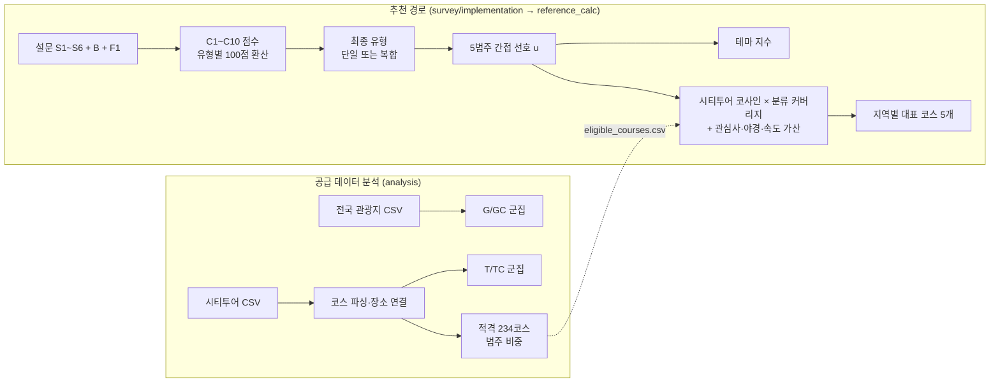

## 바로 보기

| 자료 | 위치 |
|---|---|
| 전체 상세명세서: 설문, 산식, PCA 축, 코사인, 지역 배정, 여행장소, 체류 | [Markdown](docs/Tour_Navigator_Integrated_Specification.md) · [Word](docs/Tour_Navigator_Cosine_Specification.docx) |
| 최신 설문과 선택지별 가산점 | [설문 MD](survey/Tour_Navigator_Branching_Questionnaire.md) · [점수 사전 CSV](survey/implementation/question_score_map.csv) |
| 응답자용 설문지 | [Word](survey/Tour_Navigator_Survey_Form.docx) · [PNG 6장](survey/survey_png/) |
| CSV → PCA·코사인 군집·표·그림 | [Jupyter Notebook](analysis/Tour_Navigator_Integrated.ipynb) · [동일 분석 Python](analysis/run_analysis.py) |
| 신규 설문 → 유형 → 테마·지역 시티투어 | [추천 코드](reference_calc/recommend_reference.py) · [설문 엔진](survey/implementation/score_survey.py) |
| 유형별 시티투어 매칭 표 | [계산 코드](reference_calc/type_course_matching.py) · [유형별 대표 5개](reference_calc/type_course_top5.csv) · [유형×군집 평균](reference_calc/type_T_cluster_fit.csv) |
| 주 분석 PNG 44개·결과 CSV 92개 | [결과 폴더](analysis/outputs_cosine/run_20260929_234547_706228/) |
| 입력 데이터의 위치·행 수·해시 | [입력 목록](docs/INPUT_DATA_INDEX.md) · [전체 파일 SHA256](verification/release_manifest.csv) |
| 군집 모델 안정성 점검 | [보고서](docs/MODEL_RECHECK_2026-09-30.md) · [스크립트](verification/k_selection_stability.py) · [수치](verification/k_selection_stability.json) |
| 기존 앱·확장 산식 비교와 체류 코드 | [Node.js 코드집](tour_scoring/) · [원본 추적 정보](tour_scoring/PROVENANCE.json) |

## 설문지 구성과 판정 로직

분기형 설문 6.4입니다. 모든 응답자는 공통 6문항과, S4에서 고른 관심사 두 가지에 연결된 후속 1~2문항에 답합니다. 상위 유형 점수가 비슷할 때만 확인 문항 1개를 더 받아 **7~9문항**으로 끝납니다(전수 경로 기준 7문항 0.4%, 8문항 20.1%, 9문항 79.5%). S4만 두 가지를 고르고 나머지 문항은 한 가지만 고릅니다. 문항 전문과 선택지별 배점은 [설문 문항지](survey/Tour_Navigator_Branching_Questionnaire.md), 응답자 화면은 [설문지 Word](survey/Tour_Navigator_Survey_Form.docx)와 [PNG](survey/survey_png/)에 있습니다.

### 문항 구성

| 순서 | 문항 | 묻는 것 | 선택지 |
|---|---|---|---|
| 공통 | S1 | 연령대 | 10대 ~ 70대 이상 (7) |
| 공통 | S2 | 동행 | 혼자·친구·연인·배우자·아이와 가족·부모님·친목 모임 (7) |
| 공통 | S3 | 여행 속도 | 빡빡하게·적당히·천천히 (3) |
| 공통 | S4 | 가장 하고 싶은 것 두 가지(관심사) | 촬영지·공연·역사·자연·바다·맛집·체험·야경·쇼핑 뷰티 스파 (9) 중 서로 다른 2개 |
| 공통 | S5 | 좋아하는 장소 분위기 | 핫플·대표 명소·한적한 곳 (3) |
| 공통 | S6 | 하루 중 여행 시간대 | 아침 일찍·낮 위주·저녁·밤까지 (3) |
| 후속 | B1~B7 중 1~2개 | S4 관심사를 어떤 방식으로 즐기는지 | A·B·C + D 없음 (4) |
| 조건부 | F1 | 가장 양보하고 싶지 않은 경험 | 접전 유형의 경험 문장 + "비슷하게 중요해요" |

S4에서 고른 두 관심사마다 아래 후속 문항을 B 번호 순서로 묻습니다. 두 관심사가 같은 후속 문항에 연결되면(촬영지와 공연, 자연과 바다) 한 번만 묻습니다. 36개 조합 중 이 두 조합만 후속 문항이 하나입니다.

| S4 관심사 | 후속 문항 |
|---|---|
| 드라마·K팝 촬영지, 공연·콘서트 | B1 콘텐츠를 즐기는 방식 |
| 역사·유적 | B2 역사를 즐기는 방식 |
| 자연·숲길, 바다 | B3 자연과 바다를 즐기는 방식 |
| 맛집·시장 | B4 먹거리 여행 방식 |
| 체험·액티비티 | B5 체험 방식 |
| 야경 | B6 야경 감상 방식 |
| 쇼핑·뷰티·스파 | B7 나를 위한 시간 |

### 여행 성향 유형 C1~C10

응답은 열 가지 유형의 점수로 모입니다. 국내외 응답자 모두 열 유형이 후보이고, 연령·동행 답이 특정 유형을 배제하지 않습니다. 유형마다 추천에 쓰는 5범주(역사·자연·체험·음식·바다) 선호 프로필이 있습니다. 이 프로필은 기존 앱에서 이어받은 설계값입니다.

| 코드 | 유형 | 프로필에서 가장 큰 범주 |
|---|---|---|
| C1 | 트렌드 탐색형 | 체험·음식 (각 0.3) |
| C2 | 감성 동행형 | 음식·바다 (각 0.3) |
| C3 | 가족 체험형 | 체험 0.5 |
| C4 | 문화 산책형 | 역사 0.5 |
| C5 | 조용한 휴식형 | 자연 0.6 |
| C6 | 미식 로컬형 | 음식 0.7 |
| C7 | K컬처 탐방형 | 체험 0.35 |
| C8 | 웰니스 쇼핑형 | 음식 0.44 |
| C9 | 자연 해양형 | 바다 0.5 |
| C10 | 역사 전통체험형 | 역사 0.31 |

### 점수 계산과 유형 판정

1. **원점수 더하기**: 선택지마다 적힌 원점수를 유형별로 더합니다. S4는 고른 두 선택지를 모두 더하고, 두 관심사는 같은 비중입니다. 예를 들어 S4 "바다"는 C2 +1·C3 +1·C9 +4입니다. 후속 문항의 A·B·C는 합계 4점이고, **D 없음**은 어떤 유형에도 더하지 않고 앞선 점수를 그대로 둡니다.
2. **100점 환산**: 유형마다 `원점수 × 100 / 최대 원점수`로 바꿉니다. 최대 원점수는 한 경로(S1~S6, S4 두 선택지와 그 B 문항)에서 그 유형이 받을 수 있는 가장 큰 값입니다(C1 23, C2 19, C3 20, C4 19, C5 22, C6 10, C7 17, C8 11, C9 11, C10 15). 선택지에 자주 나오는 유형이 원점수만으로 결과를 가져가지 않게 하려는 장치입니다.
3. **확인 문항 조건**: 환산 점수 1위와 2위의 차이가 **12점 이하**이면 F1을 보여 줍니다. 최고점과 12점 이내인 유형의 경험 문장만 선택지로 나옵니다.
4. **확인 가산**: 경험 하나를 고르면 그 유형에 +20점, "비슷하게 중요해요"를 고르면 20점을 후보 수로 나눠 똑같이 더합니다. F1은 한 번만 묻습니다.
5. **최종 유형**: 최고점과 12점 이내인 유형을 남깁니다. 하나면 단일 성향, 둘 이상이면 복합 성향입니다. 정확한 동점에서 코드 번호로 주유형을 정하지 않습니다.
6. **추천으로 넘기기**: 남은 유형의 가중치를 `2^(점수/12)` 비율로 정해(12점 높으면 2배) 유형 프로필을 섞은 5범주 선호 벡터를 만듭니다. 이 벡터로 테마와 코스를 점수화합니다. 가중치는 유형에 속할 확률이 아닙니다.

응답을 고치면 경로를 다시 계산합니다. S4를 바꾸면 더 이상 표시되지 않는 B 응답과 F1 응답을 지우고, 다른 공통 응답이나 B를 바꾸면 F1 응답을 지웁니다. 표시된 문항에 답하지 않으면 결과를 확정하지 않습니다.

**계산 예**: 10대·혼자·빡빡하게·S4 촬영지와 공연·핫플·아침 일찍, B1 "실제 촬영지 찾아가기"를 고르면 원점수 C7 16점, C1 10점입니다. 두 관심사가 모두 B1이라 후속 문항은 하나입니다. 환산하면 C7 94.12점(16/17), C1 43.48점(10/23)으로 차이가 12점보다 커서 F1 없이 **K컬처 탐방형**으로 끝납니다(7문항). S4의 공연을 야경으로 바꾸면 B1과 B6에 답하고, B6 "인기 있는 야간 명소 여러 곳"(C1 +4)을 고르면 C7 76.47점(13/17), C1 65.22점(15/23)으로 차이가 11.25점이라 F1이 나옵니다. 여기서 "비슷하게 중요해요"를 고르면 두 유형에 10점씩 더해져 86.47점과 75.22점의 복합 성향이 됩니다(9문항).

배점, 100점 환산, 12점 기준, F1의 20점은 설계 규칙이며 조사 자료로 추정한 값이 아닙니다. 설문 엔진([`score_survey.py`](survey/implementation/score_survey.py), 설정 [`survey_config.json`](survey/implementation/survey_config.json))은 S4 36개 조합의 모든 완료 경로 1,756,396개가 7~9문항에서 끝나고, 모든 유형이 단일 결과로 나올 수 있으며, D 없음이 점수를 바꾸지 않는다는 것을 전수 검사합니다([검증 결과](survey/implementation/verification.json)).

## 여행자 유형별 시티투어 매칭

각 유형을 단독 결과로 보고, 유형의 5범주 프로필과 적격 234코스의 범주 비중으로 범주 적합 `100 × cosine × 분류 커버리지`를 계산했습니다. 추천 코드와 같은 식이며, 응답마다 달라지는 관심사·야경·여행 속도 가산은 넣지 않았습니다. 계산은 [`reference_calc/type_course_matching.py`](reference_calc/type_course_matching.py)가 하고, 결과는 [유형×코스 전체](reference_calc/type_course_matching.csv), [유형별 지역 대표 5개](reference_calc/type_course_top5.csv), [유형×군집 평균](reference_calc/type_T_cluster_fit.csv)에 있습니다.

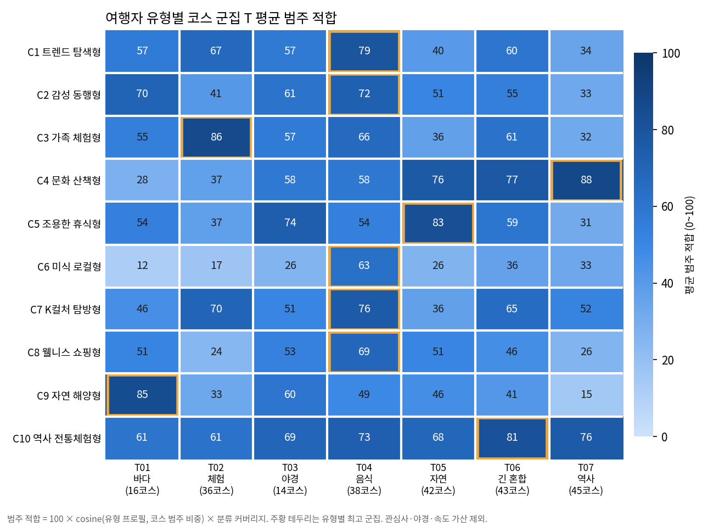

| 유형 | 가장 잘 맞는 코스 군집 (평균 적합) | 범주 적합 상위 코스 (지역별 1개, 상위 3) |
|---|---|---|
| C1 트렌드 탐색형 | 음식 T04 (79) | 포항 씨(SEA)하게 보는 포항코스 93.2 · 삼척 종일코스 92.6 · 홍성 죽도코스 91.9 |
| C2 감성 동행형 | 음식 T04 (72) | 포항 씨(SEA)하게 보는 포항코스 96.9 · 태안 광역코스 92.6 · 삼척 종일코스 92.6 |
| C3 가족 체험형 | 체험 T02 (86) | 사천 별빛투어 97.0 · 여수 2층주간코스 97.0 · 진도 진도시티투어 96.7 |
| C4 문화 산책형 | 역사 T07 (88) | 대전 광역투어(첫주, 일) 99.5 · 공주 여름코스 98.2 · 세종 천안연계투어 98.0 |
| C5 조용한 휴식형 | 자연 T05 (83) | 제주 야간코스(7월말~8월말 운영) 98.0 · 안산 대부도 해변코스(일반형 2코스) 96.6 · 여수 2층야간코스 95.8 |
| C6 미식 로컬형 | 음식 T04 (63) | 홍성 전통시장코스(광천) 4,9일 운영 91.1 · 청도 시티투어 87.8 · 대전 광역투어(다섯째주, 토) 85.6 |
| C7 K컬처 탐방형 | 음식 T04 (76) | 익산 익산숨은보석찾기코스 94.8 · 인천 인천레트로노선 94.3 · 서울 EG투어버스 H코스 94.0 |
| C8 웰니스 쇼핑형 | 음식 T04 (69) | 태안 남부코스 95.5 · 삼척 종일코스 91.5 · 홍성 전통시장코스(광천) 4,9일 운영 87.7 |
| C9 자연 해양형 | 바다 T01 (85) | 여수 제2코스 98.1 · 안산 대부도 뱃길코스(일반형 2코스) 97.5 · 부산 야경투어 94.6 |
| C10 역사 전통체험형 | 긴 혼합 T06 (81) | 목포 목포랑시티투어 97.1 · 서산 B코스 95.9 · 여수 야경코스 95.9 |

- **한 군집과 뚜렷하게 맞는 유형**: 문화 산책형(C4)은 역사 T07(88), 가족 체험형(C3)은 체험 T02(86), 자연 해양형(C9)은 바다 T01(85), 조용한 휴식형(C5)은 자연 T05(83)와 가장 잘 맞습니다. C5는 야경 T03(74)과도 잘 맞아 상위에 야간 코스가 섞입니다.
- **음식 군집에 몰리는 유형**: 트렌드 탐색형(C1)·감성 동행형(C2)·K컬처 탐방형(C7)·웰니스 쇼핑형(C8)은 모두 음식 T04가 가장 높습니다(69~79). 네 프로필 모두 음식 비중이 0.27~0.44로 커서, C1·C2·C8의 상위 5개 지역에는 포항·삼척·홍성이 함께 들어갑니다. 해석할 때 주의할 점에 적은 유형 프로필의 유사성이 코스 수준에서도 나타납니다.
- **미식 로컬형(C6)**은 음식 비중이 0.7로 가장 뚜렷하지만 음식 중심 코스가 적어(음식 비중 0.3 이상 24코스) 가장 잘 맞는 군집 평균이 63으로 가장 낮습니다. 상위 코스는 전통시장·먹거리 코스입니다.
- **역사 전통체험형(C10)**은 프로필이 고르게 퍼져 있어 군집 평균이 61~81로 차이가 작고, 여러 범주가 섞인 긴 혼합 T06(81)이 가장 높습니다.
- 범주 구성이 같은 코스는 점수가 같습니다. 이때 표시 순서는 코스 번호로 정합니다. 실제 추천에서는 복합 유형이면 프로필을 섞고, 관심사·야경·속도 가산이 더해져 순위가 바뀝니다. 가산이 붙지 않는 단일 유형 응답(예: K컬처 탐방형, S3 적당히, S4 촬영지·공연, S6 아침)에서는 추천 결과와 이 표가 같습니다.

## 추천 예제

[`reference_calc/demo_answers.json`](reference_calc/demo_answers.json)의 가상 응답을 넣은 결과입니다([전체 결과](reference_calc/demo_result.json)).

응답은 30대·혼자·천천히·S4 역사·유적과 자연·숲길·한적한 곳·아침 일찍, B2 "해설을 듣고 문화유산 주변 걷기", B3 "없음", F1 "비슷하게 중요해요"입니다(9문항).

1. **유형**: 원점수는 문화 산책형(C4) 13점, 조용한 휴식형(C5) 14점입니다. 유형별 만점(C4 19점, C5 22점) 기준 100점으로 환산하면 68.4점과 63.6점이라 차이가 12점 이내여서 F1 확인 문항이 나왔고, 응답자가 `BALANCED`를 골라 두 유형에 10점씩 더해져 78.4점과 73.6점이 됐습니다. 둘을 0.57·0.43으로 섞은 복합 유형으로 판정됩니다.
2. **테마 상위 3개**: 영월 「왕과 사는 남자」 30.4점, 제주 「제주 K-Drama」 28.3점, 서울 「케이팝 데몬 헌터스」 24.3점. 관심사 항은 역사와 자연 비중의 평균입니다.
3. **지역별 대표 시티투어 5개**

| 순위 | 지역 | 코스 | 범주 적합 | 최종 점수 | 보장 자리 |
|---|---|---|---|---|---|
| 1 | 해남 | 해남시티투어 | 95.2 | 81.3 | 역사 |
| 2 | 대전 | 생태교육 | 95.2 | 81.3 | 자연 |
| 3 | 아산 | 역사기행 코스 | 95.2 | 81.3 | |
| 4 | 순천 | (기획투어)나이트가든투어 | 95.2 | 81.3 | |
| 5 | 파주 | 2026 파주시티투어 당일코스(목요일) | 94.3 | 80.8 | |

범주 적합은 선호와 코스 구성만 비교한 점수입니다. 이 응답자는 관심사로 역사와 자연을, 여행 속도로 "천천히"를 골랐습니다. 그래서 역사·자연 비중이 크고 방문지가 적은 코스가 최종 점수에서 앞섭니다. 1~4위는 역사·자연이 반반이고 방문지가 2~3곳인 코스로 점수가 같아 코스 번호로 표시 순서만 정합니다. 반반인 코스는 역사와 자연 모두의 보장 자리가 될 수 있어, 가장 높은 해남이 역사, 다음 대전이 자연 자리를 채웠습니다. 1위 해남 시티투어(산이정원 → 대흥사)는 원문 경로가 괄호 안에 적혀 있어 코스 재점검 전에는 분석에서 빠졌던 코스입니다. 2위 대전 생태교육 코스는 "대청호(대청댐물문화관)"가 괄호 속 설명으로 자연에 분류되면서 올라왔습니다. 범주 적합이 높은 연천명소코스(95.4)는 음식 비중이 0.25 섞여 관심사 가산이 작아 20위입니다.

테마 점수와 코스 점수는 계산식이 달라 서로 더하거나 크기를 비교하지 않습니다.

## 코사인 유사도: 쓰이는 곳과 결과 파일

코사인 유사도는 두 벡터의 **방향**이 얼마나 같은지를 봅니다. `cos(a, b) = a·b / (|a| |b|)`이고, 이 저장소의 벡터는 모두 음수가 없어 값이 0~1입니다. 크기는 무시하므로 "역사 5·자연 2"와 "역사 10·자연 4"는 같은 선호로 봅니다. 저장소에서는 세 곳에 씁니다.

| 쓰임 | 비교하는 두 벡터 | 결과 파일 | 주요 열 |
|---|---|---|---|
| 최신 추천 | 유형 프로필을 섞은 선호 u ↔ 코스 5범주 비중 p | [`reference_calc/demo_courses.csv`](reference_calc/demo_courses.csv), [`type_course_matching.csv`](reference_calc/type_course_matching.csv) | `cosine_similarity`, `category_fit_score` = 100 × cos × 커버리지, `adjusted_score` = 가산 포함 |
| 직접 선호 순위 (기존 경로) | 0~5 직접 응답 q ↔ 코스 5범주 비중 p | [`cosine_course_rankings_all.csv`](analysis/outputs_cosine/run_20260929_234547_706228/tables/cosine_course_rankings_all.csv) (가상 응답 4개 × 234코스), [`_top10`](analysis/outputs_cosine/run_20260929_234547_706228/tables/cosine_course_rankings_top10.csv), [`session_results/cosine_all_courses.csv`](session_results/cosine_all_courses.csv) | `cosine_similarity`, `coverage_adjusted_score`, `contribution_*_points`, `score_rank`, `display_order` |
| 코사인 군집 GC·TC | 관광지·코스 특징을 길이 1로 맞춘 벡터 ↔ 군집 중심 | [`G_cosine_assignments.csv`](analysis/outputs_cosine/run_20260929_234547_706228/tables/G_cosine_assignments.csv)·[`T_cosine_assignments.csv`](analysis/outputs_cosine/run_20260929_234547_706228/tables/T_cosine_assignments.csv), `*_cosine_centers`, `*_cosine_unit_features`, `*_cosine_silhouette_samples`, `*_baseline_cosine_transition`, [`cosine_baseline_comparison.csv`](analysis/outputs_cosine/run_20260929_234547_706228/tables/cosine_baseline_comparison.csv) | `assigned_cosine`(가장 가까운 중심과의 코사인), `margin_to_second`(1·2위 중심 차이), `cosine_silhouette` |

**코스 점수를 읽는 법**

- **커버리지**: 범주를 알 수 없는 경유지가 있으면 그 비중만큼 점수를 낮춥니다(`× 분류 커버리지`). 모든 경유지의 범주를 알면 1입니다.
- **범주별 기여**: `contribution_*_points` 다섯 개를 더하면 점수가 되므로, "왜 이 코스인지"를 범주별로 나눠 볼 수 있습니다(분석 결과 12절 그림).
- **동점**: 순위(`score_rank`)는 점수를 소수 9자리로 반올림해 정하므로, 수학적으로 같은 점수는 같은 순위입니다. 같은 점수 안의 표시 순서(`display_order`)는 코사인, 커버리지, 코스 번호 순입니다.
- **직접 선호 순위의 성격**: 최신 설문에는 0~5 직접 선호 문항이 없어, 이 순위표는 가상 응답 4개(역사형·바다형·체험형·균형형)로 계산 구조를 보여 주는 예제입니다.

**코사인 군집의 배정 품질** (현재 스냅숏)

| 모델 | 평균 배정 코사인 | 1·2위 중심 차이 평균 | 코사인 실루엣 | 음수 실루엣 비율 |
|---|---|---|---|---|
| GC (관광지 2,540곳, 7군집) | 0.952 | 0.58 | 0.826 | 2.5% |
| TC (코스 234개, 7군집) | 0.901 | 0.22 | 0.453 | 3.0% |

관광지는 대부분 범주 하나로 이루어져 중심과 거의 같은 방향입니다(음수 실루엣은 여러 범주가 섞인 긴 체류 GC06에서만 나옵니다). 코스는 여러 범주가 섞여 중심과의 거리가 더 멀고 경계에 걸친 코스(음수 실루엣)가 있습니다.

**점검**: `python verification/audit_cosine_csvs.py`는 위 CSV를 저장된 특징값에서 다시 계산해 94개 항목을 대조합니다. 확인하는 항목은 단위 벡터, 중심, 배정, 전이표, 실루엣, 직접 선호·세션·추천 점수입니다. 결과는 [`verification/cosine_csv_audit.json`](verification/cosine_csv_audit.json)에 남습니다. 2026-09-29 점검에서 같은 점수가 부동소수점 오차로 다른 순위를 받던 문제를 찾아 고쳤습니다.

## 분석 결과 둘러보기

아래 그림은 모두 저장소에 있는 결과 파일입니다. 주 분석 그림 44개 전체는 [plots 폴더](analysis/outputs_cosine/run_20260929_234547_706228/plots/)에 있습니다. 그림의 레이블은 칼럼명이나 내부 코드 대신 아래 설명과 같은 이름(적격, 조건부 경유지, 관광지 수 등)으로 표기했습니다.

### 1. 설문 분기 흐름


공통 6문항 → S4 관심사 두 가지에 맞는 B 문항 1~2개 → (1·2위 차이 12점 이하일 때만) F1 순서로 진행합니다. 문항과 판정 규칙은 위 [설문지 구성과 판정 로직](#설문지-구성과-판정-로직)에 있습니다.

### 2. 설문 유형 쏠림 보정 (100점 환산)

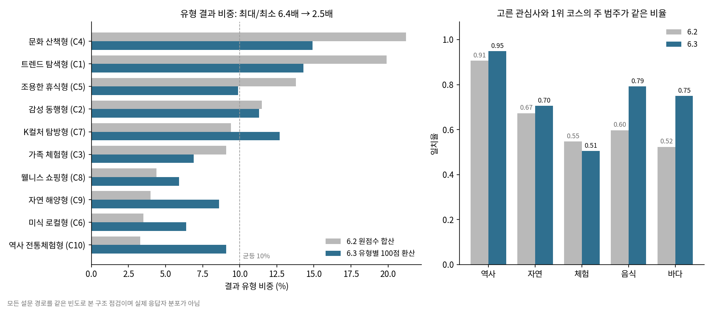

모든 설문 경로를 같은 빈도로 계산한 구조 점검입니다([그림 코드](docs/spec_assets/plot_survey_type_balance.py), 수치는 [검증 결과](verification/release_validation.json)의 `survey_6_3_recommendation_6_4_revision`). 6.2까지는 원점수를 그대로 더했는데, 유형마다 한 경로에서 받을 수 있는 최대 원점수가 9점(C9·C10)부터 18점(C1·C5)까지 달라 선택지에 자주 나오는 유형이 결과를 가져갔습니다(왼쪽 회색). 유형별 만점을 100점으로 맞추자 결과 비중이 고르게 퍼졌습니다(왼쪽 파랑). 자연 해양형(C9)은 4.0%에서 8.6%, 역사 전통체험형(C10)은 3.3%에서 9.1%가 됐습니다.

오른쪽은 고른 관심사와 1위 추천 코스의 주 범주가 같은 비율입니다(100점 환산을 적용한 229코스 기준). 음식(0.60 → 0.79)과 바다(0.52 → 0.75)가 크게 올랐습니다. 체험은 0.55에서 0.51로 조금 내렸습니다. 체험을 고르면 함께 오르는 C10이 역사 쪽 프로필이라, 만점이 작은 C10의 비중이 커지면서 역사 코스가 섞였기 때문입니다.

그림은 S4 한 가지 선택 시절(6.2·6.3) 비교입니다. 설문 6.4(S4 두 가지)에서는 최대 원점수가 두 선택 기준으로 바뀌어 결과 비중이 문화 산책형 13.8% ~ 가족 체험형 6.1%(비 2.26배)이고, 자연 해양형 11.3%, 역사 전통체험형 7.6%입니다. 바다를 고른 경로에서 C9가 결과에 포함되는 비율은 80.0%에서 56.7%로 내렸습니다. 함께 고른 다른 관심사가 점수를 나눠 가지기 때문입니다.

### 3. 관광지 군집 G: PCA 투영과 군집의 의미

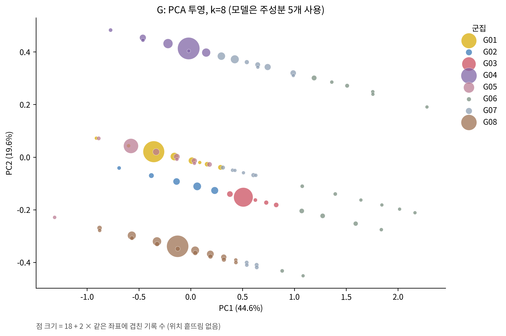

전국 관광지 3,109곳 중 숙박 569곳을 빼고 2,540곳을 군집했습니다(2026-09-29 맥도날드 9곳 제외). 특징은 범주(원핫), 기준 체류시간, 유네스코 표식입니다. PCA 5축이 분산의 99.4%를 담고, 탐색 범위 k=2~10에서 k=8이 선택됐습니다(실루엣 0.718).

- 위 그림은 첫 두 축(PC1 44.6%, PC2 19.6%)만 보여 줍니다. 점이 겹쳐 보여도 나머지 3개 축에서 나뉠 수 있습니다. 원 크기는 같은 좌표에 겹친 장소 수입니다.
- 장소마다 범주가 하나뿐이라 실루엣이 높게 나오기 쉽습니다. 이 값을 군집 품질이 뛰어나다는 뜻으로 읽지 마세요.

**군집이 뜻하는 것.** 특징이 범주와 체류시간뿐이라, 군집은 결국 "어떤 범주의 장소를 얼마나 오래 보느냐"로 나뉩니다. 음식·역사·바다는 체류시간 폭이 좁아 각각 한 군집(G01·G08·G05)이고, 체험과 자연만 짧은 방문(G02·G04, 70분 이하)과 긴 방문(G03 80~120분, G07 80~150분)으로 갈립니다. 음식·역사·바다도 100분 안팎을 넘으면 G07로, 150분 이상은 범주와 상관없이 G06으로 묶입니다.

| 군집 | 구성 | 체류시간 | 이런 곳 |
|---|---|---|---|
| G01 | 음식 450곳 | 50분(30~90). 79%가 50분 | 시장·먹자골목·이름난 식당. 인사동, 동성로, 경주중앙시장, 거제 고현시장, 삼진어묵 영도 본점 |
| G02 | 체험 118곳 | 60분(30~70) | 한 시간 안에 둘러보는 체험 장소. 미술관, 전망 다리, 산책 명소. 클레이아크김해미술관, 세빛섬, 저도 콰이강의다리, 하동 스카이워크 |
| G03 | 체험 326곳 | 90분(80~120). 88%가 90분 | 한 시간 반 안팎 머무는 체험 장소. 테마파크, 리조트, 문화단지, 잔도. 이월드, 알펜시아, 청풍문화유산단지, 단양강잔도 |
| G04 | 자연 523곳 | 60분(30~70) | 한 시간 정도 걷는 공원·오름·숲길·휴양림. 용눈이오름, 하동 송림공원, 국립아세안자연휴양림. 유네스코 표식은 계림·서출지·궁남지 3곳 |
| G05 | 바다 247곳 + 역사 2곳 | 40분(20~80). 66%가 40분 | 잠깐 들르는 항구·해변·전망대. 다대포해수욕장, 삼천포항, 바람의 언덕, 청사포 다릿돌전망대. 서천·신안·보성 벌교 갯벌은 유네스코 표식 |
| G06 | 체험 30 · 자연 23 · 바다 10 · 역사 4곳 | 180분(150~480) | 반나절 이상 머무는 곳. 범주가 아니라 체류시간이 묶은 유일한 군집. 놀이공원·워터파크(잠실 롯데월드 어드벤처, 캐리비안베이, 통도환타지아), 산행(금정산성, 신불산 억새평원, 한라산 어리목·성판악), 섬(지심도, 거문도·백도, 흑산도, 차귀도) |
| G07 | 자연 148 · 역사 16 · 음식 10 · 바다 9곳 | 100분(80~150) | 두 시간 안팎 머무는 자연 중심 장소. 산·목장·식물원·계곡(화왕산, 대관령 삼양목장, 여미지식물원, 지리산 뱀사골)에 오래 둘러보는 역사 유산(수원화성, 안동하회마을, 해인사, 남한산성)이 섞임. 유네스코 표식 4.9% |
| G08 | 역사 624곳 | 60분(30~100). 61%가 60분 | 사찰·왕릉·읍성·박물관·성지. 불국사, 대릉원, 첨성대, 회암사지, 미륵사지. 유네스코 표식 비율 8.3%로 가장 높음 |

- 군집 번호는 실행마다 새로 매기며, 특징 조합이 86가지뿐이라 입력이 조금만 바뀌어도 군집 수가 달라질 수 있습니다([군집 모델 재점검](docs/MODEL_RECHECK_2026-09-30.md)). 표의 "어떤 범주를 얼마나 오래"라는 구조는 그대로이고, 번호와 경계만 옮겨 갑니다.
- 군집은 장소의 공급 특성을 요약하는 설명용입니다. 추천 점수는 군집 번호를 쓰지 않습니다.

### 4. 관광지 군집별 규모와 체류시간

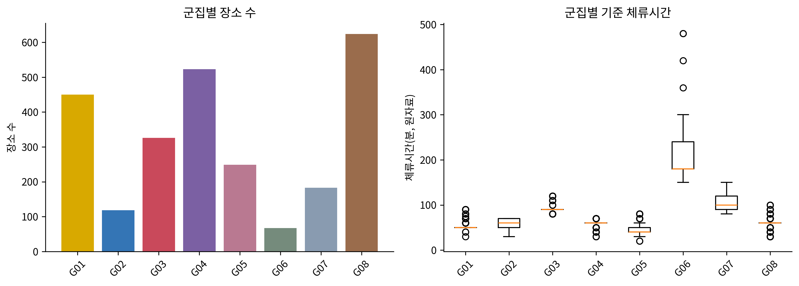

가장 큰 군집은 역사 G08(624곳), 자연 G04(523곳), 음식 G01(450곳)입니다. 체류시간(오른쪽)은 대부분 40~100분에 모이고, 150분 이상인 G06(67곳)만 따로 떨어져 있습니다.

### 5. 관광지 군집의 위치

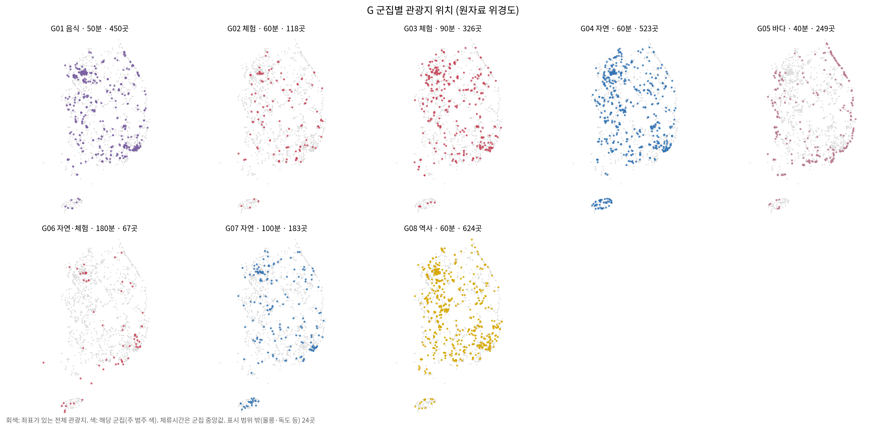

군집마다 작은 지도 한 장을 그렸습니다. 회색은 좌표가 있는 전체 관광지, 색 점은 해당 군집이고 색은 주 범주입니다(3절 표의 구성 열과 같은 범주). 제목에는 주 범주, 체류시간 중앙값, 관광지 수를 적었습니다. 울릉·독도 등 24곳은 지도 범위 밖입니다.

- G 군집은 위치를 쓰지 않고 범주·체류시간·유네스코 표식만으로 만들었습니다. 그래서 거의 모든 군집이 전국에 퍼져 있고, 지도는 결과를 확인하는 용도입니다. 군집은 "어느 지역"이 아니라 "어떤 성격의 장소"를 나눕니다.
- 바다 G05(40분, 249곳)는 해안선을 따라 놓입니다. 부산·거제·여수·울릉에 많고, 수도권 비중이 10%로 가장 낮습니다.
- 음식 G01은 도시에 몰립니다. 수도권 비중이 28%로 전체(23%)보다 높고 서울 61곳, 부산 49곳입니다.
- 체류가 긴 G06(180분)과 G07(100분)은 제주 비중이 12%로, 전체 평균 4.5%보다 높습니다.
- 역사 G08(60분)은 서울(52곳)·경주(27곳)·공주(18곳)를 비롯해 114개 지역에 넓게 퍼져 있습니다.
- 좌표는 원자료의 위경도를 그대로 썼고 주소 검증을 거치지 않았습니다.

### 6. 시티투어 코스 정제와 장소 연결

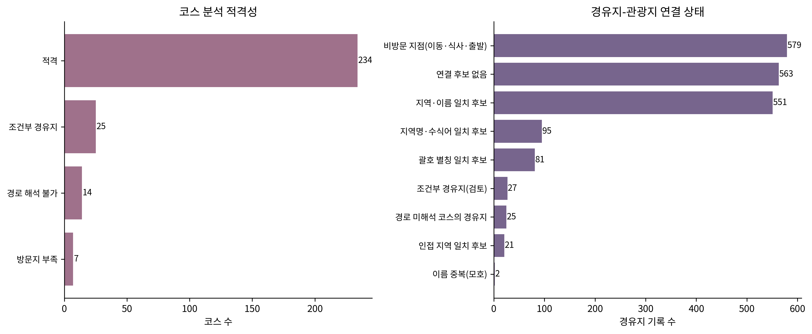

시티투어 280코스 중 234코스가 분석 조건을 통과했습니다. 조건은 방문 후보 2곳 이상, 범주 분류 커버리지 0.5 이상, 경로 해석 가능, 조건부 경유지 없음입니다. 탈락 46코스는 조건부 경유지 25, 경로 해석 불가 14, 방문지 부족 7입니다.

2026-09-29에 제공된 원문 안에서 코스 해석(179 → 229코스), 경유지–관광지 연결(229 → 223코스), 경유지 범주 분류(223 → 234코스)를 차례로 다시 점검했습니다. 규칙은 명세서 22장, 단계별 변화는 [이관 기록](docs/RELEASE_NOTES.md)에 있습니다. 현재 규칙은 다음과 같습니다.

**경유지 나누기와 방문지 판정**

- "/"·쉼표·&·"및"으로 나열된 경유지는 함께 방문하는 곳으로 보고 나눕니다. KT&G 같은 영문 이름과 "김좌진·한용운 생가"처럼 가운뎃점이 이름 안에 쓰인 경우는 나누지 않습니다. 괄호 안에 적힌 경로도 읽습니다.
- "또는·선택·계절별·or·(택1)"과 "(봄·가을)" 같은 표시만 조건부 경유지로 봅니다. 이름 속 글자(율봄식물원의 "봄", 안성맞춤박물관의 "맞춤")는 조건으로 오인하지 않습니다.
- 역·터미널·정류장·호텔·공항·시청·주차장·"○○앞", 식사 지점("(중식)" 포함), 숙박 시설, 원문 잔여 표기("<6", "안동역 19:20")는 방문지가 아닌 이동·식사 지점으로 둡니다(579건). 관광지 목록에 있는 곳이 출발·도착이나 "(하차)" 지점이면 방문지로 한 번 셉니다.

**관광지 연결** — 방문 경유지 1,340건 중 748건(56%)에 관광지 후보가 연결됐습니다.

- 이름 일치 551건, 괄호 별칭 81건.
- 지역명·수식어가 붙은 이름 95건: 국제시장 ↔ "부산 국제시장", 동화사 ↔ "팔공산 동화사"처럼 그 지역 안에서 하나뿐일 때 연결합니다.
- 인접 지역 21건: 대전 코스의 공산성(공주)·부소산성(부여)처럼 이름이 전국에서 하나이고 코스 지역 중심에서 30km 안일 때 연결합니다. 30~50km는 같은 코스에 그 지역 관광지가 둘 이상일 때만 연결하므로 홍성 죽도 ↔ 울릉 죽도 같은 동명이인은 연결하지 않습니다. 코스 지역 중심은 관광지 좌표의 평균이어서, 2026-09-29 서울 맥도날드 6곳이 빠지며 중심이 옮겨 가 서울 EG투어버스 H코스의 화성행궁이 이 조건을 벗어났습니다(범주는 키워드로 같게 정해져 코스 점수는 그대로).
- 연결 후보가 없는 경유지는 563건이고, 지역 안에 같은 이름이 둘 이상인 2건(해운대, 산수유마을)은 연결하지 않습니다. 연결은 모두 **후보**이며 사람이 확인한 연결은 아직 0건입니다.

**범주 분류**

- 연결된 경유지는 관광지 범주를, 나머지는 이름의 키워드(현충원·가옥·식물원·산책·전시관·광장·장터·먹자골목·선착장 등)를 씁니다.
- 키워드로도 정할 수 없으면 괄호 속 설명("대청호(대청댐물문화관)" → 자연), 같은 지역 관광지 목록 후보의 공통 범주(둔병 → 바다), 근거를 적은 검토표 [`analysis/stop_category_review.csv`](analysis/stop_category_review.csv)(30행) 순서로 봅니다. 검토표에서 근거를 확인할 수 없는 7개 이름(부계면·볕뉘·목화당1944 등)은 미확인으로 남겼습니다.
- 그 결과 범주 미확인 방문 경유지는 285건에서 8건(조건부 27건 별도)으로 줄었고, 적격 코스의 평균 분류율은 0.84에서 0.99가 됐습니다. 비중 0.3 이상 코스는 역사 102, 자연 116, 체험 81, 음식 24, 바다 22개입니다.

### 7. 코스 군집 T: 범주 구성


234코스를 일곱 가지 구성으로 나눴습니다. T01은 바다(0.58), T02는 체험(0.61), T04는 음식(0.29), T05는 자연(0.58), T07은 역사(0.74) 비중이 두드러집니다. T03(14코스)은 야경 코스이고, T06(43코스)은 평균 방문지가 8.5곳인 긴 혼합 코스입니다. 막대 위쪽 회색(범주 미확인)은 두 차례 재분류로 군집마다 2% 이하가 됐습니다.

2026-09-29 개정 전에는 방문지 수가 분산의 72%를 차지해서 군집이 "긴 코스 대 짧은 코스" 두 개로만 나뉘었습니다. 세 묶음의 흩어진 정도를 맞춘 뒤 가중치를 곱하도록 고쳐 설계대로 범주 구성이 군집을 가르게 됐습니다(명세서 22장). 평균 실루엣은 0.260으로 경계가 뚜렷하지 않으므로 T 군집은 탐색용 요약으로만 씁니다.

### 8. 코스 군집의 위치

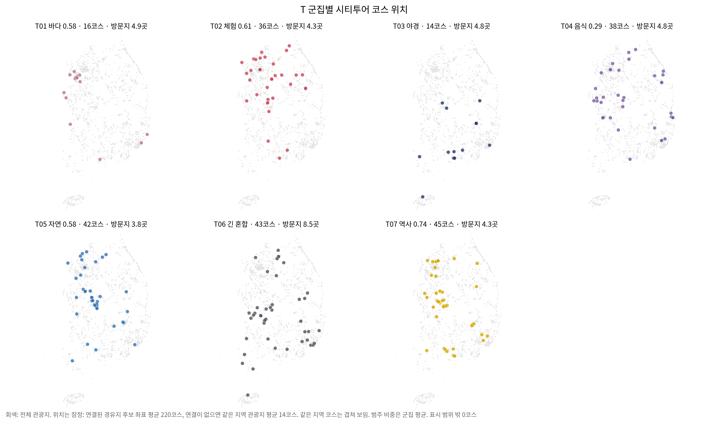

T 군집마다 적격 코스의 위치를 지도에 찍었습니다. 연한 회색은 전체 관광지로 국토 윤곽을 보여 주고, 색 점이 해당 군집의 코스입니다. 제목에는 주 범주와 그 비중(군집 평균), 코스 수, 평균 방문지 수를 적었습니다.

- 코스 위치는 코스에 연결된 경유지 후보 좌표의 평균(220코스)이고, 연결이 없으면 같은 지역 관광지 좌표의 평균(14코스)입니다. 확인된 연결이 아니므로 대략적인 위치로만 보세요. 같은 도시의 코스는 한 점에 겹칩니다.
- **바다 T01**(16코스)은 안산(5)·시흥·인천·태안 등 서해안에 모여 있습니다.
- **야경 T03**(14코스)은 여수(3)·대구(2)와 부산·광양·목포·제주 같은 항구 도시에 있습니다.
- **자연 T05**(42코스)는 대전(10)·세종(5)·아산 등 중부권에 많습니다.
- **역사 T07**(45코스)은 23개 지역에 퍼져 있고, 양주(6)·대전(6)·공주(4)가 많습니다.
- **음식 T04**(38코스, 24개 지역)는 포항·서천(각 4)·양산이, **체험 T02**(36코스, 24개 지역)는 서울(5)·인천·세종이 많습니다. **긴 혼합 T06**(43코스)은 27개 지역에 퍼져 있습니다.
- 지도는 어느 도시가 시티투어를 많이 운영하는지도 함께 보여 줍니다. 대전(23코스)처럼 코스가 많은 도시는 여러 군집에 걸쳐 나타나므로, 점의 밀도를 관광 수요로 읽지 마세요.

### 9. 기존 T와 코사인 TC 비교

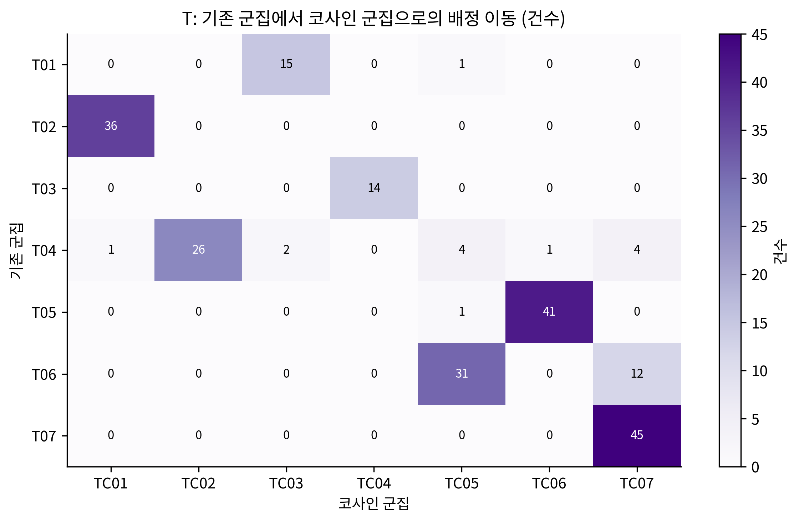

행은 기존 PCA 군집(T), 열은 구면 코사인 군집(TC)입니다. 두 모델 모두 7군집이고 대부분 대응합니다. 체험 T02는 36코스 모두 TC01, 야경 T03은 TC04, 역사 T07은 TC07로 그대로 옮겨 가고, 바다 T01은 16코스 중 15코스가 TC03, 자연 T05는 42코스 중 41코스가 TC06에 남습니다. 음식 T04는 38코스 중 26코스가 음식 TC02에 남고 나머지 12코스는 긴 혼합(4)·역사(4)·바다(2)·체험·자연으로 흩어집니다. 긴 혼합 T06(43코스)은 31코스가 TC05에 남고 12코스는 역사 TC07로 갑니다(기존 대비 ARI 0.749).

### 10. 기존 군집과 코사인 군집의 분리 정도


두 모델을 같은 거리로 평가했습니다. 코사인 거리(왼쪽)에서는 G가 0.788에서 0.826으로, T가 0.419에서 0.453으로 코사인 군집이 더 잘 나뉩니다. 유클리드 거리(오른쪽)에서는 기존 군집이 약간 높습니다. 평가 거리마다 유리한 모델이 다르므로, 한쪽 수치만으로 어느 모델이 낫다고 판단하지 않습니다.

### 11. 코사인 군집의 위치 (GC·TC)

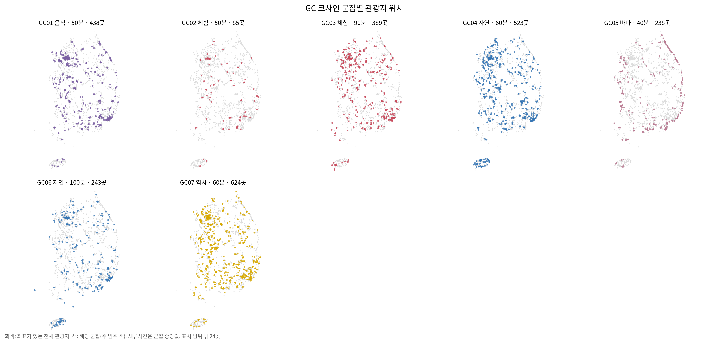

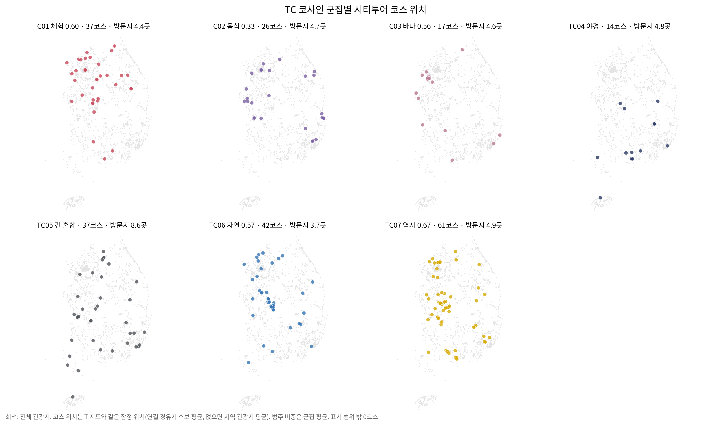

구면 코사인 군집(GC·TC)을 5절·8절과 같은 방식으로 지도에 찍었습니다. 제목과 색 규칙도 같습니다(주 범주, 체류시간 중앙값 또는 방문지 수, 개수). 관광지는 원자료 좌표, 코스는 T 지도와 같은 잠정 위치입니다.

- **GC는 기존 G와 큰 틀이 같습니다**(기존 대비 ARI 0.951). 체험 GC02(50분, 85곳)·자연 GC04·역사 GC07은 G와 같은 장소로 이루어져 지도도 같고, 음식 GC01(438곳)·바다 GC05(238곳)도 거의 그대로입니다.
- **긴 체류 혼합 G06(180분)이 사라집니다.** 67곳 중 37곳이 GC06(100분, 243곳)으로, 30곳이 90분 체험 GC03(389곳)으로 갑니다. GC06은 G07 전체와 음식 12곳·바다 11곳을 더해 자연 70%에 바다·음식·역사가 섞인 오래 머무는 장소이고, 제주(24곳) 비중이 10%입니다.
- **체험의 경계가 옮겨 갑니다.** G02(118곳) 중 33곳이 GC03으로 가서, 짧은 체험 GC02는 50분 85곳만 남습니다.
- **역사는 한 군집입니다.** 삭제 전 스냅숏에서는 유네스코 표식 비율로 역사가 둘로 나뉘었지만(k=10), 지금은 k=7이 선택되어 역사 624곳이 GC07 하나로 묶입니다. k=7~10의 실루엣 차이가 0.01 안팎이라 입력이 조금만 바뀌어도 선택되는 k가 달라질 수 있습니다.
- **TC는 T와 대부분 같습니다.** 체험 TC01·바다 TC03·야경 TC04·자연 TC06은 T의 해당 군집과 거의 같은 지도입니다. 역사 TC07(61코스)은 T07에 긴 혼합 코스 12개가 더해져 29개 지역으로 넓어지고, 대전(9)·양주(6)·공주(4)가 많습니다. 음식 TC02(26코스)는 포항(4)·양산·서울 등 16개 지역에 퍼져 있습니다.
- 코사인 군집도 위치를 쓰지 않고 만든 결과입니다. 지도는 두 모델의 차이를 장소 수준에서 확인하는 용도입니다.

### 12. 코스 점수가 만들어지는 방식


코스의 범주 적합 점수 `100 × cosine(선호, 코스 범주 비중) × 커버리지`를 범주별 기여로 나눠 보여 줍니다(노트북의 직접 선호 시연이라 관심사·야경·속도 가산은 없습니다). 이 그림은 역사를 강하게 선호하는 **가상 응답**(`DEMO_CULTURE`)의 예입니다. 공동 1위인 세종 천안연계투어와 양산 역사문화코스(98.0점)는 그중 약 70점이 역사에서 옵니다. 실제 서비스에서도 이렇게 "왜 이 코스인지"를 범주별로 설명할 수 있습니다.

### 13. 해양 관광: 월별 추이와 지역별 분포


2025년 9월부터 2026년 8월까지 행정구역당 평균 방문자 추정치입니다. 연안 도시가 늘 가장 많고 연안 어촌이 가장 적습니다. 모든 집단이 10월과 5월에 오르고, 연안은 여름(7~8월)에 다시 크게 늡니다.


시도와 연안 구분별 읍면동 방문자 추정치의 중앙값(백만 명)입니다. 부산(8.81)과 제주(7.13)의 연안 어촌이 가장 높습니다. N/A는 해당 구분의 지역이 없다는 뜻입니다. 해양 자료는 설명용이며 추천 가산점(0)이나 체류 배율(1)에는 반영하지 않습니다.

### 14. 지역 지출과 관광 공급의 관계


111개 지역의 내국인 지출 비중을 관광 공급 특징으로 설명한 Ridge 회귀입니다. 관광지 수가 많을수록 지출 비중이 크고(+0.47), 바다 비중이 클수록 작습니다(−0.26). 다만 교차검증 로그 R²가 0.13으로 설명력이 낮고, 계수는 인과가 아닌 연관입니다.

### 15. 지역별 방문자 연령·성별 구성 R


90개 지역을 방문자 연령·성별 구성비로 두 군집으로 나눴습니다(실루엣 0.317). R01(40지역)은 50·60대 비중이 높고, R02(50지역)는 20·30대 비중이 높습니다. 성별 구성은 두 군집 모두 남성 약 61~62%로 비슷합니다. 연령과 성별은 각각의 구성비이며, "30대 여성"처럼 교차한 비율이 아닙니다.

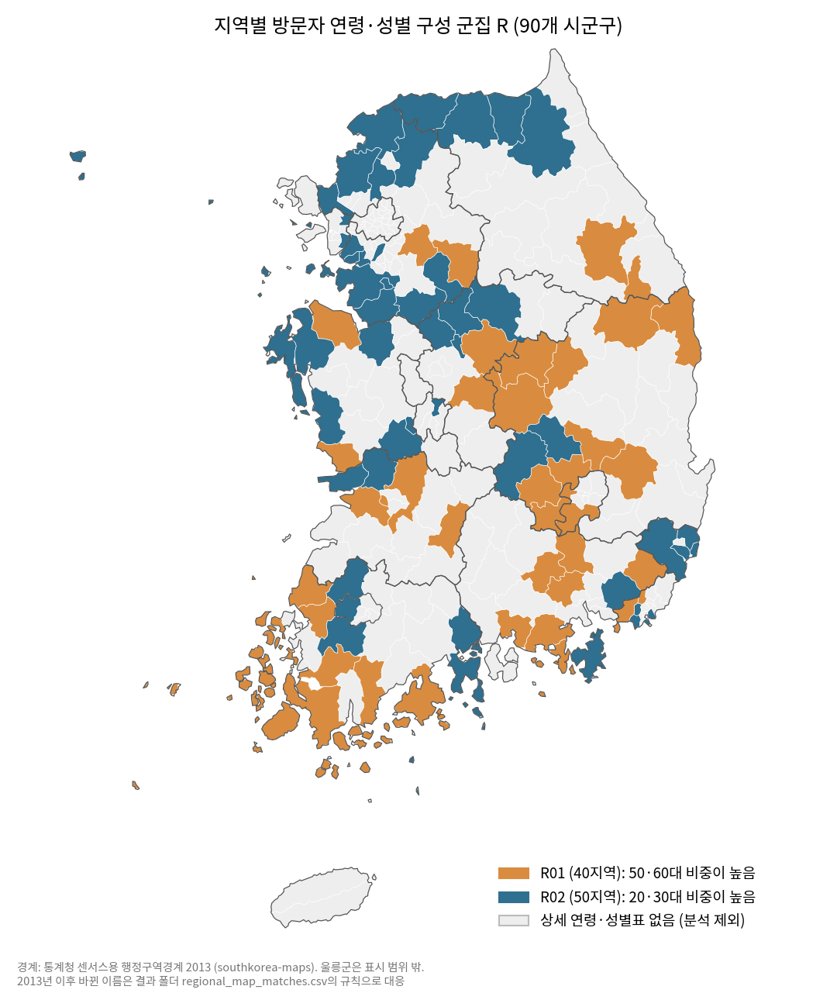

같은 군집을 시군구 지도에 칠했습니다. 방문자 중 50·60대가 R01은 평균 44.9%, R02는 38.7%이고, 20·30대는 R01 25.3%, R02 32.4%입니다.

- **R02(20·30대가 많은 곳)**는 수도권·울산·충청권에 모여 있습니다. 경기 15곳 중 13곳, 인천 3곳, 울산 4곳, 대전 1곳이 모두 R02이고, 충남도 8곳 중 6곳입니다.
- **R01(50·60대가 많은 곳)**은 영남 내륙과 남해안에 모여 있습니다. 경북 11곳 중 9곳(문경·상주·봉화·울진 등), 경남 9곳 중 7곳(통영·사천·고성 등), 대구 2곳(달성·군위)입니다. 전남 서남해안의 군 지역(해남·완도·진도·신안·고흥 등 9곳)도 R01입니다.
- 회색은 원자료에 상세 연령·성별표가 없거나(136지역) 값 검사에서 보류된(인천 4지역) 곳입니다. 서울·제주에는 분석한 지역이 없습니다. 상세표는 남성 비중 상위 목록에서 뽑힌 지역이라 전국을 대표하는 표본이 아닙니다.
- 이 군집은 지역 방문자 구성의 설명용이며 추천 점수에 군집 번호를 더하지 않습니다.

경계는 통계청 센서스용 행정구역경계(2013)를 공개한 [southkorea-maps](https://github.com/southkorea/southkorea-maps)에서 받아 방향 참고용으로만 씁니다. 경계 파일은 저장소에 넣지 않고, [지도 코드](demographic_upgrade/plot_regional_map.py)가 고정된 커밋에서 받아 SHA-256을 확인합니다. 2013년 이후 바뀐 이름(강원·전북 특별자치도, 전남광주통합특별시, 2023년 대구로 옮긴 군위군, 구로 나뉜 안산시)은 [대응표](demographic_upgrade/results/regional_map_matches.csv)에 규칙을 남겼습니다.

## 실행 방법

### 최신 설문 점수와 추천

Python 3.10 이상 표준 라이브러리만 필요합니다. 저장소 최상위에서 실행하세요. 설문 엔진과 문항 설정은 `survey/implementation`에 한 부만 있고, `reference_calc`의 추천 코드가 이를 불러 씁니다.

```bash
python survey/implementation/score_survey.py reference_calc/demo_answers.json
python reference_calc/recommend_reference.py reference_calc/demo_answers.json
python reference_calc/verify_reference.py
```

입력은 S1~S6(S4는 서로 다른 두 값의 목록, 예: `["C", "D"]`)와, 두 관심사에 해당하는 B 문항 1~2개입니다. F1이 필요한 경우에만 후보 C 코드 또는 `BALANCED`를 입력합니다. B1~B7의 **D = 없음**은 모든 유형에 0점을 더하고 기존 점수를 유지합니다. 예제 응답은 가상 데이터입니다.

- 유형: 원점수 → 유형별 100점 환산 → 12점 이내 접전이면 F1(+20) → 12점 이내 유형을 최종 후보로 유지. 자세한 규칙은 [설문지 구성과 판정 로직](#설문지-구성과-판정-로직).
- 100점 환산 이유: 원점수를 그대로 더하면 선택지에 자주 나오는 유형이 유리해 결과가 몰렸습니다(전수 경로 기준 문화 산책형 21.2% 대 자연 해양형 4.0%). 환산 후 14.9% 대 8.6%이고, 가장 많은 유형과 가장 적은 유형의 비가 6.4배에서 2.5배로 줄었습니다. 설문 6.4(S4 두 가지)의 완료 경로 1,756,396개에서는 가장 많은 문화 산책형 13.8%, 가장 적은 가족 체험형 6.1%로 비가 2.26배입니다. 고른 관심사와 1위 코스의 주 범주가 같은 비율은 역사 0.72, 자연 0.52, 체험 0.34, 음식 0.60, 바다 0.36이고, 두 관심사 중 하나와 같은 비율은 0.66입니다. 1위 코스는 한 관심사에만 맞출 수 있어 한 가지만 고르던 6.3(역사 0.91, 자연 0.69, 체험 0.55, 음식 0.81, 바다 0.69)보다 낮습니다. 대신 지역 대표 5개에는 두 관심사가 모든 경로에서 함께 들어갑니다(개정 단계별 수치는 이관 기록). 바다 비중 0.3 이상 코스는 22개로 여전히 적습니다. 모든 선택지가 같은 빈도라고 가정한 구조 점검이며, 실제 응답자 분포에 맞춘 조정은 파일럿 응답이 필요합니다.
- 선호 벡터: 후보의 기존 5범주 프로필을 점수 차이에 따른 가중치로 합성. `q_source=type_profile_prior`이며 개인 선호 실측값이 아님.
- 테마: `100 × (프로필 적합도 + 0.5 × 관심사 항) / 1.5`로 정렬. 관심사 항은 두 관심사 중 자료가 있는 것의 평균이며, 둘 다 자료가 없으면(촬영지·공연·쇼핑 뷰티 스파) 0입니다.
- 시티투어: 범주 적합 `fit = cosine(선호 벡터, 코스 범주 비중) × 분류 커버리지`에 응답별 가산을 더해 `100 × (fit + Σ w·b) / (1 + Σ w)`로 정렬하고 지역명별 첫 코스를 최대 5개 선택. 이때 관심사(자료가 있는 것)마다 그 범주가 가장 큰 코스(동률이면 모두 해당, 야경은 야경 코스) 중 가장 높은 코스를 먼저 한 자리씩 채우고, 남은 자리는 순위대로 채운 뒤 순위 순서로 보여 줍니다. 가산은 적용되는 항만 분모에 넣으므로 점수는 늘 0~100입니다.
  - 관심사(w=0.5): 두 관심사 중 자료가 있는 것의 평균. 역사·자연·체험·음식·바다는 그 범주 비중, 야경은 코스 야경 표식. 둘 다 자료가 없으면 이 항을 넣지 않습니다.
  - 야경(w=0.1): S6가 "저녁·밤까지"이고 S4에 야경이 없으면 코스 야경 표식.
  - 여행 속도(w=0.1): S3 "빡빡하게"는 방문지가 많은 코스, "천천히"는 적은 코스에 가산(3곳 이하 0 ~ 8곳 이상 1).
- 테마 점수와 코스 점수는 합산하지 않으며, 군집 번호를 추천의 강제 필터로 사용하지 않음.
- 신규 기본 흐름의 지역·한류·연령·성별 별도 가산은 0. 관련 분석 데이터를 자동 가산으로 해석하지 않음.

`reference_calc/eligible_courses.csv`는 적격 234코스 스냅숏입니다. 새 CSV를 학습해도 이 파일은 자동 교체되지 않습니다. 최신 분석 결과와 출처를 검토한 후 갱신해야 합니다.

### CSV부터 분석 재실행

```bash
python -m pip install -r analysis/requirements.txt
python analysis/run_analysis.py
```

Jupyter에서는 `analysis` 폴더에서 [Tour_Navigator_Integrated.ipynb](analysis/Tour_Navigator_Integrated.ipynb)를 열고 **Restart Kernel → Run All** 하세요. Jupyter는 별도 설치합니다. 결과는 `analysis/outputs_cosine/run_실행시각/`의 `tables`, `plots`, `models`에 저장되며 기존 스냅숏을 덮어쓰지 않습니다.

현재 스냅숏은 Python 3.12와 [`analysis/requirements-tested.txt`](analysis/requirements-tested.txt)의 고정 버전으로 만들었습니다. 같은 환경에서 다시 실행하면 결과 CSV와 모델이 바이트 단위로 같게 나옵니다. 그림의 한글은 맑은 고딕, AppleGothic, Noto Sans CJK KR, 나눔고딕 순서로 먼저 찾은 글꼴로 그립니다. 한글 글꼴이 없으면 그림의 글자만 깨지고 수치 결과는 같습니다.

| 입력 | 위치 | 용도 |
|---|---|---|
| 전국 여행장소 | `analysis/tour-places.csv` | 범주·체류·유네스코 표식, G/GC 군집 |
| 지역 시티투어 | `analysis/citytour.csv` | 코스 정제·장소 연결·범주 비중, T/TC 군집 |
| 경유지 범주 검토표 | `analysis/stop_category_review.csv` | 이름만으로 범주를 정할 수 없는 경유지 30행의 범주와 근거 |
| 지역별 내국인 지출 비율 | `analysis/spending_csv/spend_region.csv` | 지역 관광공급과 지출의 설명 회귀 |
| 전국 해양관광 | `analysis/marine_csv/` | 전국 히트맵, 월별 추이, Top5, 검색순위 |
| 연령별 인기관광지 | `age_upgrade/data/raw/` | 연령 지표와 A 군집 |
| 지역 성별·연령별 방문자 구성비 | `demographic_upgrade/data/raw/` | 주변비율 지표와 R 군집 |
| 2026 해외한류실태조사 집계치 | `hallyu_preprocessed_csv/` | 전처리 CSV 8개, 통계값·설계계수·적용조건 |

한국관광공사 집중률 API(앱 홈 "지금 인기 관광지"가 쓰는 자료)에 나오는 관광지 가운데 장소 표에 없는 곳은 [`tools/add_popular_places.py`](tools/add_popular_places.py)로 `analysis/tour-places.csv`에 더할 수 있습니다. 기본(`--scope all`)은 장소 표의 124개 지역 전부를 대상으로, 장소(숙박 제외)가 있는 시군구 211곳([`analysis/place_signgu.json`](analysis/place_signgu.json)의 법정동 코드, 앱 `signgu.json`과 같음)의 집중률을 받아 지역마다 상위 10곳을 후보로 삼습니다. `--scope home`은 앱 홈 칩 10개 도시(서울·부산·제주·경주·강릉·전주·인천·속초·대구·춘천)만 앱과 같은 시군구 선택으로 봅니다. 후보는 같은 지역 장소와 이름(점수 2 이상)·위치(관광정보 좌표 250m 안)로 맞춰 보고 남는 곳만 `pop<관광정보 contentid>` id의 새 행으로 만듭니다(앱 `scripts/add-popular-places.mjs`가 만드는 추가 장소와 같은 id)(범주는 관광정보 분류, 추천 체류는 그 범주의 기존 중앙값, 출처에 관광정보 contentid, 시군구 코드는 `place_signgu.json`에 추가). 기본은 후보 판정표와 새 행 CSV만 `analysis/popular_added/`에 쓰고, `--apply`를 주어야 장소 표에 붙입니다. 인증키는 환경변수 `DATA_GO_KR_KEY`로만 받습니다. 붙인 뒤에는 분석을 다시 실행해야 군집과 코스 연결에 반영됩니다. 점검은 `python -m unittest tools.test_add_popular_places`입니다.

관광지 오디오 가이드(오디) 해설이 있는 관광지는 [`tools/add_odii_places.py`](tools/add_odii_places.py)로 더합니다. 오디 한국어 관광지 목록(`Odii/themeBasedList`) 전부를 받아 주소로 지역을 정하고(없으면 30km 안 가장 가까운 장소의 지역), 같은 지역 장소와 이름·위치로 맞춰 본 뒤 남는 곳만 새 행으로 만듭니다. 국문 관광정보에서 같은 이름·1km 안 항목을 찾으면 그 분류와 `pop<contentid>` id, 못 찾으면 이름 낱말 분류와 `odii<tid>` id입니다. 앱 `scripts/add-popular-places.mjs --source odii`와 같은 규칙입니다. 점검은 `python -m unittest tools.test_add_odii_places`입니다.

장소 표 전체의 좌표는 [`tools/verify_coords.py`](tools/verify_coords.py)로 한국관광공사 관광정보와 대조할 수 있습니다. 장소마다 이름으로 관광정보를 검색해 같은 시군구·이름 점수 2 이상인 항목의 좌표와 거리를 재고, 300m를 넘는 곳을 `analysis/coord_check/coord_fix_<날짜>.csv`에 모읍니다(좌표를 바꾸지는 않습니다). 점검은 `python -m unittest tools.test_verify_coords`입니다.

한국관광공사 관광지별 연관 관광지(「함께 많이 가는 관광지」, 장소 표의 `ro*` · `rs*` 행 1,509곳이 처음 들어온 자료)는 [`tools/add_related_places.py`](tools/add_related_places.py)로 전수 재조사합니다(`python -m tools.add_related_places --apply`). 장소가 있는 시군구 전부마다 시군구 전체 연관 관광지 목록(`TarRlteTarService1/areaBasedList1`, 기준월 2개월 전)을 받아 연관 관광지로 나오는 모든 곳을 시군구 · 이름으로 모으고(연계 수 · 최고 순위 · 기준 관광지, 주차장 · 화장실 · 전국 체인 브랜드 제외), 같은 지역 장소와 이름 · 위치로 맞춰 본 뒤 남는 곳을 국문 관광정보 좌표로 새 행(`pop<contentid>`, 숙박은 `stay`)으로 만듭니다. 관광정보에 없는 곳은 좌표가 없어 후보 표(`analysis/related_added/related_candidates_<날짜>.csv`)에 「못 찾음」으로만 남습니다. 앱 `scripts/add-popular-places.mjs --source related`와 같은 규칙 · 같은 id입니다. 점검은 `python -m unittest tools.test_add_related_places`입니다. 인증키가 없는 환경에서 미리 뽑아 둔 참고표 [`analysis/related_added/related_mentioned_missing_2026-10-03.csv`](analysis/related_added/related_mentioned_missing_2026-10-03.csv)는 기존 연관 관광지 행의 설명(「A, B 등과 함께 많이 찾는 곳」)에 이름이 나오지만 장소 표에 없는 842곳(지역 · 언급 수 · 언급한 장소)입니다.

인증키가 없는 환경에서 사람이 좌표를 적은 장소는 [`tools/add_manual_places.py`](tools/add_manual_places.py)로 더합니다(`python -m tools.add_manual_places --apply`). 입력은 [`analysis/citytour_manual_places.csv`](analysis/citytour_manual_places.csv)(시티투어 280노선의 경유지 중 앱 장소와 맞지 않는 곳을 사람이 고르고 좌표·범주·설명을 적은 표, 앱 `scripts/data/citytour-manual-places.csv`와 같은 파일)입니다. id는 `ctm<sha1(지역|이름) 앞 8자리>`라 다시 돌려도 같은 곳을 두 번 넣지 않고, 기존 장소와 250m 안(또는 1km 안에서 이름이 절반 넘게 겹침)이면 넣지 않습니다. 출처에 「좌표 수기 입력(지도 검증 필요)」을 적어 두었으니 인증키가 있는 곳에서 `tools/verify_coords.py`로 관광정보 좌표와 대조하는 것이 좋습니다. 2026-10-03에 시티투어 표 124행 중 기존 장소와 겹치는 27곳을 빼고 97곳, 연관 관광지 표 [`analysis/related_manual_places.csv`](analysis/related_manual_places.csv)(기존 연관 관광지 행의 설명에 이름이 나오지만 장소 표에 없던 842곳 가운데 언급 2회 이상이고 웹 검색으로 소속 시군을 확인한 67곳) 중 63곳, 혼잡도(집중률) 관광지와 같은 명단인 데이터랩 인기 관광지 연령대별 순위([`age_upgrade/data/raw`](age_upgrade/data/raw/))에서 앱에 없던 7곳([`analysis/crowd_manual_places.csv`](analysis/crowd_manual_places.csv): 삽교호관광지 · 동탄호수공원 · 헌인릉 · 국립과천과학관 · 비발디파크 오션월드 · 궁평항 · 대명포구)을 붙였습니다(3,109 → 3,276행. 앱 `added-places.json`과 같은 167곳. `source` 열은 출처 앞 문구를 바꿉니다. `nearOk=1` 열은 기존 장소 250m 안이어도 사람이 다른 곳으로 확인한 이웃 장소라 넣습니다. 서울 출발 EG투어버스가 들르는 김포 · 부천 · 광명은 장소가 없던 지역이라 권역은 전국으로 둡니다). 분석 결과(군집·코스 연결)는 3,109행 기준 그대로이며, 새 장소를 반영하려면 분석을 다시 실행해야 합니다. 점검은 `python -m unittest tools.test_add_manual_places`입니다.

같은 장소가 두 번 들어간 쌍은 [`tools/merge_same_places.py`](tools/merge_same_places.py)로 하나로 합칩니다(`python -m tools.merge_same_places --apply`). 입력은 [`analysis/same_places.csv`](analysis/same_places.csv)(keep · drop · reason, 앱 `scripts/data/same-places.csv`와 같은 파일)입니다. 2026-10-03 전수 점검(같은 지역 · 같은 이름, 좌표 60m 안, 이름이 서로를 품고 1km 안의 쌍을 눈으로 확인)으로 65쌍을 합쳤습니다: 수기 장소가 기존 장소와 같은 이름이던 5쌍(구봉산전망대카페거리 · 마량리동백나무숲 · 유구색동수국정원 · 상주 자전거박물관 · 여수해양공원 = 종포해양공원), 앱 전용 화면 묶음과 전국 목록에 함께 있던 14쌍(서울숲 · 장릉 · 감은사지 · BIFF광장 · 서울스카이 …), 전국 목록 안의 같은 장소 46쌍(전등사 · 강화 전등사, 노동당사 · 철원 노동당사, 황남빵 · 황남빵 본점, 무령왕릉 · 무령왕릉과 왕릉원 …). drop 행은 지우고 keep 행의 빈 칸(中文 · 日本語 · 유네스코 · 지정구역 · 설명 · 링크)은 drop 값으로 채웁니다(3,276 → 3,211행, 앱 장소 3,049 + 162와 같음). 지운 id → 남긴 id 표는 [`analysis/place_aliases.csv`](analysis/place_aliases.csv)이며, 분석 결과 · 교차표에 남은 옛 id는 이 표로 읽습니다(`age_upgrade/data/datalab_place_crosswalk.csv`의 광안리해수욕장 `ro4` → `bc4`, 월정사 `ro31` → `nax521`은 바꿨습니다). 분석 결과(군집 · 코스 연결 · 연령 점수)는 3,109행 기준 그대로이며, 다시 실행해야 반영됩니다. 점검은 `python -m unittest tools.test_merge_same_places`입니다.

사용자가 요청한 장소는 [`analysis/user_manual_places.csv`](analysis/user_manual_places.csv)(앱 `scripts/data/user-manual-places.csv`와 같은 파일, 출처 「사용자 요청(날짜)」)에 적어 같은 도구로 붙입니다. 2026-10-04에 속초 설악해맞이공원 · 쇠머리오름(우도봉) 2곳을 더했습니다(3,211 → 3,213행. 요청 중 이중섭 문화거리 · 1100고지습지는 `jdx57` · `jdx74`로 이미 있었습니다).

국보가 있는 장소는 [`analysis/national_treasure_places.csv`](analysis/national_treasure_places.csv)(앱 `scripts/data/national-treasure-places.csv`와 같은 파일)로 붙였습니다. 2026-10-04에 국보가 있는 장소 67곳(건축물 · 석탑 · 석불 · 비석이 있는 곳 + 유물형 국보를 가진 박물관)을 장소 표와 대조해 없던 26곳 · 바로 옆 장소만 있던 2곳 · 창녕 석탑 1곳 = 29곳을 더했습니다(3,213 → 3,242행). 국가유산청 목록에 접속할 수 없어 대조 목록은 수기로 정리했고, 좌표는 수기 입력 뒤 시군구 경계 폴리곤으로 확인했습니다.

같은 날 국가유산 기본정보(국보 369건, 엑셀)로 다시 대조했습니다. 유적건조물은 그 장소, 유물 · 기록유산은 관리자(소장처)를 같은 도시의 장소와 맞춰, 관광지에 있는 국보 330건이 모두 장소와 이어지도록 빠진 34곳을 [`analysis/national_treasure_places_2.csv`](analysis/national_treasure_places_2.csv)로 더했습니다(나머지 39건은 개인 · 도서관 · 연구기관 소장). 이때 도시 이름이 앞에 붙은 같은 장소 6쌍(부여 무량사 = 무량사, 공주 석장리박물관 = 석장리박물관 …)을 `same_places.csv`에 더해 합쳤습니다(3,242 → 3,236 → 3,270행).

보물(국가유산 기본정보 2,475건)도 같은 방식으로 대조해 장소 표에 없는 소재지 · 소장처 577곳을 [`analysis/treasure_sites.csv`](analysis/treasure_sites.csv)에 두고, 카카오 로컬 API(지오코딩)가 막힌 환경이라 소재지 주소로 수기 좌표를 적은 [`analysis/treasure_places.csv`](analysis/treasure_places.csv)(앱 `scripts/data/treasure-places.csv`와 같은 파일, 559행)를 `python -m tools.add_manual_places --csv analysis/treasure_places.csv --apply`로 붙였습니다(2026-10-04). 좌표는 시군구 경계 폴리곤 안에 드는지 확인했고, 면 · 마을 수준만 아는 곳은 출처에 「대략 위치」를 적었습니다. 관광지가 아닌 소장처(회사 · 문중 · 관청 · 연구소 · 대학 도서관, 주소가 시군 이름뿐인 곳) 14곳과 같은 향교 건물 · 같은 주소 중복 4곳은 빼고, 같은 경내 · 같은 유적(양동마을 고택, 동구릉 정자각 …) 46곳은 기존 장소로 건너뛰었습니다. 호텔 · 시장 · 옆 유적과 250m 안이라 걸린 40곳은 사람이 확인해 `nearOk=1`로 넣었습니다. 513곳이 늘어 3,270 → 3,783행입니다. 카카오 키가 있는 환경에서는 앱 `scripts/geocode-heritage-places.mjs`로 좌표를 다시 맞출 수 있습니다. 전국 수집 대상(`tools/add_popular_places.py targets_all`)은 한 시군구의 장소 수가 같으면 시군구가 적은 지역에 붙입니다(옥천 · 금산, 앱과 같은 규칙).

한국관광 100선 · 열린관광지는 공식 명단을 표로 두었습니다(2026-10-04 재점검). [`analysis/k100_list.csv`](analysis/k100_list.csv)는 2025~2026 한국관광 100선 100건과 각 건이 가리키는 장소 id(5대 고궁 · 에버랜드&한국민속촌처럼 묶인 건은 모두, 제주올레길은 길 전체라 없음, 장소 154곳), [`analysis/open_tourism_list.csv`](analysis/open_tourism_list.csv)는 열린관광지 2015~2026 선정 211건(장소 203곳)입니다. 앱은 이 표의 장소에만 배지를 겁니다(앱 `scripts/apply-badge-lists.mjs`). 옛 PoC 플래그(100선 98 · 열린관광지 99)는 지난 판이라 2023년 이후 선정지가 빠져 있었습니다. 명단에 있지만 장소 표에 없던 열린관광지 32곳은 [`analysis/open_tourism_places.csv`](analysis/open_tourism_places.csv)(수기 좌표, 시군구 경계 확인)로 붙였습니다(3,783 → 3,815행). 명단은 보도자료 · 지자체 발표 검색으로 모았고, 100선은 경기 남한산성 1건이 불확실하며, 열린관광지는 2026년 5곳 안팎을 찾지 못했습니다.

앱 홈 「지금 인기 관광지」 수기 목록([`analysis/popular_manual_places.csv`](analysis/popular_manual_places.csv), 앱 `scripts/data/popular-manual.csv`와 같은 파일)에 2026-10-04 대구 · 춘천 10곳씩을 더했습니다(8 → 10개 도시, 100행). 둘은 데이터랩 전국 30위 안에 없어 근거는 「수기(집중률 상위 상례)」이고 한국관광 100선(서문시장 · 사유원 · 남이섬)을 적었습니다.

인기 관광지(집중률 · 데이터랩 명단)와 장소 표의 연결은 세 층으로 관리합니다. ① 수기 대조표 [`analysis/popular_match.csv`](analysis/popular_match.csv)(도시 · 이름 · 장소 id, 앱 `src/lib/popular-match.ts`와 같은 짝): 이름 규칙으로 못 잇는 이름(팔각정북악스카이 → 북악스카이웨이 팔각정, 헌릉과 인릉 → 헌인릉, 롯데월드잠실점 → 잠실 롯데월드 어드벤처)을 적고 `tools/add_popular_places.py`가 규칙보다 먼저 봅니다(`read_match` · `match_by_name`). ② 이름 규칙(`name_score`, 앱과 같음). ③ 데이터랩 교차표 [`age_upgrade/data/datalab_place_crosswalk.csv`](age_upgrade/data/datalab_place_crosswalk.csv): 2026-10-04에 장소가 생긴 미연결 16행(킨텍스 · 삽교호관광지 · 동탄호수공원 · 헌릉과 인릉 · 궁평항 · 대명포구 · 연안부두 · 국립수목원 …)을 `name_manual_2026-10-04`로 채웠습니다(남은 미연결 8행은 영화관 · 골프장, 동음이의 2행은 그대로). 연령 분석 결과는 다시 실행해야 반영됩니다. 시군구 경계에 걸친 장소(1100고지 습지: 집중률은 제주시, 관광정보는 서귀포시)는 같은 시군구 관광정보가 없을 때 같은 시도의 이름 같은 관광정보 좌표 1km 안에서 이름도 맞는 기존 장소만 찾습니다(`pick_spot_item_loose` · `match_by_location_named`, 2026-10-04).


앱 홈 「지금 인기 관광지」가 인증키 없이 보이는 수기 목록은 [`analysis/popular_manual_places.csv`](analysis/popular_manual_places.csv)에 기록합니다(앱 `scripts/data/popular-manual.csv`와 같은 파일, 2026-10-03). 홈 칩 도시 8곳마다 장소 표의 관광지 10곳을 골라 순위를 적었고, 근거는 [`age_upgrade/data/raw/`](age_upgrade/data/raw/)의 한국관광 데이터랩 인기 관광지 순위(2025-09~2026-08)와 집중률 상위 상례입니다. 실시간 집중률 값이 아니라 순위만 있는 참고 목록이며, 인증키가 있는 서버에서는 실시간 목록이 우선합니다.
지출 **업종 분류 S/SC 및 업종·월별 지출 입력은 제거**했습니다. 지역 지출 회귀는 유지합니다. 해양 월별 방문자는 지출 월별 입력과 다른 자료입니다.

주 노트북의 직접 5범주 평점 CSV는 코사인 계산을 검증하는 별도 선택 입력이며 최신 분기 설문에 포함되지 않습니다. 파일이 없으면 `SYNTHETIC_DEMONSTRATION`으로 표시한 가상 응답 4개로 계산을 시연합니다.

분석 스냅숏: 장소 3,109행(2026-09-29 맥도날드 9곳 제외) 중 숙박 569행 제외 후 2,540행, 코스 280행 중 적격 234행, G 8군집·GC 7군집, T 7군집·TC 7군집. T는 범주 비중·방문 후보 수·야경 세 묶음의 분산을 맞춘 뒤 가중치 0.75·0.15·0.10을 적용합니다(명세서 22장). PCA 축은 학습된 성분이며 설문 유형과 다릅니다. 식·실루엣·ARI 해석은 통합 명세서를 참조하세요.

### 연령·성연령 및 기존 산식 비교

```bash
python age_upgrade/run_age_clustering.py
python demographic_upgrade/analyze_demographics.py
npm test --prefix tour_scoring
python run_session.py examples/full_session.json
```

코사인 관련 CSV(GC·TC 군집, 직접 선호 순위, 세션·추천 참조 점수)는 `python verification/audit_cosine_csvs.py`로 특징값에서 다시 계산해 대조할 수 있습니다(94개 항목, 결과는 `verification/cosine_csv_audit.json`).

마지막 두 명령과 `tour_scoring`, `survey_legacy`, `session_results`는 **기존 v1~v4 비교용**입니다. 최신 설문은 `reference_calc`를 사용합니다. `run_session.py`는 세션 입력에 `branchSurvey`(설문 6.4 응답)가 있으면 `reference_calc`의 추천도 실행해 `session_results/branch_survey_recommendation.json`에 나란히 저장합니다. 세 결과의 점수는 서로 더하지 않습니다. 성별·연령 구성비는 교차분포가 아닌 주변비율입니다. 한류 자료는 개인 응답 원자료가 아닌 집계 통계입니다.

체류·일정 코드는 `tour_scoring/src/scoring-v2.cjs`, `citytour.cjs`, `session.cjs`와 명세서에 있습니다. 신규 설문의 체류 연결은 명세에 포함되어 있으나 `reference_calc`에 일정 검증을 통합한 것은 아닙니다.

## 폴더 구조

| 폴더 | 역할 | 상태 |
|---|---|---|
| `reference_calc/` | 테마·시티투어 추천 계산, 적격 코스 스냅숏, 예제 결과, 유형별 시티투어 매칭 | 최신 |
| `survey/` | 분기 설문 6.4 문항, 설문지 Word·PNG, 설문 엔진(`implementation/`)과 전수 검증 | 최신 |
| `analysis/` | 입력 CSV, 주 분석 노트북·스크립트, 결과 스냅숏(`outputs_cosine/`) | 최신 |
| `docs/` | 통합 명세서 MD·Word, 입력 목록, 이관 기록 | 최신 |
| `age_upgrade/` | 연령별 인기관광지 A 군집 | 보조 분석 |
| `demographic_upgrade/` | 지역 성별·연령 구성 R 군집 | 보조 분석 |
| `hallyu_preprocessed_csv/` | 2026 해외한류실태조사 전처리 CSV | 보조 자료 |
| `tour_scoring/`, `survey_legacy/`, `session_results/`, `examples/`, `run_session.py` | 기존 v1~v4 산식과 세션 예제. 세션 실행기는 최신 설문 추천도 나란히 저장. 연령·지역 구성 분석이 만든 앱 데이터는 `tour_scoring/data`에 둠 | 비교용 |
| `verification/` | 실행 로그, 검증 결과, 전체 파일 SHA256 | 검증 기록 |
| `tools/` | 인기 관광지 추가(`add_popular_places.py`) · 오디 해설 관광지 추가(`add_odii_places.py`) · 연관 관광지 전수 재조사(`add_related_places.py`) · 수기 장소 추가(`add_manual_places.py`) · 같은 장소 통합(`merge_same_places.py`) · 좌표 대조(`verify_coords.py`) 도구와 점검 | 입력 갱신 |
| `archive/` | 이전 버전 안내 | 보관 |

## 해석할 때 주의할 점

- 군집 번호(G01, T03 등)는 실행마다 새로 매기는 번호입니다. 입력이나 전처리를 바꾸면 번호와 의미가 달라질 수 있습니다.
- 설문 유형 C1~C10은 규칙으로 만든 분류이고, G·T 군집은 데이터에서 묶은 집단입니다. 번호가 같아도 서로 대응하지 않습니다.
- 예제 응답과 노트북의 직접 선호 응답은 모두 가상 데이터입니다.
- 실루엣과 ARI는 군집이 얼마나 잘 나뉘고 안정적인지를 보여 줄 뿐, 추천 정확도나 이용자 만족도를 뜻하지 않습니다.
- 유형별 5범주 프로필은 기존 앱에서 이어받은 설계값이며 응답 데이터로 추정한 값이 아닙니다. 트렌드 탐색형(C1)과 K컬처 탐방형(C7), 감성 동행형(C2)과 웰니스 쇼핑형(C8)은 프로필의 코사인 유사도가 0.95·0.94여서 거의 같은 코스를 추천받습니다.
- 100점 환산 뒤의 유형 비중과 일치율도 모든 선택지를 같은 빈도로 본 구조 점검입니다. 실제 관광객 구성에 맞추려면 파일럿 응답으로 다시 확인해야 합니다. 응답과 함께 추천받은 코스, 실제 선택, 만족도를 모은 뒤 유형 점수로 선택한 코스의 범주 비중을 설명하는 회귀로 프로필을 다시 추정하고, 비슷한 유형 쌍은 5범주 밖의 특징(야경, 여행 속도, 작품·쇼핑 태그)으로 구분하거나 합치는 방안을 검토합니다. 유형 분포와 문항별 변별력을 보고 배점을 조정하되, 떼어 둔 응답으로 일치율이 나아질 때만 적용합니다.

## 버전·검증 범위

- [이관 기록](docs/RELEASE_NOTES.md): 패키지와 최신·비교용 코드 구분, 2026-09-29 개정 전체(T 모델, 설문·추천 개정, 코스·연결·범주 재점검, 지도 추가, 저장소 정리)의 단계별 수치.
- [현재 검증 결과](verification/release_validation.json): 이 브랜치에서 실제 실행한 검사.
- 각 모듈의 검증 JSON·로그에는 이전 세션 검사도 보존했습니다.
- 규칙 검증과 재현 검사는 실제 이용자 만족도·추천 정확도 검증을 뜻하지 않습니다.
- 운영 앱 배포, 실시간 운행 확인, 예약 확정과 장소 동일성 검증은 완료된 범위가 아닙니다.

원천 자료의 출처·범위는 각 모듈 README와 메타데이터에 있습니다. 이 저장소에 포함됐다는 사실만으로 원천 자료의 재이용 조건을 새로 부여하지 않습니다.
