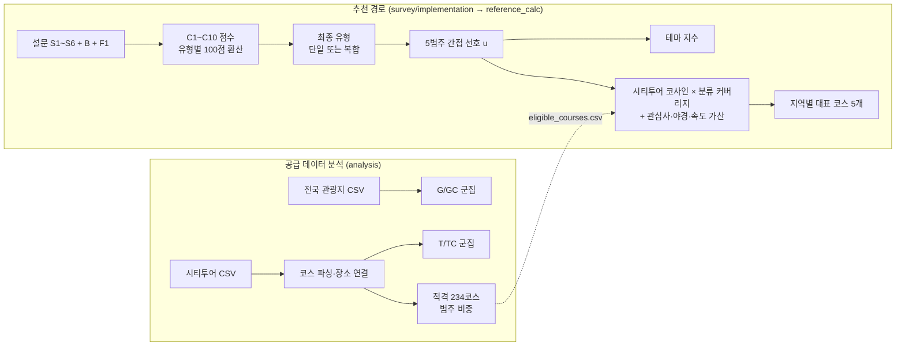
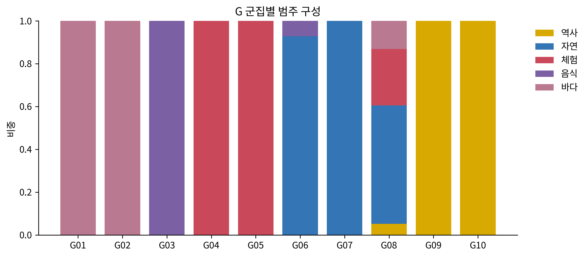
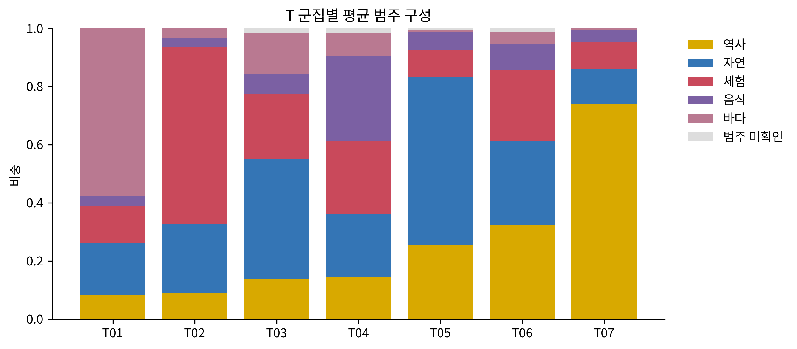
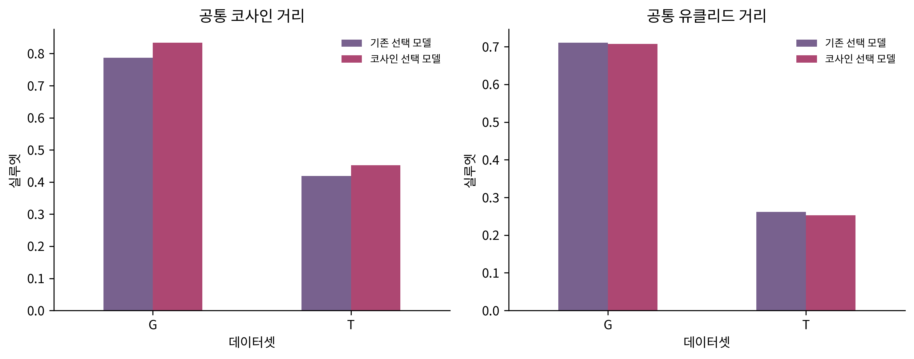
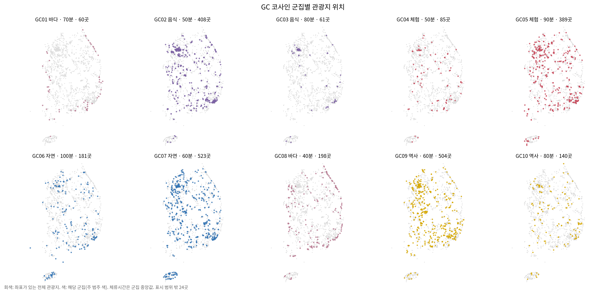
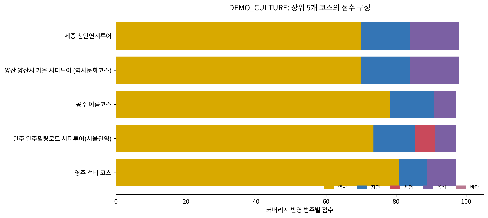
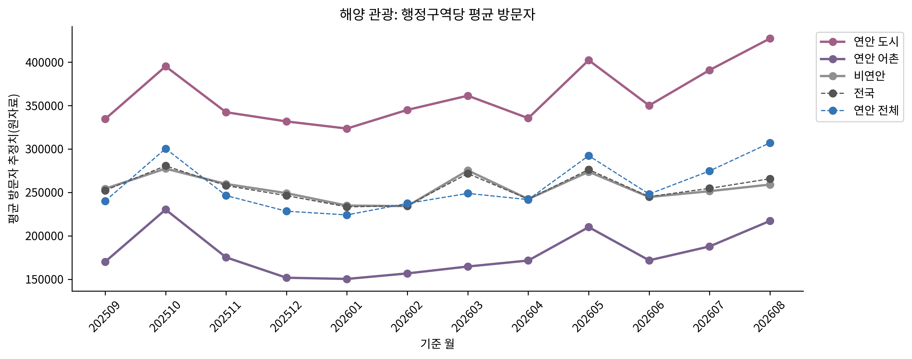
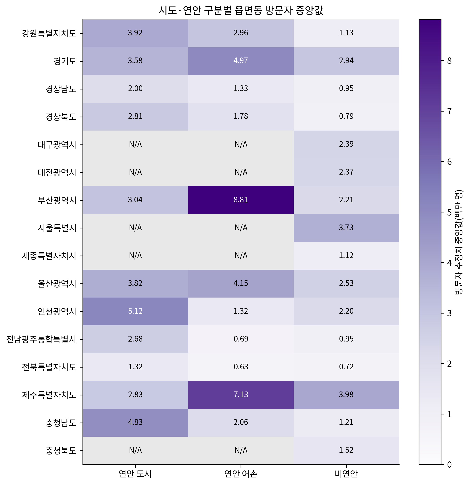
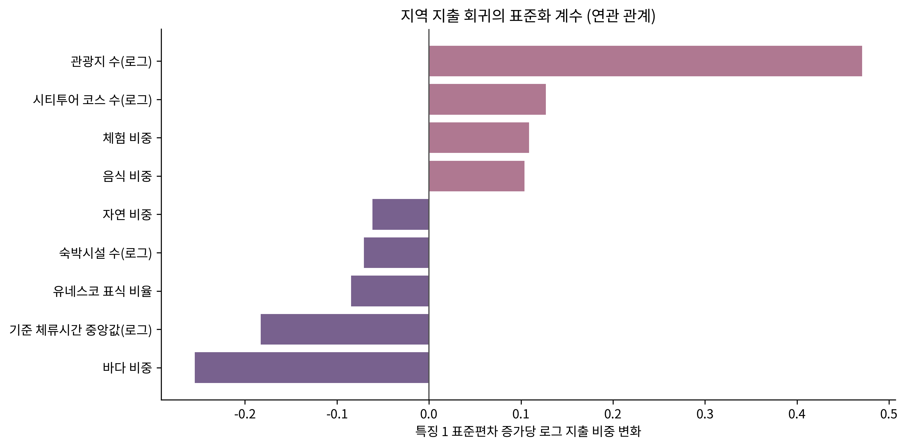

# Tour Navigator Data Analytics

Tour Navigator는 여행자가 짧은 설문에 답하면 성향 유형을 판정하고, 그 유형에 맞는 **테마 여행지**와 **지역 시티투어 코스**를 추천하는 서비스입니다. 이 저장소는 그 추천을 뒷받침하는 데이터 분석 전체를 담고 있습니다.

- **추천 경로**: 설문 → 유형 점수 → 5범주 선호 → 테마·코스 점수
- **공급 데이터 분석**: 전국 관광지 2,549곳과 시티투어 234코스의 PCA·코사인 군집, 연령·성별·지출·해양 관광 자료
- **함께 들어 있는 것**: 입력 CSV, 실행 코드·노트북, Word·Markdown 명세서, 학습 모델, 결과 표와 그림, 검증 기록

현재 기준은 **통합 명세서 6.4 / 분기 설문 6.3**, 주 분석 엔진은 **integrated-5.0**(지출업종 분류 제거)입니다. 여기 있는 결과는 세션에서 검증한 스냅숏입니다. 입력 CSV를 바꾸면 다시 학습해야 합니다.

## 핵심 요약

| 영역 | 내용 | 주요 수치 |
|---|---|---|
| 설문 | 공통 S1~S6 + 관심사 B 1문항 + 필요할 때만 F1. 7~8문항으로 끝남 | 완료 경로 109,552개 전수 검사 |
| 유형 판정 | 선택지마다 C1~C10에 원점수 가산 후 유형별 100점 만점으로 환산. 최고점과 12점 이내인 유형은 복합 유형으로 유지 | 유형 10개 |
| 추천 | 유형 프로필을 5범주(역사·자연·체험·음식·바다) 선호로 바꿔 테마와 코스를 각각 점수화. 코스에는 관심사·야경·여행 속도 가산 | 적격 코스 234개 |
| 관광지 군집 G/GC | 범주·체류시간·유네스코 표식으로 전국 관광지 군집 | 2,549곳, 10군집, 실루엣 0.719 |
| 코스 군집 T/TC | 범주 비중·방문지 수·야경 세 묶음의 분산을 0.75·0.15·0.10으로 맞춘 뒤 군집 | 234코스, T 7군집·TC 7군집 |
| 보조 분석 | 연령별 인기관광지(A), 지역 성별·연령 구성(R), 지역 지출 회귀(M), 해양 관광 | A 3군집, R 2군집, M 로그 R² 0.14 |

군집은 관광지·코스의 공급 특성을 **설명**하는 데 씁니다. 추천 점수는 군집 번호를 쓰지 않고 선호 벡터와 코스 범주 비중을 직접 비교합니다.

## 최근 개정 (2026-09-29)

| 개정 | 무엇을 바꿨나 | 효과 |
|---|---|---|
| T 모델 분산 균형 | 범주 비중·방문지 수·야경 세 묶음의 흩어진 정도를 맞춘 뒤 가중치 0.75·0.15·0.10 적용 | "긴 코스 대 짧은 코스" 2군집 → 범주 구성으로 나뉘는 군집 |
| 설문–추천 정합 (설문 6.2·추천 6.3) | S4 바다 점수를 C9 쪽으로 조정, C9 프로필 수정, 코스 점수에 관심사·야경·여행 속도 가산 | 바다 관심사의 1위 코스가 바다 중심인 비율 0 → 0.38 |
| 탈락 코스 재점검 | 제공된 원문 안에서 경로 해석·범주 분류 규칙의 오류 수정 | 적격 코스 179 → 229, 바다 비중 0.3 이상 코스 17 → 26 |
| 유형 100점 환산 (설문 6.3·추천 6.4) | 유형마다 만점을 100점으로 맞춰 원점수 환산, 경계 12점·F1 20점 | 유형 쏠림 6.4배 → 2.5배, 바다 일치율 0.52 → 0.75 |
| 경유지–관광지 연결 재점검 | 한 칸에 나열된 경유지 분리, 지역명·수식어가 붙은 관광지 이름, 인접 지역(30~50km), 출발·하차를 겸한 관광지, "or"·"택1"을 선택지로 판정 | 방문 경유지 연결률 43% → 54%, 적격 코스 229 → 223, T 7 → 6군집·TC 7 → 8군집 |
| 범주 미확인 경유지 재분류 | 키워드 사전 보강(현충원·가옥·식물원·산책·전시관·광장·장터·선착장 등), 시청·로터리·"관광코스"·"<6" 같은 비방문 항목 제외 | 범주 미확인 방문 경유지 285 → 104, 적격 코스 평균 분류율 0.84 → 0.95, 적격 코스 223 → 234, T 6 → 7군집(음식 군집 복원) |
| 범주 미확인 2차 재분류 | 괄호 속 설명("대청호(대청댐물문화관)"), 관광지 목록 후보가 모두 같은 범주인 경우(둔병 → 바다), 근거를 적은 검토표(`analysis/stop_category_review.csv`) | 남은 미확인 77 → 8건, 적격 코스 평균 분류율 0.95 → 0.99, T 실루엣 0.247 → 0.260 |
| 노트북 설명·세션 실행기 | 노트북 설명 셀을 최신 규칙으로 정리, `run_session.py`가 최신 설문 추천도 함께 저장 | 코드 셀과 분석 결과는 그대로 |
| 저장소 정리 | 모듈마다 따로 두던 같은 파일 사본을 지우고 한 곳만 읽도록 변경(설문 엔진은 `survey/implementation`, 앱 데이터는 `tour_scoring/data`) | 중복 파일 11개 삭제, 모든 결과는 바이트 단위로 같음 |

항목별 상세 수치와 변경 파일은 [이관 기록](docs/RELEASE_NOTES.md)에 있습니다.

## 전체 처리 흐름



## 바로 보기

| 자료 | 위치 |
|---|---|
| 전체 상세명세서: 설문, 산식, PCA 축, 코사인, 지역 배정, 여행장소, 체류 | [Markdown](docs/Tour_Navigator_Integrated_Specification.md) · [Word](docs/Tour_Navigator_Cosine_Specification.docx) |
| 최신 설문과 선택지별 가산점 | [설문 MD](survey/Tour_Navigator_Branching_Questionnaire.md) · [점수 사전 CSV](survey/implementation/question_score_map.csv) |
| 응답자용 설문지 | [Word](survey/Tour_Navigator_Survey_Form.docx) · [PNG 6장](survey/survey_png/) |
| CSV → PCA·코사인 군집·표·그림 | [Jupyter Notebook](analysis/Tour_Navigator_Integrated.ipynb) · [동일 분석 Python](analysis/run_analysis.py) |
| 신규 설문 → 유형 → 테마·지역 시티투어 | [추천 코드](reference_calc/recommend_reference.py) · [설문 엔진](survey/implementation/score_survey.py) |
| 주 분석 PNG 44개·결과 CSV 92개 | [결과 폴더](analysis/outputs_cosine/run_20260929_041803_474997/) |
| 입력 데이터의 위치·행 수·해시 | [입력 목록](docs/INPUT_DATA_INDEX.md) · [전체 파일 SHA256](verification/release_manifest.csv) |
| 기존 앱·확장 산식 비교와 체류 코드 | [Node.js 코드집](tour_scoring/) · [원본 추적 정보](tour_scoring/PROVENANCE.json) |

## 추천 예제

[`reference_calc/demo_answers.json`](reference_calc/demo_answers.json)의 가상 응답을 넣은 결과입니다([전체 결과](reference_calc/demo_result.json)).

1. **유형**: 문화 산책형(C4)과 조용한 휴식형(C5)이 원점수로는 11점 동점이지만, 유형별 만점(C4 17점, C5 18점) 기준 100점으로 환산하면 64.7점과 61.1점입니다. 차이가 12점 이내여서 F1 확인 문항이 나왔고, 응답자가 `BALANCED`를 골라 두 유형에 10점씩 더해져 74.7점과 71.1점이 됐습니다. 둘을 0.55·0.45로 섞은 복합 유형으로 판정됩니다.
2. **테마 상위 3개**: 영월 「왕과 사는 남자」 31.8점, 경주·거제 「RESCENE Route」 25.7점, 서울 「케이팝 데몬 헌터스」 25.3점
3. **지역별 대표 시티투어 5개**

| 순위 | 지역 | 코스 | 범주 적합 | 최종 점수 |
|---|---|---|---|---|
| 1 | 해남 | 해남시티투어 | 94.9 | 81.2 |
| 2 | 대전 | 생태교육 | 94.9 | 81.2 |
| 3 | 아산 | 역사기행 코스 | 94.9 | 81.2 |
| 4 | 순천 | (기획투어)나이트가든투어 | 94.9 | 81.2 |
| 5 | 천안 | 목요일 | 85.5 | 80.5 |

범주 적합은 선호와 코스 구성만 비교한 점수입니다. 이 응답자는 관심사로 역사를, 여행 속도로 "천천히"를 골랐습니다. 그래서 역사 비중이 크고 방문지가 적은 코스가 최종 점수에서 앞섭니다. 1~4위는 역사·자연이 반반이고 방문지가 2~3곳인 코스로 점수가 같아 코스 번호로 표시 순서만 정합니다. 1위 해남 시티투어(산이정원 → 대흥사)는 원문 경로가 괄호 안에 적혀 있어 코스 재점검 전에는 분석에서 빠졌던 코스입니다. 2위 대전 생태교육 코스는 "대청호(대청댐물문화관)"가 괄호 속 설명으로 자연에 분류되면서 올라왔습니다. 범주 적합이 높은 연천명소코스(95.6)는 역사 비중이 0.25여서 43위입니다.

테마 점수와 코스 점수는 계산식이 달라 서로 더하거나 크기를 비교하지 않습니다.

## 분석 결과 둘러보기

아래 그림은 모두 저장소에 있는 결과 파일입니다. 주 분석 그림 44개 전체는 [plots 폴더](analysis/outputs_cosine/run_20260929_041803_474997/plots/)에 있습니다. 그림의 레이블은 칼럼명이나 내부 코드 대신 아래 설명과 같은 이름(적격, 조건부 경유지, 관광지 수 등)으로 표기했습니다.

### 1. 설문 분기 흐름


모든 응답자는 공통 6문항과, S4에서 고른 주 관심사에 맞는 B 문항 1개에 답합니다. 유형 점수는 유형마다 100점 만점으로 환산하며, 1위와 2위 유형의 차이가 12점 이하일 때만 F1 확인 문항이 나옵니다. 그래서 설문은 7문항 또는 8문항으로 끝납니다. B 문항의 "D = 없음"은 어떤 유형에도 점수를 더하지 않습니다.

### 2. 설문 유형 쏠림 보정 (100점 환산)


모든 설문 경로를 같은 빈도로 계산한 구조 점검입니다([그림 코드](docs/spec_assets/plot_survey_type_balance.py), 수치는 [검증 결과](verification/release_validation.json)의 `survey_6_3_recommendation_6_4_revision`). 6.2까지는 원점수를 그대로 더했는데, 유형마다 한 경로에서 받을 수 있는 최대 원점수가 9점(C9·C10)부터 18점(C1·C5)까지 달라 선택지에 자주 나오는 유형이 결과를 가져갔습니다(왼쪽 회색). 유형별 만점을 100점으로 맞추자 결과 비중이 고르게 퍼졌습니다(왼쪽 파랑). 자연 해양형(C9)은 4.0%에서 8.6%, 역사 전통체험형(C10)은 3.3%에서 9.1%가 됐습니다.

오른쪽은 고른 관심사와 1위 추천 코스의 주 범주가 같은 비율입니다(100점 환산을 적용한 229코스 기준). 음식(0.60 → 0.79)과 바다(0.52 → 0.75)가 크게 올랐습니다. 체험은 0.55에서 0.51로 조금 내렸습니다. 체험을 고르면 함께 오르는 C10이 역사 쪽 프로필이라, 만점이 작은 C10의 비중이 커지면서 역사 코스가 섞였기 때문입니다.

### 3. 관광지 군집 G: PCA 투영과 범주 구성




전국 관광지 3,118곳 중 숙박 569곳을 빼고 2,549곳을 군집했습니다. 특징은 범주(원핫), 기준 체류시간, 유네스코 표식입니다. PCA 5축이 분산의 99.4%를 담고, 탐색 범위 k=2~10에서 k=10이 선택됐습니다(실루엣 0.719).

- 위 그림은 첫 두 축(PC1 44.6%, PC2 19.5%)만 보여 줍니다. 점이 겹쳐 보여도 나머지 3개 축에서 나뉠 수 있습니다. 원 크기는 같은 좌표에 겹친 장소 수입니다.
- 아래 그림처럼 대부분의 군집은 범주 하나로 이루어집니다. 같은 범주 안에서는 체류시간으로 다시 나뉩니다. 예를 들어 역사는 G09(짧은 방문)와 G10(보통 방문), 체험은 G04와 G05로 나뉩니다.
- 장소마다 범주가 하나뿐이라 실루엣이 높게 나오기 쉽습니다. 이 값을 군집 품질이 뛰어나다는 뜻으로 읽지 마세요.

### 4. 관광지 군집별 규모와 체류시간


가장 큰 군집은 자연 G07(523곳), 역사 G10(516곳), 음식 G03(459곳)입니다. 체류시간(오른쪽)은 대부분 40~90분에 모입니다. G08(76곳)만 중앙값 180분으로 길며, 자연·체험·바다가 섞인 장시간 방문지 묶음입니다.

### 5. 관광지 군집의 위치


군집마다 작은 지도 한 장을 그렸습니다. 회색은 좌표가 있는 전체 관광지, 색 점은 해당 군집이고 색은 주 범주입니다(3절 범주 구성 그림과 같은 색). 제목에는 주 범주, 체류시간 중앙값, 관광지 수를 적었습니다. 울릉·독도 등 24곳은 지도 범위 밖입니다.

- G 군집은 위치를 쓰지 않고 범주·체류시간·유네스코 표식만으로 만들었습니다. 그래서 거의 모든 군집이 전국에 퍼져 있고, 지도는 결과를 확인하는 용도입니다. 군집은 "어느 지역"이 아니라 "어떤 성격의 장소"를 나눕니다.
- 바다 G01(40분)·G02(70분)는 해안선을 따라 놓입니다. G02는 거제·강릉·포항·울릉처럼 머무는 시간이 긴 해안 명소입니다.
- 음식 G03은 도시에 몰립니다. 수도권 비중이 30%로 전체(23%)보다 높고 서울 67곳, 부산 49곳입니다.
- 체류가 긴 자연 G06(90분)과 자연·체험 G08(180분)은 제주 비중이 13%·11%로, 전체 평균 4.5%보다 높습니다.
- 짧게 들르는 역사 G09(40분)는 경주·안동·부여 같은 역사 도시에서 많이 나오고, 보통 방문인 역사 G10(60분)은 서울(46곳)을 비롯해 전국에 넓게 퍼져 있습니다.
- 좌표는 원자료의 위경도를 그대로 썼고 주소 검증을 거치지 않았습니다.

### 6. 시티투어 코스 정제와 장소 연결


시티투어 280코스 중 234코스가 분석 조건을 통과했습니다. 조건은 방문 후보 2곳 이상, 범주 분류 커버리지 0.5 이상, 경로 해석 가능, 조건부 경유지 없음입니다. 탈락 46코스는 조건부 경유지 25, 경로 해석 불가 14, 방문지 부족 7입니다.

2026-09-29에 제공된 원문 안에서 코스 해석(179 → 229코스), 경유지–관광지 연결(229 → 223코스), 경유지 범주 분류(223 → 234코스)를 차례로 다시 점검했습니다. 규칙은 명세서 22장, 단계별 변화는 [이관 기록](docs/RELEASE_NOTES.md)에 있습니다. 현재 규칙은 다음과 같습니다.

**경유지 나누기와 방문지 판정**

- "/"·쉼표·&·"및"으로 나열된 경유지는 함께 방문하는 곳으로 보고 나눕니다. KT&G 같은 영문 이름과 "김좌진·한용운 생가"처럼 가운뎃점이 이름 안에 쓰인 경우는 나누지 않습니다. 괄호 안에 적힌 경로도 읽습니다.
- "또는·선택·계절별·or·(택1)"과 "(봄·가을)" 같은 표시만 조건부 경유지로 봅니다. 이름 속 글자(율봄식물원의 "봄", 안성맞춤박물관의 "맞춤")는 조건으로 오인하지 않습니다.
- 역·터미널·정류장·호텔·공항·시청·주차장·"○○앞", 식사 지점("(중식)" 포함), 숙박 시설, 원문 잔여 표기("<6", "안동역 19:20")는 방문지가 아닌 이동·식사 지점으로 둡니다(579건). 관광지 목록에 있는 곳이 출발·도착이나 "(하차)" 지점이면 방문지로 한 번 셉니다.

**관광지 연결** — 방문 경유지 1,340건 중 749건(56%)에 관광지 후보가 연결됐습니다.

- 이름 일치 551건, 괄호 별칭 81건.
- 지역명·수식어가 붙은 이름 95건: 국제시장 ↔ "부산 국제시장", 동화사 ↔ "팔공산 동화사"처럼 그 지역 안에서 하나뿐일 때 연결합니다.
- 인접 지역 22건: 대전 코스의 공산성(공주)·부소산성(부여)처럼 이름이 전국에서 하나이고 코스 지역 중심에서 30km 안일 때 연결합니다. 30~50km는 같은 코스에 그 지역 관광지가 둘 이상일 때만 연결하므로 홍성 죽도 ↔ 울릉 죽도 같은 동명이인은 연결하지 않습니다.
- 연결 후보가 없는 경유지는 562건이고, 지역 안에 같은 이름이 둘 이상인 2건(해운대, 산수유마을)은 연결하지 않습니다. 연결은 모두 **후보**이며 사람이 확인한 연결은 아직 0건입니다.

**범주 분류**

- 연결된 경유지는 관광지 범주를, 나머지는 이름의 키워드(현충원·가옥·식물원·산책·전시관·광장·장터·먹자골목·선착장 등)를 씁니다.
- 키워드로도 정할 수 없으면 괄호 속 설명("대청호(대청댐물문화관)" → 자연), 같은 지역 관광지 목록 후보의 공통 범주(둔병 → 바다), 근거를 적은 검토표 [`analysis/stop_category_review.csv`](analysis/stop_category_review.csv)(30행) 순서로 봅니다. 검토표에서 근거를 확인할 수 없는 7개 이름(부계면·볕뉘·목화당1944 등)은 미확인으로 남겼습니다.
- 그 결과 범주 미확인 방문 경유지는 285건에서 8건(조건부 27건 별도)으로 줄었고, 적격 코스의 평균 분류율은 0.84에서 0.99가 됐습니다. 비중 0.3 이상 코스는 역사 102, 자연 116, 체험 81, 음식 24, 바다 22개입니다.

### 7. 코스 군집 T: 범주 구성



234코스를 일곱 가지 구성으로 나눴습니다. T01은 바다(0.58), T02는 체험(0.61), T04는 음식(0.29), T05는 자연(0.58), T07은 역사(0.74) 비중이 두드러집니다. T03(14코스)은 야경 코스이고, T06(43코스)은 평균 방문지가 8.5곳인 긴 혼합 코스입니다. 막대 위쪽 회색(범주 미확인)은 두 차례 재분류로 군집마다 2% 이하가 됐습니다.

2026-09-29 개정 전에는 방문지 수가 분산의 72%를 차지해서 군집이 "긴 코스 대 짧은 코스" 두 개로만 나뉘었습니다. 세 묶음의 흩어진 정도를 맞춘 뒤 가중치를 곱하도록 고쳐 설계대로 범주 구성이 군집을 가르게 됐습니다(명세서 22장). 평균 실루엣은 0.260으로 경계가 뚜렷하지 않으므로 T 군집은 탐색용 요약으로만 씁니다.

### 8. 코스 군집의 위치


T 군집마다 적격 코스의 위치를 지도에 찍었습니다. 연한 회색은 전체 관광지로 국토 윤곽을 보여 주고, 색 점이 해당 군집의 코스입니다. 제목에는 주 범주와 그 비중(군집 평균), 코스 수, 평균 방문지 수를 적었습니다.

- 코스 위치는 코스에 연결된 경유지 후보 좌표의 평균(221코스)이고, 연결이 없으면 같은 지역 관광지 좌표의 평균(13코스)입니다. 확인된 연결이 아니므로 대략적인 위치로만 보세요. 같은 도시의 코스는 한 점에 겹칩니다.
- **바다 T01**(16코스)은 안산(5)·시흥·인천·태안 등 서해안에 모여 있습니다.
- **야경 T03**(14코스)은 여수(3)·대구(2)와 부산·광양·목포·제주 같은 항구 도시에 있습니다.
- **자연 T05**(42코스)는 대전(10)·세종(5)·아산 등 중부권에 많습니다.
- **역사 T07**(45코스)은 23개 지역에 퍼져 있고, 양주(6)·대전(6)·공주(4)가 많습니다.
- **음식 T04**(38코스, 24개 지역)는 포항·서천(각 4)·양산이, **체험 T02**(36코스, 24개 지역)는 서울(5)·인천·세종이 많습니다. **긴 혼합 T06**(43코스)은 27개 지역에 퍼져 있습니다.
- 지도는 어느 도시가 시티투어를 많이 운영하는지도 함께 보여 줍니다. 대전(23코스)처럼 코스가 많은 도시는 여러 군집에 걸쳐 나타나므로, 점의 밀도를 관광 수요로 읽지 마세요.

### 9. 기존 T와 코사인 TC 비교


행은 기존 PCA 군집(T), 열은 구면 코사인 군집(TC)입니다. 두 모델 모두 7군집이고 대부분 대응합니다. 체험 T02는 36코스 모두 TC01, 야경 T03은 TC04, 역사 T07은 TC07로 그대로 옮겨 가고, 바다 T01은 16코스 중 15코스가 TC03, 자연 T05는 42코스 중 41코스가 TC06에 남습니다. 음식 T04는 38코스 중 26코스가 음식 TC02에 남고 나머지 12코스는 긴 혼합(4)·역사(4)·바다(2)·체험·자연으로 흩어집니다. 긴 혼합 T06(43코스)은 31코스가 TC05에 남고 12코스는 역사 TC07로 갑니다(기존 대비 ARI 0.749).

### 10. 기존 군집과 코사인 군집의 분리 정도



두 모델을 같은 거리로 평가했습니다. 코사인 거리(왼쪽)에서는 G가 0.787에서 0.834로, T가 0.419에서 0.453으로 코사인 군집이 더 잘 나뉩니다. 유클리드 거리(오른쪽)에서는 기존 군집이 약간 높습니다. 평가 거리마다 유리한 모델이 다르므로, 한쪽 수치만으로 어느 모델이 낫다고 판단하지 않습니다.

### 11. 코사인 군집의 위치 (GC·TC)




구면 코사인 군집(GC·TC)을 5절·8절과 같은 방식으로 지도에 찍었습니다. 제목과 색 규칙도 같습니다(주 범주, 체류시간 중앙값 또는 방문지 수, 개수). 관광지는 원자료 좌표, 코스는 T 지도와 같은 잠정 위치입니다.

- **GC는 기존 G와 큰 틀이 같습니다.** 바다 두 군집(GC01·GC08), 체험 GC04, 자연 GC07은 G와 같은 장소로 이루어져 지도도 같습니다.
- **음식이 체류시간으로 나뉩니다.** G03(459곳)이 GC02(50분, 408곳)와 GC03(80분, 61곳)으로 갈라집니다. 오래 머무는 음식 장소 GC03은 수도권 비중이 49%(서울 22곳)로 도시 쏠림이 더 뚜렷합니다.
- **긴 체류 혼합 G08(180분)이 사라집니다.** 76곳 중 52곳이 자연 GC06(100분, 181곳)으로 들어가서, GC06은 제주(21곳) 비중이 12%입니다.
- **역사가 유네스코 표식으로 나뉩니다.** 짧은 방문 G09와 보통 방문 G10 대신, GC09(60분, 504곳)와 유네스코 표식 비율이 24%인 GC10(80분, 140곳)이 생깁니다. GC10은 서울·경주·제주·수원·공주처럼 세계유산이 있는 곳에 많습니다.
- **TC는 T와 대부분 같습니다.** 체험 TC01·바다 TC03·야경 TC04·자연 TC06은 T의 해당 군집과 거의 같은 지도입니다. 역사 TC07(61코스)은 T07에 긴 혼합 코스 12개가 더해져 29개 지역으로 넓어지고, 대전(9)·양주(6)·공주(4)가 많습니다. 음식 TC02(26코스)는 포항(4)·양산·서울 등 16개 지역에 퍼져 있습니다.
- 코사인 군집도 위치를 쓰지 않고 만든 결과입니다. 지도는 두 모델의 차이를 장소 수준에서 확인하는 용도입니다.

### 12. 코스 점수가 만들어지는 방식



코스의 범주 적합 점수 `100 × cosine(선호, 코스 범주 비중) × 커버리지`를 범주별 기여로 나눠 보여 줍니다(노트북의 직접 선호 시연이라 관심사·야경·속도 가산은 없습니다). 이 그림은 역사를 강하게 선호하는 **가상 응답**(`DEMO_CULTURE`)의 예입니다. 공동 1위인 세종 천안연계투어와 양산 역사문화코스(98.0점)는 그중 약 70점이 역사에서 옵니다. 실제 서비스에서도 이렇게 "왜 이 코스인지"를 범주별로 설명할 수 있습니다.

### 13. 해양 관광: 월별 추이와 지역별 분포



2025년 9월부터 2026년 8월까지 행정구역당 평균 방문자 추정치입니다. 연안 도시가 늘 가장 많고 연안 어촌이 가장 적습니다. 모든 집단이 10월과 5월에 오르고, 연안은 여름(7~8월)에 다시 크게 늡니다.



시도와 연안 구분별 읍면동 방문자 추정치의 중앙값(백만 명)입니다. 부산(8.81)과 제주(7.13)의 연안 어촌이 가장 높습니다. N/A는 해당 구분의 지역이 없다는 뜻입니다. 해양 자료는 설명용이며 추천 가산점(0)이나 체류 배율(1)에는 반영하지 않습니다.

### 14. 지역 지출과 관광 공급의 관계



111개 지역의 내국인 지출 비중을 관광 공급 특징으로 설명한 Ridge 회귀입니다. 관광지 수가 많을수록 지출 비중이 크고(+0.47), 바다 비중이 클수록 작습니다(−0.26). 다만 교차검증 로그 R²가 0.14로 설명력이 낮고, 계수는 인과가 아닌 연관입니다.

### 15. 지역별 방문자 연령·성별 구성 R


90개 지역을 방문자 연령·성별 구성비로 두 군집으로 나눴습니다(실루엣 0.317). R01(40지역)은 50·60대 비중이 높고, R02(50지역)는 20·30대 비중이 높습니다. 성별 구성은 두 군집 모두 남성 약 61~62%로 비슷합니다. 연령과 성별은 각각의 구성비이며, "30대 여성"처럼 교차한 비율이 아닙니다.


같은 군집을 시군구 지도에 칠했습니다. 방문자 중 50·60대가 R01은 평균 44.9%, R02는 38.7%이고, 20·30대는 R01 25.3%, R02 32.4%입니다.

- **R02(20·30대가 많은 곳)**는 수도권·울산·충청권에 모여 있습니다. 경기 15곳 중 13곳, 인천 3곳, 울산 4곳, 대전 1곳이 모두 R02이고, 충남도 8곳 중 6곳입니다.
- **R01(50·60대가 많은 곳)**은 영남 내륙과 남해안에 모여 있습니다. 경북 11곳 중 9곳(문경·상주·봉화·울진 등), 경남 9곳 중 7곳(통영·사천·고성 등), 대구 2곳(달성·군위)입니다. 전남 서남해안의 군 지역(해남·완도·진도·신안·고흥 등 9곳)도 R01입니다.
- 회색은 원자료에 상세 연령·성별표가 없거나(136지역) 값 검사에서 보류된(인천 4지역) 곳입니다. 서울·제주에는 분석한 지역이 없습니다. 상세표는 남성 비중 상위 목록에서 뽑힌 지역이라 전국을 대표하는 표본이 아닙니다.
- 이 군집은 지역 방문자 구성의 설명용이며 추천 점수에 군집 번호를 더하지 않습니다.

경계는 통계청 센서스용 행정구역경계(2013)를 공개한 [southkorea-maps](https://github.com/southkorea/southkorea-maps)에서 받아 방향 참고용으로만 씁니다. 경계 파일은 저장소에 넣지 않고, [지도 코드](demographic_upgrade/plot_regional_map.py)가 고정된 커밋에서 받아 SHA-256을 확인합니다. 2013년 이후 바뀐 이름(강원·전북 특별자치도, 전남광주통합특별시, 2023년 대구로 옮긴 군위군, 구로 나뉜 안산시)은 [대응표](demographic_upgrade/results/regional_map_matches.csv)에 규칙을 남겼습니다.

## 실행 방법

### 최신 설문 점수와 추천

Python 3.10 이상 표준 라이브러리만 필요합니다. 저장소 최상위에서 실행하세요. 설문 엔진과 문항 설정은 `survey/implementation`에 한 부만 있고, `reference_calc`의 추천 코드가 이를 불러 씁니다.

```bash
python survey/implementation/score_survey.py reference_calc/demo_answers.json
python reference_calc/recommend_reference.py reference_calc/demo_answers.json
python reference_calc/verify_reference.py
```

입력은 S1~S6와, S4에서 고른 관심사에 해당하는 B 문항 하나입니다. F1이 필요한 경우에만 후보 C 코드 또는 `BALANCED`를 입력합니다. B1~B7의 **D = 없음**은 모든 유형에 0점을 더하고 기존 점수를 유지합니다. 예제 응답은 가상 데이터입니다.

- 유형: 선택지별 C1~C10 원점수를 더한 뒤 유형마다 `원점수 × 100 / 최대 원점수`로 환산(최대 원점수: 한 경로에서 그 유형이 받을 수 있는 가장 큰 원점수, C1 18 … C9·C10 9). F1은 선택 유형 +20, 균형은 20을 후보 수로 나눔. 최고점과 12점 이내인 유형을 최종 후보로 유지하고, 12점 차이마다 가중치가 2배.
- 100점 환산 이유: 원점수를 그대로 더하면 선택지에 자주 나오는 유형이 유리해 결과가 몰렸습니다(전수 경로 기준 문화 산책형 21.2% 대 자연 해양형 4.0%). 환산 후 14.9% 대 8.6%이고, 가장 많은 유형과 가장 적은 유형의 비가 6.4배에서 2.5배로 줄었습니다. 현재 234코스에서 고른 관심사와 1위 코스의 주 범주가 같은 비율은 역사 0.91, 자연 0.69, 체험 0.55, 음식 0.81, 바다 0.69입니다(개정 단계별 수치는 이관 기록). 바다 비중 0.3 이상 코스는 22개로 여전히 적습니다. 모든 선택지가 같은 빈도라고 가정한 구조 점검이며, 실제 응답자 분포에 맞춘 조정은 파일럿 응답이 필요합니다.
- 선호 벡터: 후보의 기존 5범주 프로필을 점수 차이에 따른 가중치로 합성. `q_source=type_profile_prior`이며 개인 선호 실측값이 아님.
- 테마: `100 × (프로필 적합도 + 0.5 × 주요 관심사 항) / 1.5`로 정렬.
- 시티투어: 범주 적합 `fit = cosine(선호 벡터, 코스 범주 비중) × 분류 커버리지`에 응답별 가산을 더해 `100 × (fit + Σ w·b) / (1 + Σ w)`로 정렬하고 지역명별 첫 코스를 최대 5개 선택. 가산은 적용되는 항만 분모에 넣으므로 점수는 늘 0~100입니다.
  - 관심사(w=0.5): S4가 역사·자연·체험·음식·바다면 그 범주 비중, 야경이면 코스 야경 표식.
  - 야경(w=0.1): S6가 "저녁·밤까지"이고 S4가 야경이 아니면 코스 야경 표식.
  - 여행 속도(w=0.1): S3 "빡빡하게"는 방문지가 많은 코스, "천천히"는 적은 코스에 가산(3곳 이하 0 ~ 8곳 이상 1).
- 테마 점수와 코스 점수는 합산하지 않으며, 군집 번호를 추천의 강제 필터로 사용하지 않음.
- 신규 기본 흐름의 지역·한류·연령·성별 별도 가산은 0. 관련 분석 데이터를 자동 가산으로 해석하지 않음.

`reference_calc/eligible_courses.csv`는 적격 234코스 스냅숏입니다. 새 CSV를 학습해도 이 파일은 자동 교체되지 않습니다. 최신 분석 결과와 출처를 검토한 후 갱신해야 합니다.

### CSV부터 분석 재실행

```bash
python -m pip install -r analysis/requirements.txt
python analysis/run_analysis.py
```

Jupyter에서는 `analysis` 폴더에서 [Tour_Navigator_Integrated.ipynb](analysis/Tour_Navigator_Integrated.ipynb)를 열고 **Restart Kernel → Run All** 하세요. Jupyter는 별도 설치합니다. 결과는 `analysis/outputs_cosine/run_실행시각/`의 `tables`, `plots`, `models`에 저장되며 기존 스냅숏을 덮어쓰지 않습니다.

현재 스냅숏은 Python 3.12와 [`analysis/requirements-tested.txt`](analysis/requirements-tested.txt)의 고정 버전으로 만들었습니다. 같은 환경에서 다시 실행하면 결과 CSV와 모델이 바이트 단위로 같게 나옵니다. 그림의 한글은 맑은 고딕, AppleGothic, Noto Sans CJK KR, 나눔고딕 순서로 먼저 찾은 글꼴로 그립니다. 한글 글꼴이 없으면 그림의 글자만 깨지고 수치 결과는 같습니다.

| 입력 | 위치 | 용도 |
|---|---|---|
| 전국 여행장소 | `analysis/tour-places.csv` | 범주·체류·유네스코 표식, G/GC 군집 |
| 지역 시티투어 | `analysis/citytour.csv` | 코스 정제·장소 연결·범주 비중, T/TC 군집 |
| 경유지 범주 검토표 | `analysis/stop_category_review.csv` | 이름만으로 범주를 정할 수 없는 경유지 30행의 범주와 근거 |
| 지역별 내국인 지출 비율 | `analysis/spending_csv/spend_region.csv` | 지역 관광공급과 지출의 설명 회귀 |
| 전국 해양관광 | `analysis/marine_csv/` | 전국 히트맵, 월별 추이, Top5, 검색순위 |
| 연령별 인기관광지 | `age_upgrade/data/raw/` | 연령 지표와 A 군집 |
| 지역 성별·연령별 방문자 구성비 | `demographic_upgrade/data/raw/` | 주변비율 지표와 R 군집 |
| 2026 해외한류실태조사 집계치 | `hallyu_preprocessed_csv/` | 전처리 CSV 8개, 통계값·설계계수·적용조건 |

지출 **업종 분류 S/SC 및 업종·월별 지출 입력은 제거**했습니다. 지역 지출 회귀는 유지합니다. 해양 월별 방문자는 지출 월별 입력과 다른 자료입니다.

주 노트북의 직접 5범주 평점 CSV는 코사인 계산을 검증하는 별도 선택 입력이며 최신 분기 설문에 포함되지 않습니다. 파일이 없으면 `SYNTHETIC_DEMONSTRATION`으로 표시한 가상 응답 4개로 계산을 시연합니다.

분석 스냅숏: 장소 3,118행 중 숙박 569행 제외 후 2,549행, 코스 280행 중 적격 234행, G/GC 10군집, T 7군집·TC 7군집. T는 범주 비중·방문 후보 수·야경 세 묶음의 분산을 맞춘 뒤 가중치 0.75·0.15·0.10을 적용합니다(명세서 22장). PCA 축은 학습된 성분이며 설문 유형과 다릅니다. 식·실루엣·ARI 해석은 통합 명세서를 참조하세요.

### 연령·성연령 및 기존 산식 비교

```bash
python age_upgrade/run_age_clustering.py
python demographic_upgrade/analyze_demographics.py
npm test --prefix tour_scoring
python run_session.py examples/full_session.json
```

마지막 두 명령과 `tour_scoring`, `survey_legacy`, `session_results`는 **기존 v1~v4 비교용**입니다. 최신 설문은 `reference_calc`를 사용합니다. `run_session.py`는 세션 입력에 `branchSurvey`(설문 6.3 응답)가 있으면 `reference_calc`의 추천도 실행해 `session_results/branch_survey_recommendation.json`에 나란히 저장합니다. 세 결과의 점수는 서로 더하지 않습니다. 성별·연령 구성비는 교차분포가 아닌 주변비율입니다. 한류 자료는 개인 응답 원자료가 아닌 집계 통계입니다.

체류·일정 코드는 `tour_scoring/src/scoring-v2.cjs`, `citytour.cjs`, `session.cjs`와 명세서에 있습니다. 신규 설문의 체류 연결은 명세에 포함되어 있으나 `reference_calc`에 일정 검증을 통합한 것은 아닙니다.

## 폴더 구조

| 폴더 | 역할 | 상태 |
|---|---|---|
| `reference_calc/` | 테마·시티투어 추천 계산, 적격 코스 스냅숏, 예제 결과 | 최신 |
| `survey/` | 분기 설문 6.3 문항, 설문지 Word·PNG, 설문 엔진(`implementation/`)과 전수 검증 | 최신 |
| `analysis/` | 입력 CSV, 주 분석 노트북·스크립트, 결과 스냅숏(`outputs_cosine/`) | 최신 |
| `docs/` | 통합 명세서 MD·Word, 입력 목록, 이관 기록 | 최신 |
| `age_upgrade/` | 연령별 인기관광지 A 군집 | 보조 분석 |
| `demographic_upgrade/` | 지역 성별·연령 구성 R 군집 | 보조 분석 |
| `hallyu_preprocessed_csv/` | 2026 해외한류실태조사 전처리 CSV | 보조 자료 |
| `tour_scoring/`, `survey_legacy/`, `session_results/`, `examples/`, `run_session.py` | 기존 v1~v4 산식과 세션 예제. 세션 실행기는 최신 설문 추천도 나란히 저장. 연령·지역 구성 분석이 만든 앱 데이터는 `tour_scoring/data`에 둠 | 비교용 |
| `verification/` | 실행 로그, 검증 결과, 전체 파일 SHA256 | 검증 기록 |
| `archive/` | 이전 버전 안내 | 보관 |

## 해석할 때 주의할 점

- 군집 번호(G01, T03 등)는 실행마다 새로 매기는 번호입니다. 입력이나 전처리를 바꾸면 번호와 의미가 달라질 수 있습니다.
- 설문 유형 C1~C10은 규칙으로 만든 분류이고, G·T 군집은 데이터에서 묶은 집단입니다. 번호가 같아도 서로 대응하지 않습니다.
- 예제 응답과 노트북의 직접 선호 응답은 모두 가상 데이터입니다.
- 실루엣과 ARI는 군집이 얼마나 잘 나뉘고 안정적인지를 보여 줄 뿐, 추천 정확도나 이용자 만족도를 뜻하지 않습니다.
- 유형별 5범주 프로필은 기존 앱에서 이어받은 설계값이며 응답 데이터로 추정한 값이 아닙니다. 트렌드 탐색형(C1)과 K컬처 탐방형(C7), 감성 동행형(C2)과 웰니스 쇼핑형(C8)은 프로필의 코사인 유사도가 0.95·0.94여서 거의 같은 코스를 추천받습니다.
- 100점 환산 뒤의 유형 비중과 일치율도 모든 선택지를 같은 빈도로 본 구조 점검입니다. 실제 관광객 구성에 맞추려면 파일럿 응답으로 다시 확인해야 합니다. 응답과 함께 추천받은 코스, 실제 선택, 만족도를 모은 뒤 유형 점수로 선택한 코스의 범주 비중을 설명하는 회귀로 프로필을 다시 추정하고, 비슷한 유형 쌍은 5범주 밖의 특징(야경, 여행 속도, 작품·쇼핑 태그)으로 구분하거나 합치는 방안을 검토합니다. 유형 분포와 문항별 변별력을 보고 배점을 조정하되, 떼어 둔 응답으로 일치율이 나아질 때만 적용합니다.

## 버전·검증 범위

- [이관 기록](docs/RELEASE_NOTES.md): 패키지와 최신·비교용 코드 구분, 2026-09-29 개정 전체(T 모델, 설문·추천 개정, 코스·연결·범주 재점검, 지도 추가, 저장소 정리)의 단계별 수치.
- [현재 검증 결과](verification/release_validation.json): 이 브랜치에서 실제 실행한 검사.
- 각 모듈의 검증 JSON·로그에는 이전 세션 검사도 보존했습니다.
- 규칙 검증과 재현 검사는 실제 이용자 만족도·추천 정확도 검증을 뜻하지 않습니다.
- 운영 앱 배포, 실시간 운행 확인, 예약 확정과 장소 동일성 검증은 완료된 범위가 아닙니다.

원천 자료의 출처·범위는 각 모듈 README와 메타데이터에 있습니다. 이 저장소에 포함됐다는 사실만으로 원천 자료의 재이용 조건을 새로 부여하지 않습니다.
