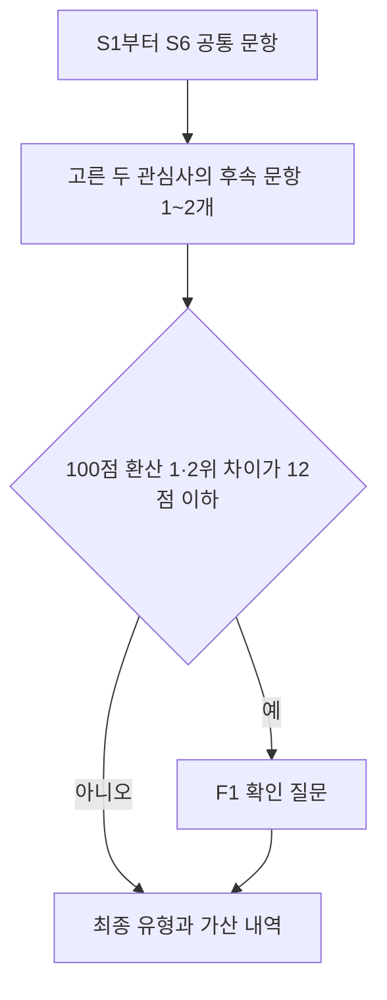

# Tour Navigator 분기형 유형 설문문항지

버전 branch-survey-6.4-proposal · 2026년 9월 29일

## 01 설문 구성과 응답 순서

공통 6문항과 관심사별 후속 1~2문항에 답한다. S4에서 관심사 두 가지를 고르고, 두 관심사에 연결된 후속 문항에 모두 답한다. 두 관심사가 같은 후속 문항에 연결되면 한 번만 묻는다. 후속 문항에는 가산 없는 “D 없음”을 둔다. 유형 점수가 비슷할 때만 확인 질문을 추가해 총 7~9문항으로 끝난다.

문항과 선택지는 실제 화면에 사용할 문구다. 회색 배점 표시는 운영자용이며 응답 화면에서는 숨긴다. S4는 서로 다른 두 가지를 고르고 나머지 질문은 한 가지만 선택한다. 유형 점수는 여행 취향을 설명하는 규칙 기반 지표다.

전체 후보 C1부터 C10까지는 끝까지 유지한다. 가지치기는 후속 질문에만 적용한다.

| S4 관심사 | 후속 질문 |
| --- | --- |
| A 드라마·K팝 촬영지 또는 B 공연·콘서트 | B1 콘텐츠를 즐기는 방식 |
| C 역사·유적 | B2 역사를 즐기는 방식 |
| D 자연·숲길 또는 E 바다 | B3 자연과 바다를 즐기는 방식 |
| F 맛집·시장 | B4 먹거리 여행 방식 |
| G 체험·액티비티 | B5 체험 방식 |
| H 야경 | B6 야경 감상 방식 |
| I 쇼핑·뷰티·스파 | B7 나를 위한 시간 |

## 02 공통 문항의 여행자와 동행 정보

S1부터 S3까지 차례로 답한다. 선택지 옆의 C는 8장에 설명한 여행 성향 코드다. 연령과 동행 응답이 특정 유형의 후보 자격을 제한하지는 않는다.

### S1 연령대가 어떻게 되세요

- [ ] A 10대 — C1 +1 · C7 +2
- [ ] B 20대 — C1 +2 · C2 +3 · C7 +1
- [ ] C 30대 — C2 +2 · C5 +1
- [ ] D 40대 — C3 +2
- [ ] E 50대 — C4 +1 · C10 +1
- [ ] F 60대 — C4 +2 · C10 +1
- [ ] G 70대 이상 — C4 +3 · C10 +1

### S2 이번 여행은 누구와 함께하나요

- [ ] A 혼자 — C1 +1 · C5 +3 · C7 +1 · C8 +1
- [ ] B 친구와 — C1 +3 · C6 +1
- [ ] C 연인과 — C2 +3 · C10 +1
- [ ] D 배우자와 — C2 +1 · C4 +2 · C10 +1
- [ ] E 아이와 가족 — C3 +3 · C9 +1
- [ ] F 부모님 모시고 — C3 +1 · C4 +2 · C6 +1 · C10 +1
- [ ] G 친목 모임 — C4 +3 · C6 +1

### S3 어떤 속도로 여행하고 싶으세요

- [ ] A 빡빡하게, 많이 보고 싶어요 — C1 +2 · C7 +2
- [ ] B 적당히, 보고 쉬고 반반 — C2 +1 · C3 +1 · C6 +1 · C8 +1
- [ ] C 천천히, 걷고 쉬며 여유롭게 — C4 +2 · C5 +3

다음은 S4 관심사 두 가지다. S1부터 S3까지의 가산점은 기존 Q1부터 Q3까지의 값을 유지했다.

## 03 공통 문항의 관심사와 분위기

### S4 이번 여행에서 가장 하고 싶은 것 두 가지는 무엇인가요

- [ ] A 드라마·K팝 촬영지 — C1 +2 · C2 +1 · C7 +3 → B1
- [ ] B 공연·콘서트 — C1 +1 · C2 +1 · C7 +3 → B1
- [ ] C 역사·유적 — C3 +1 · C4 +3 · C10 +3 → B2
- [ ] D 자연·숲길 — C4 +2 · C5 +3 · C9 +2 · C10 +1 → B3
- [ ] E 바다 — C2 +1 · C3 +1 · C9 +4 → B3
- [ ] F 맛집·시장 — C1 +1 · C6 +3 → B4
- [ ] G 체험·액티비티 — C1 +1 · C3 +3 · C10 +2 → B5
- [ ] H 야경 — C1 +2 · C2 +2 → B6
- [ ] I 쇼핑·뷰티·스파 — C8 +3 → B7

### S5 어떤 분위기의 장소를 좋아하세요

- [ ] A 요즘 뜨는 핫플 — C1 +3 · C7 +1
- [ ] B 누구나 아는 대표 명소 — C3 +1 · C4 +1 · C7 +1 · C8 +1
- [ ] C 사람 적은 한적한 곳 — C4 +1 · C5 +3 · C6 +1

### S6 하루 중 언제 여행을 즐기고 싶으세요

- [ ] A 아침 일찍부터 — C4 +2 · C5 +1
- [ ] B 낮 시간 위주 — C3 +2 · C4 +1 · C8 +1
- [ ] C 저녁·밤까지 — C1 +2 · C2 +2 · C7 +1

S4는 서로 다른 관심사 두 가지를 선택한다. 기존 Q4의 최대 2개 선택을 정확히 2개로 정했다. 두 선택지의 원점수를 모두 더하고 두 관심사를 같은 비중으로 다룬다. S5와 S6까지 답한 다음 두 관심사에 연결된 B 문항으로 이동한다. 두 관심사가 같은 B 문항에 연결되면(A와 B, D와 E) 그 문항 하나만, 다르면 B 번호 순서로 두 문항을 답한다.

## 04 관심사별 후속 문항 콘텐츠 역사 자연

S4에서 고른 두 관심사에 연결된 문항만 표시한다. B의 A·B·C는 원점수 합계 4점, D 없음은 전 유형에 0점을 더한다.

### B1 콘텐츠와 관련해 어떤 시간을 가장 보내고 싶으세요

S4에 A 또는 B가 있을 때 표시. 한 가지만 선택.

- [ ] A 좋아하는 작품이나 아티스트의 실제 촬영지와 관련 장소를 찾아가고 싶어요 — C7 +4
- [ ] B 팝업과 공연 주변의 인기 장소를 여러 곳 둘러보고 싶어요 — C1 +3 · C7 +1
- [ ] C 작품 속 분위기를 느끼며 동행인과 사진을 남기고 싶어요 — C2 +3 · C7 +1
- [ ] D 없음 — 전 유형 +0

### B2 역사 장소에서는 무엇을 가장 하고 싶으세요

S4에 C가 있을 때 표시. 한 가지만 선택.

- [ ] A 해설을 듣고 문화유산 주변을 차분히 걷고 싶어요 — C4 +3 · C10 +1
- [ ] B 전통 공예나 생활문화를 직접 체험하며 깊이 알아보고 싶어요 — C10 +4
- [ ] C 가족과 쉬운 해설이나 미션형 체험에 참여하고 싶어요 — C3 +3 · C10 +1
- [ ] D 없음 — 전 유형 +0

### B3 자연이나 바다에서는 어떤 시간이 가장 좋으세요

S4에 D 또는 E가 있을 때 표시. 한 가지만 선택.

- [ ] A 한적한 한 곳에 오래 머물며 걷고 쉬고 싶어요 — C5 +4
- [ ] B 해안과 숲의 여러 전망 지점을 둘러보고 싶어요 — C9 +4
- [ ] C 동행인과 풍경을 보며 대화하고 사진을 남기고 싶어요 — C2 +3 · C9 +1
- [ ] D 없음 — 전 유형 +0

후속 답변은 주 관심사 안에서 경험 방식의 차이를 확인한다. 다른 C 유형을 제외하거나 답변을 강제로 한 유형으로 확정하지 않는다.

## 05 관심사별 후속 문항 미식 체험 야경 웰니스

S4 F는 B4, G는 B5, H는 B6, I는 B7로 이동한다. 고른 두 관심사에 해당하는 문항에만 답한다.

### B4 맛집이나 시장에서는 무엇을 가장 기대하세요

S4에 F가 있을 때 표시. 한 가지만 선택.

- [ ] A 그 지역의 대표 음식과 시장 먹거리를 다양하게 맛보고 싶어요 — C6 +4
- [ ] B 요즘 인기 있는 음식점과 카페를 찾아가고 싶어요 — C1 +3 · C6 +1
- [ ] C 동행인과 분위기 좋은 곳에서 여유롭게 식사하고 싶어요 — C2 +3 · C6 +1
- [ ] D 없음 — 전 유형 +0

### B5 어떤 체험을 가장 해보고 싶으세요

S4에 G가 있을 때 표시. 한 가지만 선택.

- [ ] A 아이와 가족이 함께할 수 있는 만들기나 놀이 체험이 좋아요 — C3 +4
- [ ] B 처음 해보는 활동이나 유행하는 액티비티에 도전하고 싶어요 — C1 +4
- [ ] C 지역의 전통 기술과 생활문화를 직접 배우고 싶어요 — C10 +4
- [ ] D 없음 — 전 유형 +0

### B6 야경을 볼 때 어떤 시간을 가장 보내고 싶으세요

S4에 H가 있을 때 표시. 한 가지만 선택.

- [ ] A 인기 있는 야간 명소를 여러 곳 둘러보고 싶어요 — C1 +4
- [ ] B 동행인과 전망을 보며 사진과 추억을 남기고 싶어요 — C2 +4
- [ ] C 사람이 적은 야간 산책길에서 조용히 쉬고 싶어요 — C5 +4
- [ ] D 없음 — 전 유형 +0

### B7 나를 위한 시간 중 무엇을 가장 원하세요

S4에 I가 있을 때 표시. 한 가지만 선택.

- [ ] A 스파나 뷰티 체험으로 몸과 마음을 관리하고 싶어요 — C8 +4
- [ ] B 좋아하는 브랜드나 지역 상품을 여유롭게 쇼핑하고 싶어요 — C8 +3 · C1 +1
- [ ] C 주변의 조용한 산책길이나 쉼터에서 쉬는 시간이 더 좋아요 — C5 +3 · C8 +1
- [ ] D 없음 — 전 유형 +0

## 06 상위 유형이 비슷할 때의 확인 문항

### F1 이번 여행에서 가장 양보하고 싶지 않은 경험은 무엇인가요

공통 6문항과 B 문항의 원점수를 유형별 100점 만점으로 환산했을 때 1위와 2위 차이가 12점 이하이면 표시한다. 최고점과 12점 이내인 유형들의 경험 문장만 선택지로 보여 준다. 동점 후보가 세 개 이상이면 모두 포함한다.

| 후보 | 화면에 표시할 경험 문장 |
| --- | --- |
| C1 | 요즘 인기 있는 장소와 새로운 경험을 찾아다니기 |
| C2 | 동행인과 경치와 분위기를 즐기며 추억 남기기 |
| C3 | 아이와 가족이 함께 즐길 수 있는 체험하기 |
| C4 | 문화유산과 동네 이야기를 들으며 차분하게 걷기 |
| C5 | 혼자 또는 조용한 환경에서 걷고 쉬기 |
| C6 | 시장과 지역 맛집을 중심으로 여행하기 |
| C7 | 좋아하는 한국 콘텐츠의 촬영지와 관련 장소 찾아가기 |
| C8 | 스파와 뷰티 체험 또는 쇼핑으로 나를 위한 시간 보내기 |
| C9 | 숲과 해안의 풍경을 넓게 돌아보기 |
| C10 | 유적의 역사와 전통문화를 깊이 배우거나 직접 체험하기 |

후보 경험 하나를 선택하면 해당 유형에 20점(100점 척도)을 더한다. 마지막 선택지로 “위 경험들이 비슷하게 중요해요”를 제공하며, 이때는 표시된 후보 전체에 합계 20점을 균등 배분한다. 후보가 2개이면 각각 10점, 3개이면 각각 20/3점(약 6.67점)이다.

예를 들어 환산 점수가 C4 70점, C10 66점, 다른 유형 55점 이하라면 C4와 C10의 두 문장 및 균형 선택지를 표시한다. C10을 고르면 C10은 86점이 되고 C4는 70점이어서 역사 전통체험형 단일 성향이 된다. 균형을 고르면 C4 80점과 C10 76점의 복합 성향이 유지된다.

차이가 12점을 초과하면 F1을 생략한다. F1은 한 번만 묻고, 답한 뒤에도 점수가 비슷하면 그 상태를 결과에 설명한다.

## 07 점수 계산과 최종 유형 판정

| 단계 | 계산과 처리 |
| --- | --- |
| 1 공통 가산 | S1~S6의 선택지에 적힌 C 원점수를 유형별로 더한다. S4는 고른 두 선택지의 원점수를 모두 더한다. 원점수는 기존 여섯 문항의 값을 보존한다. |
| 2 후속 가산 | S4의 두 관심사에 연결된 B 문항 1~2개를 모두 계산한다. A·B·C는 원점수 합계 4점, D 없음은 0점이다. D 점수를 다른 유형에 배분하지 않는다. |
| 3 100점 환산 | 유형마다 원점수에 100 / 최대 원점수를 곱한다. 최대 원점수는 한 경로(S1~S6, S4 두 선택지에 연결된 B 문항)에서 그 유형이 받을 수 있는 가장 큰 원점수로 C1 23, C2 19, C3 20, C4 19, C5 22, C6 10, C7 17, C8 11, C9 11, C10 15점이다. 가장 유리한 답을 모두 고른 유형은 100점이 된다. |
| 4 확인 조건 | 환산 점수 1위에서 2위를 뺀 차이가 12점 이하일 때 F1을 표시한다. |
| 5 확인 가산 | 후보 경험 선택은 해당 C +20점(100점 척도). 균형 선택은 후보 수로 20점을 나누어 각각 가산한다. |
| 6 최종 결과 | 최고점과 12점 이내인 유형을 결과 후보로 남긴다. 한 개면 단일 성향, 두 개 이상이면 복합 성향이다. |
| 7 상대 가중치 | 각 환산 점수를 12로 나눈 값을 2의 지수로 변환한 뒤 전체 C1~C10 변환값 합으로 나눈다. 계산상 최고점을 뺀 후 변환해도 같은 비율이다. 12점 높은 유형이 2배 가중치를 받는다. |

배점과 100점 환산, 12점 기준, B의 A·B·C 원점수 4점과 F1의 20점 가산은 설계 규칙이다. 조사 자료로 추정한 회귀계수나 성격검사 기준은 아니다. 상대 가중치는 유형에 속할 확률로 표시하지 않는다. 분기가 다른 응답자끼리 점수를 비교하지 않는다.

100점 환산을 쓰는 이유: 선택지에 자주 나오는 유형은 한 경로에서 받을 수 있는 최대 원점수가 커서, 원점수를 그대로 더하면 결과가 몇몇 유형에 몰린다. 6.2에서 모든 선택지를 같은 빈도로 가정한 전수 경로의 결과 비중은 문화 산책형 21.2%, 자연 해양형 4.0%로 5배 넘게 차이 났고, 환산 뒤에는 각각 14.9%, 8.6%다. 6.4(S4 두 가지)의 완료 경로 1,756,396개에서는 가장 많은 문화 산책형 13.8%, 가장 적은 가족 체험형 6.1%다. 실제 응답자 구성에 맞춘 배점 조정은 파일럿 응답으로 다시 확인한다.

### 분기 길이와 무응답 처리

응답자는 S4의 두 관심사에 따라 B 문항 1~2개를 답한다. S4 조합 36개 중 A·B와 D·E 두 조합만 B 문항이 하나다. D 없음은 응답 완료로 기록하되 앞선 점수는 그대로 유지하며, 미노출이나 무응답과 구분한다. D를 골라도 F1 표시 조건은 동일하게 확인한다. 해당하면 F1의 실제 응답만 별도로 반영한다. 추가 20점은 개인 내부의 순위 조정에만 사용한다.

표시된 필수 질문을 아직 답하지 않으면 결과를 확정하지 않는다. 이전 화면에서 S4를 바꾸면 기존 B와 F1 응답을 삭제하고 새 경로로 계산한다. 다른 공통 응답이나 B 응답을 바꾸어도 기존 F1 응답을 지우고 확인 조건과 후보를 다시 계산한다.

### 복합 성향과 동점 표시

두 유형이면 두 이름을 함께 보여 준다. 세 개 이상이면 “복합 성향”으로 표시하고 해당 성향과 점수를 모두 펼쳐 볼 수 있게 한다. 정확한 동점에 코드 번호가 낮다는 이유로 주유형을 부여하지 않는다. 코드 순서는 동점 목록의 표시 순서에만 사용한다.

## 08 유형 명칭과 기존 설문의 변경 사항

C 코드를 추적용으로 유지하면서 이름을 경험 중심으로 바꾼다. 국내외 응답자 모두 C1부터 C10까지 후보가 된다. 거주 모드에 따른 후보 제한과 해외·브라우저 언어 가산은 제거한다.

| 코드 | 기존 이름 | 개정 이름 |
| --- | --- | --- |
| C1 | MZ 트렌드 탐색형 | 트렌드 탐색형 |
| C2 | 커플 감성형 | 감성 동행형 |
| C3 | 키즈 가족형 | 가족 체험형 |
| C4 | 액티브 시니어형 | 문화 산책형 |
| C5 | 나홀로 힐링형 | 조용한 휴식형 |
| C6 | 미식 로컬형 | 미식 로컬형 |
| C7 | 외래객 K-컬처형 | K컬처 탐방형 |
| C8 | 외래객 웰니스형 | 웰니스 쇼핑형 |
| C9 | 외래객 자연·지방형 | 자연 해양형 |
| C10 | 외래객 역사·전통문화형 | 역사 전통체험형 |

예를 들어 국내 응답자가 쇼핑·뷰티·스파를 선택해 받은 C8 가산도 최종 판정에 반영된다. 기존 국내 후보 C1~C6 제한 아래에서는 이 가산을 주유형 판정에 활용할 수 없었다. C4의 높은 역사·자연 비중은 문화 산책형, C9의 자연·바다 성향은 자연 해양형으로 설명한다.

| 기존 문항 | 개정 처리 |
| --- | --- |
| Q1 Q2 Q3 Q4 Q5 Q8 | S1~S6으로 정리. 선택지별 가산 보존. Q4는 최대 2개에서 정확히 2개 선택으로 변경. |
| Q6 국내외 거주 | 유형 설문에서 제거. 후보 제한과 해외·언어 가산도 제거. |
| Q7 경비와 Q9 정보 경로 | 일부 선택지가 0점이고 여행 경험을 직접 구분하기 어려워 문항 전체 제거. |
| Q10~Q14 일정 교통 보행 등 | 유형 가산이 없어 설문에서 제거. |
| H 문항 D 성별 코사인 5문항 | C 유형 직접 가산이 없어 이 유형 설문에서는 제거. 별도 점수로 자동 대체하지 않음. |
| B1~B7 및 F1 | 후속 문항과 접전 확인 문항. B1~B7의 D 없음은 전 유형 0점. |

## 09 응답 한 건의 계산 예시

| 문항 | 선택한 답 | 가산 |
| --- | --- | --- |
| S1 | 10대 | C1 +1 · C7 +2 |
| S2 | 혼자 | C1 +1 · C5 +3 · C7 +1 · C8 +1 |
| S3 | 빡빡하게, 많이 보고 싶어요 | C1 +2 · C7 +2 |
| S4 | 드라마·K팝 촬영지, 공연·콘서트 | C1 +3 · C2 +2 · C7 +6 |
| S5 | 요즘 뜨는 핫플 | C1 +3 · C7 +1 |
| S6 | 아침 일찍부터 | C4 +2 · C5 +1 |
| B1 | 좋아하는 작품이나 아티스트의 실제 촬영지와 관련 장소를 찾아가고 싶어요 | C7 +4 |

원점수 합계는 C1 10점, C2 2점, C3 0점, C4 2점, C5 4점, C6 0점, C7 16점, C8 1점, C9 0점, C10 0점이다. 100점 환산 점수는 C7 94.12점(16/17), C1 43.48점(10/23), C5 18.18점(4/22), C2 10.53점(2/19), C4 10.53점(2/19), C8 9.09점(1/11)이다. C7과 C1의 차이가 50.64점이므로 F1은 표시하지 않고 K컬처 탐방형으로 마무리한다. 두 관심사가 모두 B1에 연결되어 후속 문항은 하나이고, 총 7문항에 답한다.

상대 가중치는 C7 90.34%, C1 4.85%다. 이는 설계식으로 변환한 점수 비중이며 성향 확률이나 코사인 유사도가 아니다.

### 두 번째 관심사가 달라지면 확인 질문이 생기는 예

같은 공통 응답에서 S4의 두 번째 관심사를 공연·콘서트 대신 야경으로 바꾸면 B1과 B6 두 후속 문항에 답한다. B1은 그대로 두고 B6에서 “인기 있는 야간 명소를 여러 곳 둘러보고 싶어요”(C1 +4)를 고르면 원점수는 C1 15점, C7 13점이고 환산 점수는 C7 76.47점(13/17), C1 65.22점(15/23)이다. 두 유형 차이가 11.25점이므로 F1에서 C7 경험, C1 경험, 균형 선택지를 표시한다.

여기서 균형 선택지를 고르면 두 유형에 10점씩 더해 C7 86.47점, C1 75.22점이 된다. 차이가 11.25점으로 12점 이내이므로 K컬처 탐방형과 트렌드 탐색형을 복합 성향으로 표시한다. C7 경험을 고르면 C7이 96.47점으로 C1보다 31.25점 높아 K컬처 탐방형 단일 성향이 된다. 총 9문항이다. 확인 질문은 선택한 유형을 무조건 단일 결과로 확정하는 장치가 아니다.

## 10 적용 범위와 구현 안내

이 문항지와 유형 판정은 branch-survey-6.4-proposal 버전이다. 6.3 대비 S4를 관심사 두 가지 선택으로 바꾸고 두 관심사의 후속 문항에 모두 답하도록 했다. 선택지별 원점수와 100점 환산 판정 규칙(경계 12점, F1 20점, 상대 가중치 지수 분모 12)은 같고, 최대 원점수만 두 선택 기준으로 다시 계산했다. 6.3에서 유형 점수를 유형별 100점 만점으로 환산하도록 바꿨고, 6.2에서 S4 바다 선택지 점수를 C2 +1 · C3 +1 · C9 +4로 바꿨다. 통합 상세명세서 5.0의 설문 개정안이다.

| 파일 | 역할 |
| --- | --- |
| survey_config.json | 공통 6문항, 후속 7문항, C 유형 이름, 선택지별 점수와 분기 조건 |
| question_score_map.csv | 고정 선택지 60개의 C1~C10 원점수 가산표 |
| score_survey.py | 다음 문항 결정, 가산 내역, 확인 질문과 최종 유형 계산 |
| example_answers.json | 7문항 단일 성향 예제 |
| example_close_answers.json | 9문항 복합 성향 예제 |
| verify_survey.py와 verification.json | 모든 기본 분기 및 확인 선택의 실행 검증 |

Python 3.10 이상에서 implementation 폴더로 이동해 “python score_survey.py example_answers.json”을 실행한다. 외부 패키지는 필요 없다. 응답 키는 S1~S6, 활성 B 1~2개, 필요한 경우 F1이다. 선택값은 A·B·C 등이고, S4는 서로 다른 두 값의 목록(예: ["A", "H"])이며, F1은 C 코드 또는 BALANCED다.

기존 answers 숫자 키에 바로 넣지 않는다. 기존 v4는 Q6를 필수로 검사하고 거주 모드 및 예전 유형 의미를 사용하므로 어댑터 없이 호출할 수 없다. 기존 C별 추천 프로필도 바뀐 이름과 경험 문항에 맞는지 확인한 뒤 연결해야 한다.

### 자료 연결과 해석의 한계

S1은 연령 인기도, S3는 체류 배율에 연결할 수 있다. 일정 가능성을 판단할 날짜·기간·이동수단·보행 한도는 별도 여행 설정에서 받아야 한다. 거주 정보 없이 국내 전용 지표나 해외 한류 통계의 대상 자격을 추정하지 않는다.

기존 코사인 선호 벡터를 S4 두 가지로 채우지 않는다. 직접 선호가 필요한 코사인 점수와 한류 H 점수는 이 설문만으로 재현되지 않는다. 공급 자료의 PCA 군집도 C 유형과 자동 대응되지 않는다.

실행 검증에서 S4 조합 36개의 기본 경로 730,296개, 확인 선택까지 포함한 완료 경로 1,756,396개가 7~9문항으로 종료됐다(7문항 0.4%, 8문항 20.1%, 9문항 79.5%). 모든 B의 D 선택은 기존 점수를 보존했다. C1~C10 각각의 단일 결과도 가능했고, 각 유형은 가장 유리한 경로에서 정확히 100점이 됐다. 이는 조합 검증이며 실제 이용자 분포나 유형 정확도를 뜻하지 않는다.

출처: 통합 상세명세서 5.0 제4~12장, legacy_questions_and_profiles.json. 신규 B·F 가산과 전체 후보 적용, 이름·판정 규칙은 개정 설계값이다. 지출업종 분류는 제외한다.

